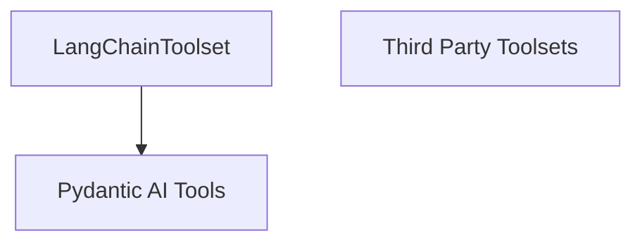

# Langchain Integration Module

## Introduction
The `langchain_integration` module provides a bridge between the Pydantic AI framework and LangChain tools, enabling the seamless incorporation of existing LangChain functionalities into Pydantic AI agents. It primarily focuses on wrapping LangChain tools to be compatible with the Pydantic AI toolset architecture.

## Core Functionality

### LangChainToolset
The `LangChainToolset` class is the central component of this module. It extends the `FunctionToolset` from the `pydantic_ai_tools` module, allowing it to act as a collection of callable tools within the Pydantic AI ecosystem.

- **Purpose**: To encapsulate one or more LangChain tools, converting them into a format that Pydantic AI agents can utilize.
- **Conversion**: It takes a list of `LangChainTool` objects during initialization and transforms each into a compatible Pydantic AI tool using an internal `tool_from_langchain` utility. This ensures that LangChain tools can be invoked and managed by Pydantic AI agents as if they were native tools.

## Architecture and Component Relationships

The `langchain_integration` module is a sub-module of `third_party_toolsets`, indicating its role in integrating external tool providers. It depends on the core `pydantic_ai_tools` module for its base `FunctionToolset` functionality.

<!-- DIAGRAM_JSON
{
    "direction": "TD",
    "nodes": [
        {"id": "langchain_toolset_component", "label": "LangChainToolset", "type": "component", "link": null},
        {"id": "third_party_toolsets", "label": "Third Party Toolsets", "type": "external", "link": "third_party_toolsets.md"},
        {"id": "pydantic_ai_tools", "label": "Pydantic AI Tools", "type": "external", "link": "pydantic_ai_tools.md"}
    ],
    "edges": [
        {"source": "langchain_toolset_component", "target": "pydantic_ai_tools"}
    ],
    "groups": []
}
-->

### Component Breakdown:

*   **`LangChainToolset`**: (Current Module Component) Manages the integration and conversion of LangChain tools.
*   **`third_party_toolsets`**: (External Module) The parent module that groups integrations with various third-party tool providers. This module is part of this broader category.
*   **`pydantic_ai_tools`**: (External Module) Provides the fundamental toolset abstractions, including `FunctionToolset`, from which `LangChainToolset` inherits its core capabilities. This dependency highlights how LangChain tools are adapted to fit the Pydantic AI tool framework.
