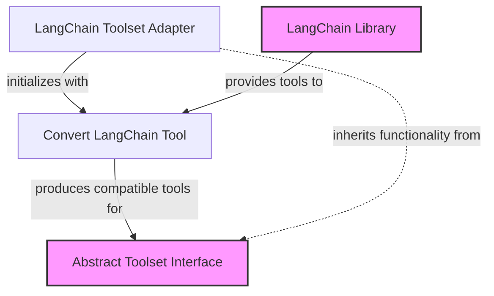

# LangChain Toolset Module

## Introduction

The `langchain_toolset` module provides a crucial integration point for incorporating tools defined within the LangChain framework into the Pydantic AI agent system. It acts as an adapter, enabling the Pydantic AI agent to leverage the rich ecosystem of tools available in LangChain, thereby extending its capabilities without requiring direct reimplementation.

This module is part of the `external_toolset_integrations` family, emphasizing its role in bridging our agent system with external tool providers.

## Core Functionality

The primary component of this module is the `LangChainToolset` class.

### `LangChainToolset`

```python
class LangChainToolset(FunctionToolset):
    """A toolset that wraps LangChain tools."""

    def __init__(self, tools: list[LangChainTool], *, id: str | None = None):
        super().__init__([tool_from_langchain(tool) for tool in tools], id=id)
```

The `LangChainToolset` is a specialized `FunctionToolset` (from the [toolset_management](toolset_management.md) module) designed to encapsulate and manage tools originating from the LangChain library. Upon initialization, it takes a list of `LangChainTool` objects. Each `LangChainTool` is then processed by the internal `tool_from_langchain` utility function, which converts it into a format compatible with the Pydantic AI system's `FunctionToolset` interface. This conversion ensures seamless interoperability, allowing LangChain tools to be used by agents just like any other native tool.

### How it Works
1.  **Tool Ingestion**: The `LangChainToolset` receives a list of `LangChainTool` instances, which are standard tool definitions from the LangChain ecosystem.
2.  **Adaptation**: For each `LangChainTool`, an internal adapter function (`tool_from_langchain`) translates its definition and execution logic into a format that the Pydantic AI's `FunctionToolset` understands.
3.  **Integration**: The adapted tools are then aggregated into the base `FunctionToolset`, making them available for agent discovery and execution.

## Architecture Diagram

<!-- DIAGRAM_JSON
{
    "direction": "TD",
    "nodes": [
        {
            "id": "langchain_toolset",
            "label": "LangChain Toolset Adapter",
            "type": "component",
            "link": null
        },
        {
            "id": "tool_conversion",
            "label": "Convert LangChain Tool",
            "type": "component",
            "link": null
        },
        {
            "id": "abstract_toolset",
            "label": "Abstract Toolset Interface",
            "type": "external",
            "link": "toolset_management.md"
        },
        {
            "id": "langchain_lib",
            "label": "LangChain Library",
            "type": "external",
            "link": null
        }
    ],
    "edges": [
        {
            "source": "langchain_toolset",
            "target": "tool_conversion",
            "label": "initializes with"
        },
        {
            "source": "tool_conversion",
            "target": "abstract_toolset",
            "label": "produces compatible tools for"
        },
        {
            "source": "langchain_lib",
            "target": "tool_conversion",
            "label": "provides tools to"
        },
        {
            "source": "langchain_toolset",
            "target": "abstract_toolset",
            "label": "inherits functionality from"
        }
    ],
    "groups": []
}
-->


## Integration with the System

The `langchain_toolset` module plays a vital role within the `external_toolset_integrations` module by providing a standardized way to incorporate LangChain's extensive collection of tools. It relies heavily on the `toolset_management` module for its foundational `FunctionToolset` capabilities, ensuring that LangChain tools conform to the system's expected tool interface.

This integration allows agents within the Pydantic AI system to seamlessly interact with LangChain tools, treating them as first-class citizens alongside any custom or built-in tools. This modular design promotes extensibility and reusability, making it easy to expand agent functionalities by simply adding new LangChain tools without modifying the core agent logic.