# LiteLLM Provider Module

The `litellm_provider` module integrates LiteLLM, a universal API for large language models, into the system. It enables seamless interaction with a wide array of LLM providers through a consistent interface, abstracting away the complexities of different provider APIs. This module is crucial for maintaining flexibility in model choice and simplifying the process of switching between or combining various LLMs.

## `LiteLLMProvider`

The `LiteLLMProvider` class is the core component of this module, acting as an adapter for the LiteLLM API. It extends the base `Provider` functionality to offer a unified way of requesting model completions and managing model profiles across different LLM services supported by LiteLLM.

### Key Features:

*   **Universal API Access**: Provides a single interface to interact with numerous LLMs by leveraging LiteLLM's abstraction layer.
*   **Dynamic Model Profile Mapping**: Automatically maps various LLM provider-specific model names (e.g., `anthropic/claude-3`, `google/gemini-pro`) to their corresponding internal model profiles. If a specific profile is not found, it defaults to an OpenAI-compatible profile, ensuring broad compatibility.
*   **OpenAI Client Compatibility**: Internally uses an `AsyncOpenAI` client, which LiteLLM intercepts to route requests to the appropriate backend. This maintains compatibility with tools and models designed for the OpenAI API standard.
*   **Flexible Initialization**: Allows for initialization with API keys, custom base URLs, or pre-configured `AsyncOpenAI` or `AsyncHTTPClient` instances, offering adaptability to various deployment scenarios.

### How it Works:

1.  **Initialization**: When `LiteLLMProvider` is instantiated, it sets up an `AsyncOpenAI` client. This client's requests are then intercepted by LiteLLM, which handles the routing and translation to the actual LLM provider's API.
2.  **Model Profile Resolution**: The `model_profile` method is central to its operation. It takes a model name and intelligently determines the correct internal [ModelProfile](model_core_interfaces.md) to use. This involves:
    *   Checking for a provider prefix in the model name (e.g., `anthropic/claude-3`).
    *   Using a lookup table to find the appropriate model profile function for the detected provider (e.g., [anthropic_provider.md](anthropic_provider.md), [openai_provider.md](model_provider_openai.md), [google_provider.md](openrouter_google_profile.md), [mistral_provider.md](mistral_provider.md), [cohere_provider.md](cohere_provider.md), [bedrock_profile.md](bedrock_profile.md), [groq_profiles.md](groq_profiles.md), [deepseek_provider.md](deepseek_provider.md), [moonshotai_provider.md](moonshotai_provider.md), [xai_provider.md](xai_provider.md), [alibaba_provider.md](alibaba_provider.md)).
    *   Defaulting to an [OpenAIModelProfile](model_provider_openai.md) with an [OpenAIJsonSchemaTransformer](model_provider_openai.md) if no specific provider is identified, ensuring consistent schema handling.

## Architecture Diagram

<!-- DIAGRAM_JSON
{
    "direction": "TD",
    "nodes": [
        {"id": "litellm_provider", "label": "LiteLLMProvider", "type": "component", "link": null},
        {"id": "init_client", "label": "Initialize OpenAI Client", "type": "component", "link": null},
        {"id": "model_profile_mapping", "label": "Map Model to Profile", "type": "component", "link": null},
        {"id": "model_profile", "label": "ModelProfile", "type": "external", "link": "model_core_interfaces.md"},
        {"id": "openai_model_profile", "label": "OpenAIModelProfile & JSON Transformer", "type": "external", "link": "model_provider_openai.md"},
        {"id": "anthropic_profile", "label": "Anthropic Model Profile", "type": "external", "link": "anthropic_provider.md"},
        {"id": "openai_profile", "label": "OpenAI Model Profile", "type": "external", "link": "model_provider_openai.md"},
        {"id": "google_profile", "label": "Google Model Profile", "type": "external", "link": "openrouter_google_profile.md"},
        {"id": "mistral_profile", "label": "Mistral Model Profile", "type": "external", "link": "mistral_provider.md"},
        {"id": "cohere_profile", "label": "Cohere Model Profile", "type": "external", "link": "cohere_provider.md"},
        {"id": "amazon_profile", "label": "Amazon Bedrock Model Profile", "type": "external", "link": "bedrock_profile.md"},
        {"id": "meta_profile", "label": "Meta Model Profile", "type": "external", "link": "model_profile_definitions.md"},
        {"id": "groq_profile", "label": "Groq Model Profile", "type": "external", "link": "groq_profiles.md"},
        {"id": "deepseek_profile", "label": "DeepSeek Model Profile", "type": "external", "link": "deepseek_provider.md"},
        {"id": "moonshotai_profile", "label": "MoonshotAI Model Profile", "type": "external", "link": "moonshotai_provider.md"},
        {"id": "xai_profile", "label": "Xai (Grok) Model Profile", "type": "external", "link": "xai_provider.md"},
        {"id": "qwen_profile", "label": "Qwen Model Profile", "type": "external", "link": "alibaba_provider.md"},
        {"id": "async_openai", "label": "AsyncOpenAI Client (from LiteLLM)", "type": "external", "link": null},
        {"id": "async_http_client", "label": "AsyncHTTPClient", "type": "external", "link": null}
    ],
    "edges": [
        {"source": "litellm_provider", "target": "init_client", "label": "initializes"},
        {"source": "litellm_provider", "target": "model_profile_mapping", "label": "resolves profiles"},
        {"source": "init_client", "target": "async_openai", "label": "creates instance of"},
        {"source": "init_client", "target": "async_http_client", "label": "uses"},
        {"source": "model_profile_mapping", "target": "model_profile", "label": "generates"},
        {"source": "model_profile_mapping", "target": "openai_model_profile", "label": "defaults to / uses"},
        {"source": "model_profile_mapping", "target": "anthropic_profile", "label": "gets profile from"},
        {"source": "model_profile_mapping", "target": "openai_profile", "label": "gets profile from"},
        {"source": "model_profile_mapping", "target": "google_profile", "label": "gets profile from"},
        {"source": "model_profile_mapping", "target": "mistral_profile", "label": "gets profile from"},
        {"source": "model_profile_mapping", "target": "cohere_profile", "label": "gets profile from"},
        {"source": "model_profile_mapping", "target": "amazon_profile", "label": "gets profile from"},
        {"source": "model_profile_mapping", "target": "meta_profile", "label": "gets profile from"},
        {"source": "model_profile_mapping", "target": "groq_profile", "label": "gets profile from"},
        {"source": "model_profile_mapping", "target": "deepseek_profile", "label": "gets profile from"},
        {"source": "model_profile_mapping", "target": "moonshotai_profile", "label": "gets profile from"},
        {"source": "model_profile_mapping", "target": "xai_profile", "label": "gets profile from"},
        {"source": "model_profile_mapping", "target": "qwen_profile", "label": "gets profile from"}
    ],
    "groups": [
        {
            "id": "provider_initialization",
            "label": "Provider Initialization",
            "role": "control",
            "nodes": ["init_client", "async_openai", "async_http_client"]
        },
        {
            "id": "profile_resolution_process",
            "label": "Model Profile Resolution",
            "role": "analytical",
            "nodes": [
                "model_profile_mapping", "model_profile", "openai_model_profile",
                "anthropic_profile", "openai_profile", "google_profile", "mistral_profile",
                "cohere_profile", "amazon_profile", "meta_profile", "groq_profile",
                "deepseek_profile", "moonshotai_profile", "xai_profile", "qwen_profile"
            ]
        }
    ]
}
-->

```mermaid
flowchart TD
    %% Main LiteLLM Provider
    litellm_provider["LiteLLMProvider"]

    subgraph provider_initialization["Provider Initialization"]
        init_client["Initialize OpenAI Client"]
        async_openai["AsyncOpenAI Client (from LiteLLM)"]
        async_http_client["AsyncHTTPClient"]
        init_client -->|"creates instance of"| async_openai
        init_client -.->|"uses"| async_http_client
    end

    subgraph profile_resolution_process["Model Profile Resolution"]
        model_profile_mapping["Map Model to Profile"]
        model_profile["ModelProfile"]:::external
        openai_model_profile["OpenAIModelProfile & JSON Transformer"]:::external
        anthropic_profile["Anthropic Model Profile"]:::external
        openai_profile["OpenAI Model Profile"]:::external
        google_profile["Google Model Profile"]:::external
        mistral_profile["Mistral Model Profile"]:::external
        cohere_profile["Cohere Model Profile"]:::external
        amazon_profile["Amazon Bedrock Model Profile"]:::external
        meta_profile["Meta Model Profile"]:::external
        groq_profile["Groq Model Profile"]:::external
        deepseek_profile["DeepSeek Model Profile"]:::external
        moonshotai_profile["MoonshotAI Model Profile"]:::external
        xai_profile["Xai (Grok) Model Profile"]:::external
        qwen_profile["Qwen Model Profile"]:::external

        model_profile_mapping -->|"generates"| model_profile
        model_profile_mapping -->|"defaults to / uses"| openai_model_profile
        model_profile_mapping -.->|"gets profile from"| anthropic_profile
        model_profile_mapping -.->|"gets profile from"| openai_profile
        model_profile_mapping -.->|"gets profile from"| google_profile
        model_profile_mapping -.->|"gets profile from"| mistral_profile
        model_profile_mapping -.->|"gets profile from"| cohere_profile
        model_profile_mapping -.->|"gets profile from"| amazon_profile
        model_profile_mapping -.->|"gets profile from"| meta_profile
        model_profile_mapping -.->|"gets profile from"| groq_profile
        model_profile_mapping -.->|"gets profile from"| deepseek_profile
        model_profile_mapping -.->|"gets profile from"| moonshotai_profile
        model_profile_mapping -.->|"gets profile from"| xai_profile
        model_profile_mapping -.->|"gets profile from"| qwen_profile
    end

    %% Connections between main component and its internal processes
    litellm_provider -->|"initializes"| init_client
    litellm_provider -->|"resolves profiles"| model_profile_mapping

    classDef external fill:#f9f,stroke:#333,stroke-width:2px;
```

