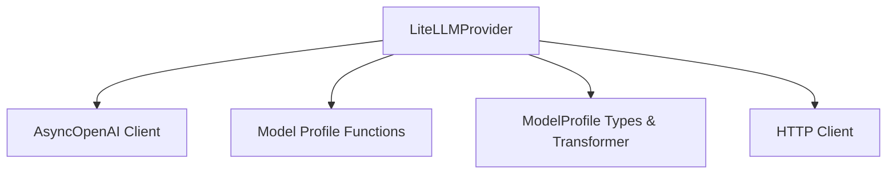

# litellm_provider Module Documentation

## Introduction

The `litellm_provider` module provides a flexible interface for integrating various Large Language Model (LLM) providers through LiteLLM, a library that simplifies accessing different LLMs using a unified API. This module leverages LiteLLM to offer a consistent interaction layer, primarily by wrapping the `AsyncOpenAI` client, thereby allowing seamless integration with components designed for OpenAI-compatible models.

## Architecture and Component Relationships

The `litellm_provider` module's core component is the `LiteLLMProvider` class. It acts as an adapter, translating requests and responses to and from LiteLLM while maintaining compatibility with the `pydantic_ai` framework's model handling. This module is part of the larger [pydantic_ai_providers module](pydantic_ai_providers.md), which aggregates different LLM providers.

### Core Components

- **`LiteLLMProvider`**: The main class responsible for configuring and interacting with the LiteLLM library. It provides properties to access its name, base URL, and the underlying `AsyncOpenAI` client.

### Component Relationships

`LiteLLMProvider` relies on several external components and modules to fulfill its functionality:

- **OpenAI Client Library (`AsyncOpenAI`)**: `LiteLLMProvider` internally uses an `AsyncOpenAI` client, which LiteLLM intercepts and routes to the appropriate backend LLM. This integration is further detailed in the [openai_model_integration module](openai_model_integration.md).
- **Model Profile Functions**: To correctly interpret and handle different LLM models, `LiteLLMProvider` utilizes various model profile functions (e.g., `anthropic_model_profile`, `google_model_profile`) to determine model-specific behaviors. These profiles are managed within the [model_profiles module](model_profiles.md).
- **ModelProfile Types & Transformer**: The module interacts with abstract model profile types, such as `ModelProfile` and `OpenAIModelProfile`, along with transformers like `OpenAIJsonSchemaTransformer`, to ensure consistent model configuration and schema handling. These types are fundamental to the [pydantic_ai_models module](pydantic_ai_models.md).
- **HTTP Client**: An underlying HTTP client is used for making network requests to the LiteLLM API, which then dispatches to the actual LLM provider endpoints.

<!-- DIAGRAM_JSON
{
    "direction": "TD",
    "nodes": [
        {"id": "litellm_provider_component", "label": "LiteLLMProvider", "type": "component", "link": null},
        {"id": "openai_client_library", "label": "AsyncOpenAI Client", "type": "external", "link": "openai_model_integration.md"},
        {"id": "model_profile_functions", "label": "Model Profile Functions", "type": "external", "link": "model_profiles.md"},
        {"id": "model_profile_types", "label": "ModelProfile Types & Transformer", "type": "external", "link": "pydantic_ai_models.md"},
        {"id": "http_client_utility", "label": "HTTP Client", "type": "external", "link": null}
    ],
    "edges": [
        {"source": "litellm_provider_component", "target": "openai_client_library"},
        {"source": "litellm_provider_component", "target": "model_profile_functions"},
        {"source": "litellm_provider_component", "target": "model_profile_types"},
        {"source": "litellm_provider_component", "target": "http_client_utility"}
    ],
    "groups": []
}
-->

## How it Fits into the Overall System

The `litellm_provider` module plays a crucial role in the `pydantic_ai` ecosystem by enabling the system to communicate with a wide array of LLM providers through a single, consistent interface. By leveraging LiteLLM, it abstracts away the complexities of integrating with different LLM APIs, allowing the `pydantic_ai` framework to remain agnostic to the underlying model provider. This makes it easier to switch between or incorporate new LLMs without significant code changes, contributing to the flexibility and extensibility of the overall system, especially for applications requiring broad LLM compatibility or dynamic model selection. It specifically falls under the [openai_compatible_providers module](openai_compatible_providers.md) as it provides an OpenAI-like interface.