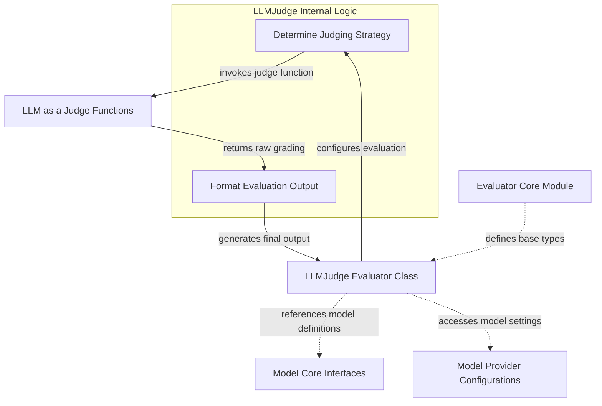

# llm_based_evaluators

The `llm_based_evaluators` module provides the `LLMJudge` component, a powerful tool for evaluating the quality of Language Model (LLM) outputs against specific criteria defined by a rubric. This module is crucial for automated quality assurance in LLM-powered applications, enabling developers to programmatically assess model performance and ensure adherence to desired standards.

## How it Works

The core of this module is the `LLMJudge` class, which acts as an `Evaluator` that leverages another LLM (the "judge" LLM) to grade the output of a target LLM. Users define a `rubric` that outlines the evaluation criteria, and the `LLMJudge` then uses this rubric to prompt a judge LLM to assess the target LLM's output.

Key functionalities include:

*   **Flexible Input Inclusion**: `LLMJudge` can be configured to include the original input, the expected output, or both, alongside the actual output when presenting information to the judge LLM. This allows for nuanced evaluations based on the available context.
*   **Configurable Judge Model**: While a default judge model is used if none is specified, users can explicitly choose a different LLM and provide specific `model_settings` for the judging process, allowing for customization and fine-tuning of the evaluation.
*   **Structured Output**: The evaluation results can be configured to include a `score`, an `assertion` (pass/fail), and a `reason` provided by the judge LLM, offering detailed insights into the evaluation outcome.
*   **Serialization Support**: The module handles the serialization of model information, ensuring that evaluation configurations can be easily stored and retrieved.

The `LLMJudge` component orchestrates the entire evaluation flow by:
1.  Receiving the `EvaluatorContext` containing the input, output, and optionally the expected output.
2.  Dynamically selecting the appropriate judging function based on whether the input and expected output should be included in the evaluation prompt. These judging functions are provided by the [llm_as_a_judge](llm_as_a_judge.md) module.
3.  Invoking the selected judging function with the relevant data, the defined `rubric`, the specified judge `model`, and any `model_settings`.
4.  Processing the raw grading output from the judge LLM to generate a structured `EvaluatorOutput` that includes scores, assertions, and reasons as configured by the user.

## Architecture

<!-- DIAGRAM_JSON
{
    "direction": "TD",
    "nodes": [
        {
            "id": "LLMJudge_component",
            "label": "LLMJudge Evaluator Class",
            "type": "component",
            "link": null
        },
        {
            "id": "determine_judge_strategy",
            "label": "Determine Judging Strategy",
            "type": "component",
            "link": null
        },
        {
            "id": "format_evaluation_output",
            "label": "Format Evaluation Output",
            "type": "component",
            "link": null
        },
        {
            "id": "EvaluatorCore_Module",
            "label": "Evaluator Core Module",
            "type": "external",
            "link": "evaluator_core.md"
        },
        {
            "id": "LLMAsAJudge_Module",
            "label": "LLM as a Judge Functions",
            "type": "external",
            "link": "llm_as_a_judge.md"
        },
        {
            "id": "ModelCoreInterfaces_Module",
            "label": "Model Core Interfaces",
            "type": "external",
            "link": "model_core_interfaces.md"
        },
        {
            "id": "ModelProviderConfigs_Module",
            "label": "Model Provider Configurations",
            "type": "external",
            "link": "model_provider_configurations.md"
        }
    ],
    "edges": [
        {
            "source": "EvaluatorCore_Module",
            "target": "LLMJudge_component",
            "label": "defines base types"
        },
        {
            "source": "LLMJudge_component",
            "target": "determine_judge_strategy",
            "label": "configures evaluation"
        },
        {
            "source": "determine_judge_strategy",
            "target": "LLMAsAJudge_Module",
            "label": "invokes judge function"
        },
        {
            "source": "LLMAsAJudge_Module",
            "target": "format_evaluation_output",
            "label": "returns raw grading"
        },
        {
            "source": "format_evaluation_output",
            "target": "LLMJudge_component",
            "label": "generates final output"
        },
        {
            "source": "LLMJudge_component",
            "target": "ModelCoreInterfaces_Module",
            "label": "references model definitions",
            "line_type": "-.->"
        },
        {
            "source": "LLMJudge_component",
            "target": "ModelProviderConfigs_Module",
            "label": "accesses model settings",
            "line_type": "-.->"
        }
    ],
    "groups": [
        {
            "id": "llm_judge_internal_logic",
            "label": "LLMJudge Internal Logic",
            "role": "control",
            "nodes": [
                "determine_judge_strategy",
                "format_evaluation_output"
            ]
        }
    ]
}
-->
