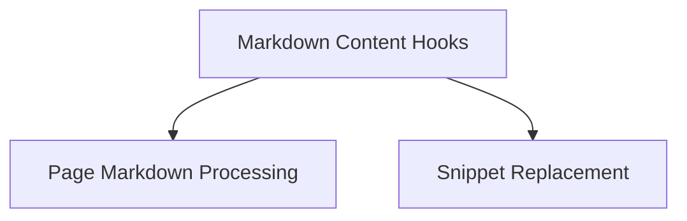

# Markdown Content Hooks

This module (`markdown_content_hooks`) provides essential hooks for manipulating and enriching markdown content during the documentation build process. It allows for dynamic content injection, markdown transformations, and the replacement of custom snippet directives, ensuring that documentation is consistent and easy to maintain.

## Architecture Overview

The `markdown_content_hooks` module orchestrates the processing of markdown files through two primary sub-modules:

<!-- DIAGRAM_JSON
{
    "direction": "TD",
    "nodes": [
        {"id": "mch", "label": "Markdown Content Hooks", "type": "module"},
        {"id": "pmp", "label": "Page Markdown Processing", "type": "module", "link": "page_markdown_processing.md"},
        {"id": "sr", "label": "Snippet Replacement", "type": "module", "link": "snippet_replacement.md"}
    ],
    "edges": [
        {"source": "mch", "target": "pmp"},
        {"source": "mch", "target": "sr"}
    ],
    "groups": []
}
-->

## Sub-modules

### [Page Markdown Processing](page_markdown_processing.md)
This sub-module focuses on the `on_page_markdown` hook, which is invoked for every markdown file. It applies a series of transformations including snippet injection, UV Python run replacements, example rendering, video embedding, and gateway toggles.

### [Snippet Replacement](snippet_replacement.md)
This sub-module is responsible for identifying and replacing custom snippet directives within markdown content. It resolves file paths, extracts specific content fragments, applies syntax highlighting, and generates appropriate titles for the embedded code blocks.