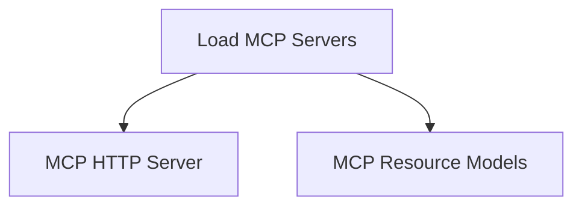

# `mcp_config_loader` Module Documentation

## Introduction

The `mcp_config_loader` module is a crucial component within the `pydantic_ai_slim` system, specifically designed to manage the loading and parsing of Multi-Config Protocol (MCP) server configurations. It provides the core functionality for initializing various types of MCP servers from a structured configuration file, enabling flexible deployment and integration of AI agents.

## Core Functionality

The primary responsibility of this module is to load and validate MCP server configurations. It abstracts the complexity of configuration parsing and environment variable resolution, presenting a ready-to-use list of server instances.

### `load_mcp_servers` Function

```python
def load_mcp_servers(config_path: str | Path) -> list[MCPServerStdio | MCPServerStreamableHTTP | MCPServerSSE]:
    # ... (see code for full implementation)
```

This function is the entry point for loading MCP server configurations. It performs the following key operations:

1.  **Path Resolution and Validation**: Ensures the provided `config_path` exists and is accessible. If not, it raises a `FileNotFoundError`.
2.  **Configuration Loading**: Reads the configuration data from the specified path, expecting a JSON format.
3.  **Environment Variable Expansion**: Dynamically expands environment variables referenced within the configuration file. It supports two syntaxes:
    *   `${VAR_NAME}`: Expands to the value of `VAR_NAME`. If `VAR_NAME` is not defined, a `ValueError` is raised.
    *   `${VAR_NAME:-default}`: Expands to the value of `VAR_NAME` if set; otherwise, it uses the provided `default` value.
4.  **Schema Validation**: Validates the loaded and expanded configuration data against the `MCPServerConfig` Pydantic schema to ensure its structural integrity and correctness. A `ValidationError` is raised if the configuration does not conform to the schema.
5.  **Server Instantiation**: Iterates through the validated server configurations, instantiating appropriate MCP server objects (`MCPServerStdio`, `MCPServerStreamableHTTP`, or `MCPServerSSE`) based on the configuration details. Each server is assigned an `id` and `tool_prefix` based on its name in the configuration.

**Parameters**:

*   `config_path` (`str | Path`): The file path to the MCP server configuration file.

**Returns**:

*   `list[MCPServerStdio | MCPServerStreamableHTTP | MCPServerSSE]`: A list of instantiated MCP server objects.

**Raises**:

*   `FileNotFoundError`: If the `config_path` does not point to an existing file.
*   `ValidationError`: If the configuration file's content does not adhere to the expected `MCPServerConfig` schema.
*   `ValueError`: If an environment variable is referenced with `${VAR_NAME}` syntax but is not defined.

## Architecture and Component Relationships

The `mcp_config_loader` module, through its `load_mcp_servers` function, acts as the central point for setting up MCP server instances. It relies on configuration definitions and the actual server implementations to fulfill its role.

<!-- DIAGRAM_JSON
{
    "direction": "TD",
    "nodes": [
        {"id": "load_mcp_servers", "label": "Load MCP Servers", "type": "component", "link": null},
        {"id": "mcp_http_server", "label": "MCP HTTP Server", "type": "external", "link": "mcp_http_server.md"},
        {"id": "mcp_resource_models", "label": "MCP Resource Models", "type": "external", "link": "mcp_resource_models.md"}
    ],
    "edges": [
        {"source": "load_mcp_servers", "target": "mcp_http_server"},
        {"source": "load_mcp_servers", "target": "mcp_resource_models"}
    ],
    "groups": []
}
-->


*   `load_mcp_servers`: This is the core function within this module, responsible for orchestrating the loading and parsing process.
*   `mcp_http_server`: This represents the various MCP server types (e.g., `MCPServerStdio`, `MCPServerStreamableHTTP`, `MCPServerSSE`) that are instantiated by the `load_mcp_servers` function. These server definitions are external to this module's direct code but are fundamental to its operation. For more details, refer to the [mcp_http_server](mcp_http_server.md) documentation.
*   `mcp_resource_models`: This module provides the Pydantic models, such as `MCPServerConfig`, which define the structure and validation rules for the MCP server configuration files. The `load_mcp_servers` function heavily relies on these schemas for data validation. For more details, refer to the [mcp_resource_models](mcp_resource_models.md) documentation.

## How it Fits into the Overall System

The `mcp_config_loader` module is a foundational piece of the `pydantic_ai_slim` system's Multi-Config Protocol (MCP) integration. It serves as the initial setup layer for any application or service that needs to interact with or expose functionalities via MCP servers.

By centralizing the configuration loading logic, it ensures that all MCP server instances across the system are consistently initialized and properly configured. This module enables the dynamic scaling and management of AI capabilities by allowing new MCP servers to be brought online simply by updating a configuration file. Its robust environment variable expansion capabilities further enhance flexibility, allowing deployments to be easily adapted to different environments without code changes.

It is typically invoked during application startup to prepare the necessary MCP server instances, which then become available for other modules within the `pydantic_ai_slim` framework to interact with, facilitating inter-process communication and tool execution for AI agents. This module is a direct sub-module of [mcp_integration](mcp_integration.md).