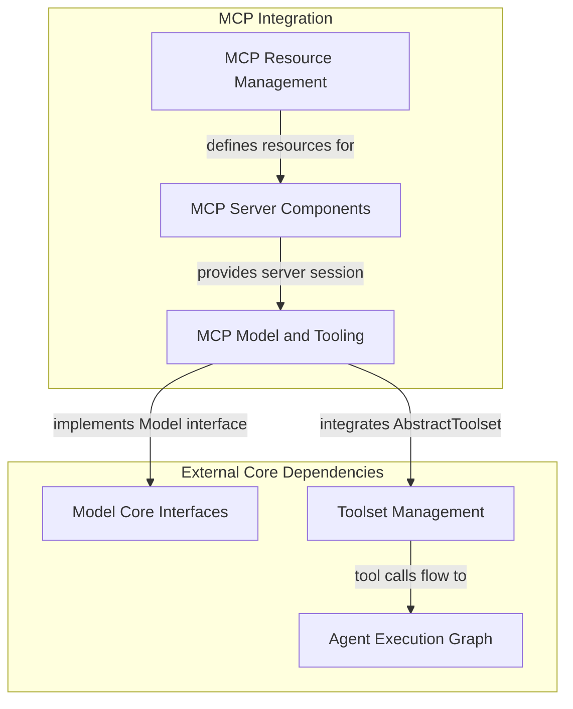

# MCP Core Module Documentation

## Introduction and Purpose

The `mcp_core` module is central to integrating the Model Context Protocol (MCP) within Pydantic-AI. It provides the foundational components for communicating with MCP servers, managing resources, and enabling agents to leverage MCP-compliant models and toolsets. This module is critical for extending the capabilities of Pydantic-AI agents to distributed and external services through the MCP specification, facilitating robust and scalable AI application development.

## Architecture Overview

The `mcp_core` module is structured into three main sub-modules, each handling a specific aspect of MCP integration: server management, resource definition, and model/toolset interaction. These sub-modules work together to enable seamless communication with MCP servers, allowing agents to utilize external models and tools efficiently.

<!-- DIAGRAM_JSON
{
    "direction": "TD",
    "nodes": [
        {"id": "mcp_server_components", "label": "MCP Server Components", "type": "module", "link": "mcp_server_components.md"},
        {"id": "mcp_resource_management", "label": "MCP Resource Management", "type": "module", "link": "mcp_resource_management.md"},
        {"id": "mcp_model_and_tooling", "label": "MCP Model and Tooling", "type": "module", "link": "mcp_model_and_tooling.md"},
        {"id": "model_core_interfaces", "label": "Model Core Interfaces", "type": "external", "link": "model_core_interfaces.md"},
        {"id": "toolset_management", "label": "Toolset Management", "type": "external", "link": "toolset_management.md"},
        {"id": "agent_execution_graph", "label": "Agent Execution Graph", "type": "external", "link": "agent_execution_graph.md"}
    ],
    "edges": [
        {"source": "mcp_server_components", "target": "mcp_model_and_tooling", "label": "provides server session"},
        {"source": "mcp_resource_management", "target": "mcp_server_components", "label": "defines resources for"},
        {"source": "mcp_model_and_tooling", "target": "model_core_interfaces", "label": "implements Model interface"},
        {"source": "mcp_model_and_tooling", "target": "toolset_management", "label": "integrates AbstractToolset"},
        {"source": "toolset_management", "target": "agent_execution_graph", "label": "tool calls flow to"}
    ],
    "groups": [
        {
            "id": "mcp_integration",
            "label": "MCP Integration",
            "role": "generative",
            "nodes": ["mcp_server_components", "mcp_resource_management", "mcp_model_and_tooling"]
        },
        {
            "id": "external_dependencies",
            "label": "External Core",
            "role": "generative",
            "nodes": ["model_core_interfaces", "toolset_management", "agent_execution_graph"]
        }
    ]
}
-->

### High-Level Functionality

Each sub-module within `mcp_core` plays a distinct role in enabling MCP integration:

*   **[MCP Server Components](mcp_server_components.md)**: This sub-module focuses on establishing and managing connections with MCP servers. It includes implementations for HTTP-based Server-Sent Events (SSE) transport and utilities for loading server configurations from files, allowing flexible deployment and configuration of MCP interactions.

*   **[MCP Resource Management](mcp_resource_management.md)**: This sub-module defines the structures for `Resource` and `ResourceTemplate`, which are fundamental for describing and interacting with data available on MCP servers. It provides the means to specify parameters for dynamic resources and to convert between Pydantic-AI's internal representations and the MCP SDK's resource types.

*   **[MCP Model and Tooling](mcp_model_and_tooling.md)**: This sub-module integrates MCP Sampling models and the FastMCP Toolset. It enables Pydantic-AI agents to interact with models that leverage MCP Sampling for requests and to utilize tools provided by FastMCP servers, thereby extending the agent's capabilities to a wide range of external services and functionalities.

### Connection to Other Modules

The `mcp_core` module integrates with several other key modules in the Pydantic-AI ecosystem:

*   **[Model Core Interfaces](model_core_interfaces.md)**: The `MCPSamplingModel` adheres to the `Model` interface defined in `model_core_interfaces`, ensuring that MCP-based models can be seamlessly used wherever Pydantic-AI models are expected.

*   **[Toolset Management](toolset_management.md)**: The `FastMCPToolset` integrates with the `toolset_management` module, allowing MCP-provided tools to be discovered, managed, and invoked by Pydantic-AI agents. This enables agents to leverage external capabilities provided by MCP servers.

*   **[Agent Execution Graph](agent_execution_graph.md)**: The tools exposed through the `FastMCPToolset` are ultimately executed within the `agent_execution_graph`, where `handle_call_or_result` and `_call_tool` components manage their invocation and response handling.
