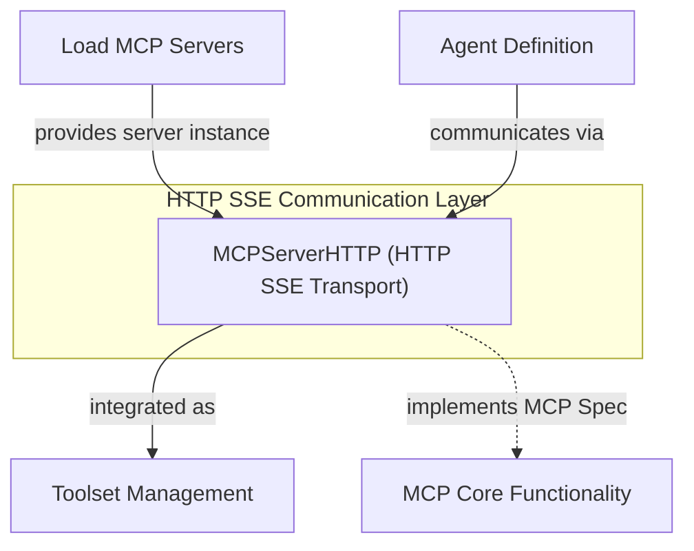

# `mcp_http_server`

The `mcp_http_server` module provides the foundational components for establishing HTTP-based Server-Sent Events (SSE) communication within the Model Context Protocol (MCP) ecosystem. This module is critical for enabling agents to interact with MCP servers using a standard HTTP transport layer, ensuring robust and real-time data exchange.

### Comprehensive Documentation

The core of this module is the `MCPServerHTTP` class, which extends `MCPServerSSE` (indicating its role in handling Server-Sent Events). It's designed to implement the SSE transport mechanism as defined by the MCP specification. This class acts as a client-side component, allowing `Agent` instances to connect to an already running MCP server via HTTP SSE.

From a user's perspective, `MCPServerHTTP` simplifies the integration of agents with MCP servers. Developers can instantiate `MCPServerHTTP` with the server's SSE endpoint and then include this server instance as a toolset within their `Agent` definition. This setup enables the agent to send and receive messages, execute tools, and participate in the broader MCP communication flow over a persistent HTTP connection.

The module integrates closely with the `agent_definition` module, as `MCPServerHTTP` instances are typically passed into an `Agent` as part of its `toolsets`. It also relies on the broader `mcp_core` functionality, adhering to the Model Context Protocol specification for its communication patterns. The `mcp_server_loader` module would typically be responsible for loading and managing instances of `MCPServerHTTP` or similar server components.

<!-- DIAGRAM_JSON
{
    "direction": "TD",
    "nodes": [
        {
            "id": "mcp_http_server_component",
            "label": "MCPServerHTTP (HTTP SSE Transport)",
            "type": "component",
            "link": null
        },
        {
            "id": "mcp_server_loader",
            "label": "Load MCP Servers",
            "type": "external",
            "link": "mcp_server_loader.md"
        },
        {
            "id": "agent_definition",
            "label": "Agent Definition",
            "type": "external",
            "link": "agent_definition.md"
        },
        {
            "id": "toolset_management",
            "label": "Toolset Management",
            "type": "external",
            "link": "toolset_management.md"
        },
        {
            "id": "mcp_core",
            "label": "MCP Core Functionality",
            "type": "external",
            "link": "mcp_core.md"
        }
    ],
    "edges": [
        {
            "source": "mcp_server_loader",
            "target": "mcp_http_server_component",
            "label": "provides server instance"
        },
        {
            "source": "mcp_http_server_component",
            "target": "toolset_management",
            "label": "integrated as"
        },
        {
            "source": "agent_definition",
            "target": "mcp_http_server_component",
            "label": "communicates via"
        },
        {
            "source": "mcp_http_server_component",
            "target": "mcp_core",
            "label": "implements MCP Spec"
        }
    ],
    "groups": [
        {
            "id": "http_communication_layer",
            "label": "HTTP SSE Communication Layer",
            "role": "technical",
            "nodes": [
                "mcp_http_server_component"
            ]
        }
    ]
}
-->
