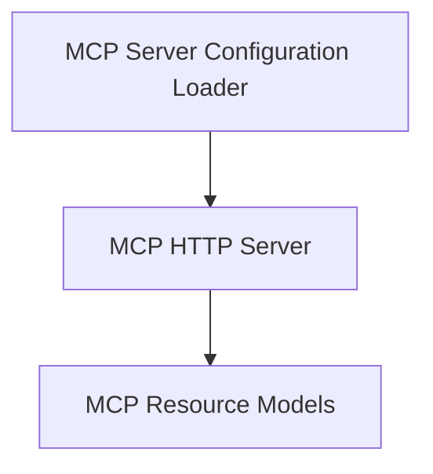

# MCP Integration Module

The `mcp_integration` module provides essential components for interacting with the Model Context Protocol (MCP) servers. It includes functionalities for setting up HTTP-based MCP servers, loading server configurations, and defining data models for MCP resources.

## Architecture

The following diagram illustrates the high-level architecture and relationships within the `mcp_integration` module:

<!-- DIAGRAM_JSON
{
    "direction": "TD",
    "nodes": [
        {"id": "mcp_http_server", "label": "MCP HTTP Server", "type": "module", "link": "mcp_http_server.md"},
        {"id": "mcp_config_loader", "label": "MCP Server Configuration Loader", "type": "module", "link": "mcp_config_loader.md"},
        {"id": "mcp_resource_models", "label": "MCP Resource Models", "type": "module", "link": "mcp_resource_models.md"}
    ],
    "edges": [
        {"source": "mcp_config_loader", "target": "mcp_http_server"},
        {"source": "mcp_http_server", "target": "mcp_resource_models"}
    ],
    "groups": []
}
-->

## Module Components

This module is composed of the following sub-modules:

*   ### [MCP HTTP Server](mcp_http_server.md)
    Implements the HTTP-based Server-Sent Events (SSE) transport for the Model Context Protocol (MCP).

*   ### [MCP Server Configuration Loader](mcp_config_loader.md)
    Handles loading and parsing of MCP server configurations from files, including environment variable expansion.

*   ### [MCP Resource Models](mcp_resource_models.md)
    Defines the data models for MCP resources and resource templates, facilitating interaction with MCP servers.
