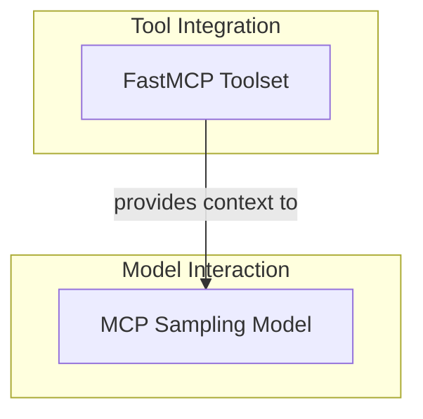

# MCP Model and Tooling

## Introduction
The `mcp_model_and_tooling` module provides fundamental components for integrating Pydantic-AI agents with the Model Context Protocol (MCP). This integration allows agents to leverage advanced model sampling capabilities and execute tools defined on local or remote MCP servers. It forms a crucial part of building intelligent agents that can interact with external systems and utilize flexible model inference strategies.

## Architecture Overview

<!-- DIAGRAM_JSON
{
    "direction": "TD",
    "nodes": [
        {
            "id": "mcp_model_and_tooling",
            "label": "MCP Model and Tooling",
            "type": "module"
        },
        {
            "id": "mcp_sampling_model",
            "label": "MCP Sampling Model",
            "type": "module",
            "link": "mcp_sampling_model.md"
        },
        {
            "id": "fastmcp_toolset",
            "label": "FastMCP Toolset",
            "type": "module",
            "link": "fastmcp_toolset.md"
        }
    ],
    "edges": [
        {
            "source": "fastmcp_toolset",
            "target": "mcp_sampling_model",
            "label": "provides context to"
        }
    ],
    "groups": [
        {
            "id": "model_interaction",
            "label": "Model Interaction",
            "role": "generative",
            "nodes": [
                "mcp_sampling_model"
            ]
        },
        {
            "id": "tool_integration",
            "label": "Tool Integration",
            "role": "surface",
            "nodes": [
                "fastmcp_toolset"
            ]
        }
    ]
}
-->

## Sub-modules

### [MCP Sampling Model](mcp_sampling_model.md)
This sub-module defines the `MCPSamplingModel`, a specialized Pydantic-AI model that interacts with MCP servers for model inference. It allows for flexible model requests where the MCP server can call back to the client for sampling.

### [FastMCP Toolset Integration](fastmcp_toolset.md)
This sub-module provides the `FastMCPToolset`, which enables Pydantic-AI agents to dynamically discover and execute tools exposed by local or remote FastMCP servers. It handles tool definition, execution, and error handling for robust agent operation.
