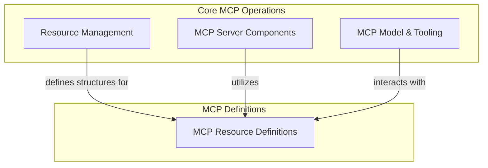

# MCP Resource Definitions

## Introduction and Purpose

The `mcp_resource_definitions` module is a core component within the Model Context Protocol (MCP) ecosystem, responsible for defining the fundamental structures for resources and resource templates. It provides the standardized data models, `Resource` and `ResourceTemplate`, which are essential for describing content accessible via an MCP server. This module ensures consistency and interoperability when exchanging resource information across different MCP components and clients.

These definitions are crucial for:
- **Standardized Resource Representation**: Providing a consistent way to describe data assets, including their URI, size, MIME type, and metadata.
- **Parameterized Resource Handling**: Enabling the definition of resource templates for dynamically generated or parameterized resources.
- **Interoperability**: Facilitating seamless communication and data exchange between MCP clients and servers by adhering to the MCP specification.

## Architecture Overview

The `mcp_resource_definitions` module sits within the broader [mcp_core.md](mcp_core.md) module, specifically as part of [mcp_resource_management.md](mcp_resource_management.md). It defines the data structures that are utilized by other MCP components, such as those responsible for serving and loading MCP resources.

The primary components of this module are:
- **`Resource`**: Represents a specific, addressable resource available through an MCP server.
- **`ResourceTemplate`**: Defines a pattern for constructing resource URIs, allowing for dynamic resource generation or identification.

These definitions are consumed by components in the [mcp_server_components.md](mcp_server_components.md) module to handle incoming requests and serve content, ensuring that all resources conform to the established MCP specification.

<!-- DIAGRAM_JSON
{
    "direction": "TD",
    "nodes": [
        {"id": "mcp_resource_definitions", "label": "MCP Resource Definitions", "type": "module", "link": "mcp_resource_definitions.md"},
        {"id": "mcp_resource_management", "label": "Resource Management", "type": "module", "link": "mcp_resource_management.md"},
        {"id": "mcp_server_components", "label": "MCP Server Components", "type": "module", "link": "mcp_server_components.md"},
        {"id": "mcp_model_and_tooling", "label": "MCP Model & Tooling", "type": "module", "link": "mcp_model_and_tooling.md"}
    ],
    "edges": [
        {"source": "mcp_resource_management", "target": "mcp_resource_definitions", "label": "defines structures for"},
        {"source": "mcp_server_components", "target": "mcp_resource_definitions", "label": "utilizes"},
        {"source": "mcp_model_and_tooling", "target": "mcp_resource_definitions", "label": "interacts with"}
    ],
    "groups": [
        {
            "id": "mcp_definitions",
            "label": "MCP Definitions",
            "role": "data",
            "nodes": ["mcp_resource_definitions"]
        },
        {
            "id": "mcp_core_operations",
            "label": "Core MCP Operations",
            "role": "generative",
            "nodes": ["mcp_resource_management", "mcp_server_components", "mcp_model_and_tooling"]
        }
    ]
}
-->

## High-Level Functionality

### Resource

The `Resource` class represents a singular, identifiable data entity within the MCP. It includes fields such as `uri` (the unique identifier), `size` (content size in bytes), `mime_type`, and associated `metadata` and `annotations`. This class provides a `from_mcp_sdk` class method to convert an MCP SDK `Resource` object into the PydanticAI `Resource` format, ensuring compatibility and ease of integration.

### ResourceTemplate

The `ResourceTemplate` class defines a blueprint for generating `Resource` URIs. It uses a `uri_template` (following RFC 6570) to describe how resource URIs can be constructed, allowing for flexible and parameterized access to resources. Like the `Resource` class, it includes descriptive fields and a `from_mcp_sdk` class method for converting from the MCP SDK `ResourceTemplate` object. This enables dynamic resource discovery and access patterns within the MCP.