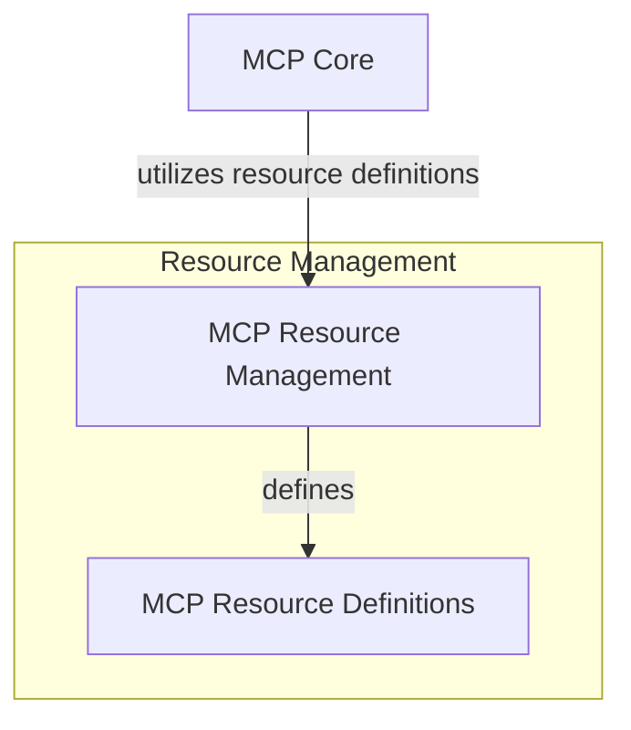

# MCP Resource Management

The `mcp_resource_management` module is crucial for defining and managing resources and resource templates within the Model Context Protocol (MCP) framework. It provides the foundational data structures for interacting with an MCP server, ensuring that models can exchange contextual information effectively.

## Architecture Overview

This module defines the core structures for MCP resources. It integrates closely with the broader [mcp_core](mcp_core.md) module, which handles server interactions and overall MCP management. The `mcp_resource_management` module provides the data models that `mcp_core` utilizes when dealing with individual resources.

<!-- DIAGRAM_JSON
{
    "direction": "TD",
    "nodes": [
        {"id": "mcp_resource_management_module", "label": "MCP Resource Management", "type": "module", "link": "mcp_resource_management.md"},
        {"id": "mcp_core_module", "label": "MCP Core", "type": "external", "link": "mcp_core.md"},
        {"id": "mcp_resource_definitions", "label": "MCP Resource Definitions", "type": "module", "link": "mcp_resource_definitions.md"}
    ],
    "edges": [
        {"source": "mcp_core_module", "target": "mcp_resource_management_module", "label": "utilizes resource definitions"},
        {"source": "mcp_resource_management_module", "target": "mcp_resource_definitions", "label": "defines"}
    ],
    "groups": [
        {
            "id": "resource_management_group",
            "label": "Resource Management",
            "role": "data",
            "nodes": ["mcp_resource_management_module", "mcp_resource_definitions"]
        },
        {
            "id": "core_mcp_group",
            "label": "Core MCP Functionality",
            "role": "generative",
            "nodes": ["mcp_core_module"]
        }
    ]
}
-->

## Sub-modules

*   ### [MCP Resource Definitions](mcp_resource_definitions.md)
    This sub-module defines the fundamental `Resource` and `ResourceTemplate` classes, which are essential for describing data and parameterized data sources on an MCP server. These definitions enable the system to understand and interact with various types of content exchanged via the Model Context Protocol.