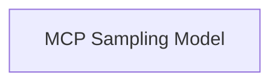

<!-- AUTO_GENERATED_PLACEHOLDER
  reason: LLM did not create .md file for this module
  module_path: pydantic_ai_agent_core/mcp_core/mcp_model_and_tooling/mcp_sampling_model
  component_count: 1
  generated_at: 2026-04-06T06:47:34.936839
  TODO: Fix LLM prompt to handle small leaf modules
-->

# MCP Sampling Model

> ⚠️ **Auto-Generated Placeholder**
> This documentation was auto-generated because the LLM failed to create it.
> Module path: `pydantic_ai_agent_core/mcp_core/mcp_model_and_tooling/mcp_sampling_model`

Implements a Pydantic-AI model that leverages MCP (Model Context Protocol) sampling for model requests, allowing an MCP server to call back to the client.

## Components

This module contains 1 component(s):

- `pydantic_ai_slim.pydantic_ai.models.mcp_sampling.MCPSamplingModel`

## Structure

---
*Auto-generated placeholder. See sync_issues.json for details.*
