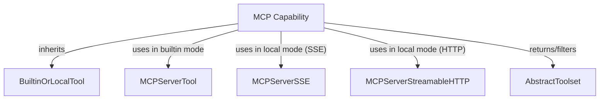

# `mcp_server_capability`

The following is a comprehensive documentation for the `mcp_server_capability` module.

# `mcp_server_capability`

The `mcp_server_capability` module provides the core functionality for integrating and managing Multi-Capability Protocol (MCP) servers within the system. It abstracts the complexities of connecting to and interacting with MCP servers, offering both built-in model support and direct HTTP connectivity.

## Purpose and Core Functionality

The primary purpose of the `mcp_server_capability` module, embodied by the `MCP` class, is to enable agents to interact with external services exposed via the Multi-Capability Protocol. It can utilize either a model's native MCP server capabilities or establish a direct HTTP connection to an MCP server when built-in support is unavailable or undesired. It provides robust configuration options for URL, authorization, headers, and tool filtering, ensuring flexible and secure integration with various MCP server implementations.

## Architecture and Component Relationships

The `mcp_server_capability` module, specifically the `MCP` class, is built upon the `BuiltinOrLocalTool` abstraction, allowing it to function as both an internal capability and a gateway to external tools. It dynamically resolves its connection method, either instantiating a `MCPServerTool` for built-in model integration or utilizing `MCPServerSSE` or `MCPServerStreamableHTTP` for direct HTTP communication, depending on the server's endpoint characteristics. The module then manages the lifecycle and filtering of the provided tools, returning an an `AbstractToolset` that can be used by the agent.

<!-- DIAGRAM_JSON
{
    "direction": "TD",
    "nodes": [
        {"id": "mcp_capability", "label": "MCP Capability", "type": "component", "link": null},
        {"id": "builtin_or_local_tool", "label": "BuiltinOrLocalTool", "type": "external", "link": "builtin_local_tool_handler.md"},
        {"id": "mcp_server_tool", "label": "MCPServerTool", "type": "external", "link": "builtin_local_tool_handler.md"},
        {"id": "mcp_server_sse", "label": "MCPServerSSE", "type": "external", "link": "pydantic_ai_misc.md"},
        {"id": "mcp_server_streamable_http", "label": "MCPServerStreamableHTTP", "type": "external", "link": "pydantic_ai_misc.md"},
        {"id": "abstract_toolset", "label": "AbstractToolset", "type": "external", "link": "pydantic_ai_tools.md"}
    ],
    "edges": [
        {"source": "mcp_capability", "target": "builtin_or_local_tool", "label": "inherits"},
        {"source": "mcp_capability", "target": "mcp_server_tool", "label": "uses in builtin mode"},
        {"source": "mcp_capability", "target": "mcp_server_sse", "label": "uses in local mode (SSE)"},
        {"source": "mcp_capability", "target": "mcp_server_streamable_http", "label": "uses in local mode (HTTP)"},
        {"source": "mcp_capability", "target": "abstract_toolset", "label": "returns/filters"}
    ],
    "groups": []
}
-->

### Component Breakdown

*   **`MCP` (Component)**: The central class of this module. It manages the configuration and connection logic for MCP servers, adapting its behavior based on whether a built-in or local connection is preferred.

### External Dependencies

*   **`BuiltinOrLocalTool` (from `builtin_local_tool_handler`)**: The `MCP` class extends `BuiltinOrLocalTool`, inheriting its fundamental capabilities for handling tools that can be either natively supported or provided as local implementations. For more details, refer to the [builtin_local_tool_handler documentation](builtin_local_tool_handler.md).
*   **`MCPServerTool` (from `builtin_local_tool_handler` or related tool definition)**: This represents a specialized tool object used when the MCP server is integrated through a model's built-in capabilities. It's constructed by `MCP` to define the parameters for this built-in interaction.
*   **`MCPServerSSE`, `MCPServerStreamableHTTP` (from `pydantic_ai_misc`)**: These classes are used by `MCP` to establish direct HTTP connections to MCP servers when a local connection is utilized. `MCPServerSSE` is employed for Server-Sent Events endpoints, while `MCPServerStreamableHTTP` handles general streamable HTTP interactions. More information can be found in the [pydantic_ai_misc documentation](pydantic_ai_misc.md).
*   **`AbstractToolset` (from `pydantic_ai_tools`)**: The `MCP` class ultimately provides its functionalities through an `AbstractToolset` instance, which represents a collection of tools available from the MCP server. This toolset can be further filtered based on `allowed_tools` specified in the `MCP` configuration. For more details, refer to the [pydantic_ai_tools documentation](pydantic_ai_tools.md).

## How the Module Fits into the Overall System

The `mcp_server_capability` module is a crucial part of the `pydantic_ai_capabilities` package, specifically within the `tool_integrations` sub-module. It empowers the larger Pydantic AI system by providing a standardized and flexible mechanism to interact with external services that adhere to the MCP. This allows agents to extend their functionalities beyond their inherent capabilities, by seamlessly integrating various tools and services hosted on MCP servers. It plays a vital role in enabling agents to perform complex tasks that require interaction with diverse external resources, such as code execution environments, data sources, or specialized processing units.
The `MCP` class's ability to switch between built-in and local modes ensures adaptability across different model providers and deployment environments.
The integration with `AbstractToolset` ensures that the tools exposed by an MCP server are presented in a consistent manner to the rest of the Pydantic AI framework, allowing for uniform tool invocation and management.