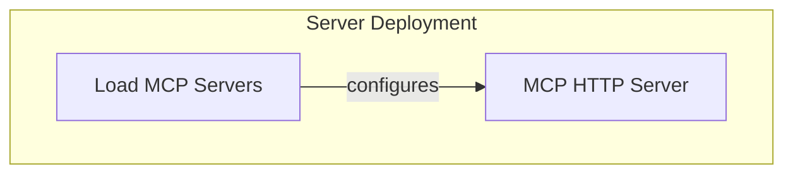

# MCP Server Components

The `mcp_server_components` module is responsible for providing the foundational elements to establish and manage Model Context Protocol (MCP) servers within the system. It enables agents to communicate with external MCP-compliant services, facilitating complex interactions and tool usage.

This module primarily focuses on the HTTP-based implementation of the MCP server, allowing for integration with various environments, and provides utilities for loading server configurations.

## Architecture Overview

The `mcp_server_components` module integrates with the broader MCP ecosystem and leverages configuration files to define server instances. The core components work together to provide a robust mechanism for agent-to-server communication.

<!-- DIAGRAM_JSON
{
    "direction": "TD",
    "nodes": [
        {
            "id": "mcp_server_components",
            "label": "MCP Server Components",
            "type": "module"
        },
        {
            "id": "mcp_http_server",
            "label": "MCP HTTP Server",
            "type": "module",
            "link": "mcp_http_server.md"
        },
        {
            "id": "mcp_server_loader",
            "label": "MCP Server Configuration Loader",
            "type": "module",
            "link": "mcp_server_loader.md"
        }
    ],
    "edges": [
        {
            "source": "mcp_server_loader",
            "target": "mcp_http_server",
            "label": "configures"
        }
    ],
    "groups": [
        {
            "id": "server_deployment",
            "label": "Server Deployment",
            "role": "generative",
            "nodes": [
                "mcp_http_server",
                "mcp_server_loader"
            ]
        }
    ]
}
-->

## Sub-modules

*   **[MCP HTTP Server](mcp_http_server.md)**: Implements the Model Context Protocol (MCP) server over HTTP using Server-Sent Events (SSE) for agent communication.
*   **[MCP Server Configuration Loader](mcp_server_loader.md)**: Handles loading and validating MCP server configurations from files, including environment variable expansion.
