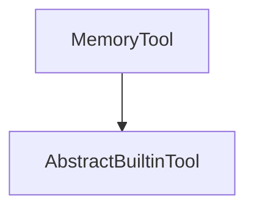

# Memory Tool Module

## Introduction

The `memory_tool` module provides agents with the fundamental capability to manage and utilize memory during their operations. This built-in tool allows agents to store relevant information and recall it when needed, enabling more coherent and context-aware interactions. It is designed as a core component for intelligent agents requiring statefulness.

## Purpose and Core Functionality

The primary purpose of the `MemoryTool` is to offer a standardized interface for agents to interact with an internal memory system. By integrating this tool, agents can:

*   **Store Information:** Persist data or conversational context that needs to be remembered across turns or tasks.
*   **Retrieve Information:** Access previously stored data to inform subsequent actions or responses.
*   **Maintain Context:** Help the agent maintain a consistent understanding of ongoing interactions or tasks by recalling past events or details.

The `MemoryTool` is specifically supported by models like Anthropic, ensuring compatibility and optimized performance within those environments.

## Architecture and Component Relationships

The `memory_tool` module is straightforward, primarily encapsulating the `MemoryTool` class. This class inherits from `AbstractBuiltinTool`, establishing a clear hierarchical relationship and ensuring adherence to the conventions defined for all built-in tools within the system.

```python
class MemoryTool(AbstractBuiltinTool):
    """A builtin tool that allows your agent to use memory.

    Supported by:

    * Anthropic
    """

    kind: str = 'memory'
    """The kind of tool."""
```

## How the Module Fits into the Overall System

The `memory_tool` module is an integral part of the larger [pydantic_ai_tools](pydantic_ai_tools.md) ecosystem, specifically categorized under [builtin_tools](builtin_tools.md). Agents defined within the [pydantic_ai_agent_core](pydantic_ai_agent_core.md) module can leverage the `MemoryTool` to enhance their capabilities by providing persistent memory. This allows for the development of more sophisticated agents that can engage in longer, more complex interactions without losing context. Its integration is seamless, providing a crucial building block for advanced agent behaviors.

<!-- DIAGRAM_JSON
{
    "direction": "TD",
    "nodes": [
        {"id": "MemoryTool", "label": "MemoryTool", "type": "component", "link": null},
        {"id": "AbstractBuiltinTool", "label": "AbstractBuiltinTool", "type": "external", "link": "pydantic_ai_tools.md"}
    ],
    "edges": [
        {"source": "MemoryTool", "target": "AbstractBuiltinTool"}
    ],
    "groups": []
}
-->

