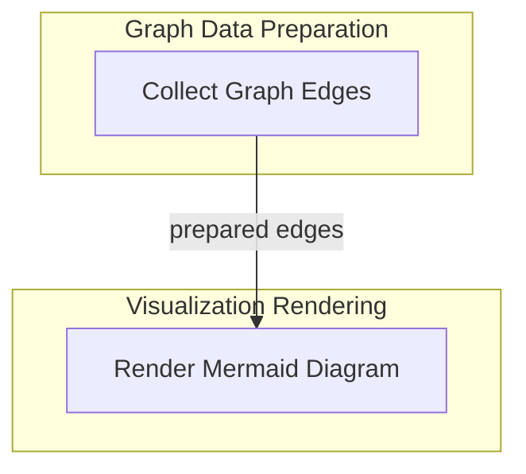

# Mermaid Graph Rendering Module

## Introduction and Purpose

The `mermaid_graph_rendering` module is a crucial component within the `pydantic_ai_agent_core` system, specifically designed for visualizing complex Pydantic graphs. Its primary purpose is to convert an internal representation of a graph, composed of nodes and edges, into a Mermaid diagram syntax. This enables developers and users to easily understand the structure and flow of agents and their interactions through human-readable and visually appealing diagrams.

This module plays a vital role in debugging, documentation, and overall comprehension of the agent's internal workings, providing a clear visual representation of the agent's execution flow and dependencies.

## Architecture Overview

The `mermaid_graph_rendering` module is composed of two main sub-modules: `edge_collection` and `graph_renderer`. The `edge_collection` sub-module is responsible for identifying and organizing the various connections (edges) within the Pydantic graph structure. Once these edges are collected, the `graph_renderer` sub-module takes this information, along with node details, and translates it into the Mermaid diagram language. This separation of concerns ensures that the process of identifying graph relationships is distinct from the process of rendering the visual output.

The `edge_collection` prepares the necessary graph data, which is then consumed by the `graph_renderer` to produce the final Mermaid diagram code, allowing for flexible and extensible visualization capabilities.

## High-level Functionality of Sub-modules

*   **[Edge Collection Logic](edge_collection.md)**: This sub-module focuses on gathering and structuring the edges of the graph from its internal representation. It interprets various path markers and destinations to correctly identify connections between graph nodes.
*   **[Mermaid Graph Renderer](graph_renderer.md)**: This sub-module is responsible for the actual generation of the Mermaid diagram code. It takes the collected nodes and edges, applies topological sorting, and formats them into the `stateDiagram-v2` syntax, including special handling for different node types and edge labels.

<!-- DIAGRAM_JSON
{
    "direction": "TD",
    "nodes": [
        {"id": "edge_collection", "label": "Collect Graph Edges", "type": "module", "link": "edge_collection.md"},
        {"id": "graph_renderer", "label": "Render Mermaid Diagram", "type": "module", "link": "graph_renderer.md"}
    ],
    "edges": [
        {"source": "edge_collection", "target": "graph_renderer", "label": "prepared edges"}
    ],
    "groups": [
        {
            "id": "graph_data_preparation",
            "label": "Graph Data Preparation",
            "role": "analytical",
            "nodes": ["edge_collection"]
        },
        {
            "id": "visualization_rendering",
            "label": "Visualization Rendering",
            "role": "generative",
            "nodes": ["graph_renderer"]
        }
    ]
}
-->

