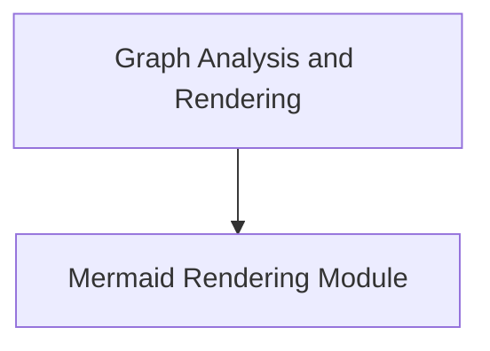

# Mermaid Rendering Module

## Introduction
The `mermaid_rendering` module is a vital part of the `pydantic_graph` library, specifically designed for visualizing complex graph structures using Mermaid syntax. It provides functionalities to transform internal graph representations into human-readable and renderable Mermaid diagrams, aiding in debugging, documentation, and understanding the flow of data and operations within a graph.

## Architecture Overview
This module primarily consists of two core components: `_collect_edges` and `MermaidGraph`. The `_collect_edges` function is responsible for parsing paths within the graph structure to identify and collect all relevant edges, including their source, destination, and any associated labels. The `MermaidGraph` class then takes these collected nodes and edges and orchestrates their rendering into a complete Mermaid state diagram. It handles different node types (steps, joins, broadcasts, decisions) and special start/end nodes, generating a well-formatted Mermaid diagram string.

<!-- DIAGRAM_JSON
{
    "direction": "TD",
    "nodes": [
        {"id": "mermaid_rendering", "label": "Mermaid Rendering Module", "type": "module", "link": "mermaid_rendering.md"},
        {"id": "graph_analysis_and_rendering", "label": "Graph Analysis and Rendering", "type": "module", "link": "graph_analysis_and_rendering.md"}
    ],
    "edges": [
        {"source": "graph_analysis_and_rendering", "target": "mermaid_rendering"}
    ],
    "groups": []
}
-->

## Core Functionality

### `_collect_edges`
The `_collect_edges` function is a helper responsible for traversing a given `Path` object and extracting all directed edges within it. It iterates through the items in the path, identifying `LabelMarker` for edge labels and `DestinationMarker` to determine the end of an edge. The function then records these edges, associating them with their source and destination node IDs and any collected labels. This process is crucial for building a comprehensive list of connections that the `MermaidGraph` can later render.

### `MermaidGraph`
The `MermaidGraph` class is the central component for generating the Mermaid state diagram. It encapsulates the list of `MermaidNode` and `MermaidEdge` objects that define the graph.

-   **Attributes**:
    -   `nodes`: A list of `MermaidNode` objects representing the various entities in the graph (e.g., steps, joins, decisions).
    -   `edges`: A list of `MermaidEdge` objects detailing the connections between nodes, including source, destination, and optional labels.
    -   `title`: An optional title for the generated Mermaid diagram.
    -   `direction`: An optional direction for the state diagram (e.g., `TD` for top-down).

-   **`render` method**:
    This method is responsible for constructing the final Mermaid diagram string. It performs the following key actions:
    1.  Initializes the Mermaid diagram with an optional title and specifies `stateDiagram-v2` syntax.
    2.  Applies a topological sort to the nodes and edges to ensure a logical rendering order.
    3.  Iterates through the sorted nodes, generating the appropriate Mermaid syntax for each node type (e.g., `state node_id <<join>>` for join nodes, `state node_id <<choice>>` for decision nodes). Special handling is provided for start (`[*]`) and end (`[*]`) nodes.
    4.  Iterates through the sorted edges, creating `source_id --> destination_id` connections. If `edge_labels` is enabled, any associated edge labels are included in the diagram.
    5.  Returns the complete Mermaid diagram as a single string.
