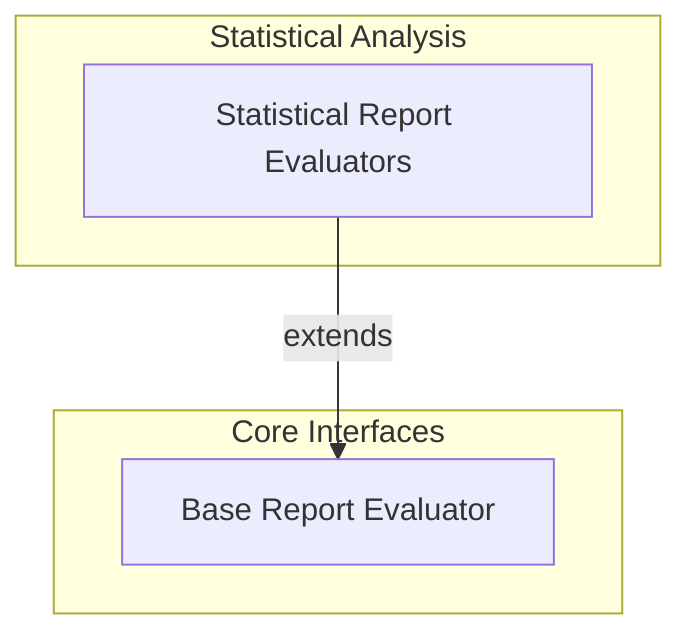

# Metric Evaluators

The `metric_evaluators` module is a fundamental component of the [pydantic_evals_framework](pydantic_evals_framework.md), providing a robust set of tools for performing experiment-wide statistical analysis and reporting on evaluation results. Unlike evaluators that assess individual cases, this module focuses on aggregating and interpreting data across an entire evaluation report to offer comprehensive insights into system performance. It is critical for understanding metrics such as classification performance, statistical distributions, and overall model effectiveness.

## Architecture

The `metric_evaluators` module is organized into a core base interface and specialized implementations for various statistical analyses. This design promotes extensibility and ensures a clear separation of concerns.

<!-- DIAGRAM_JSON
{
    "direction": "TD",
    "nodes": [
        {
            "id": "metric_evaluators",
            "label": "Metric Evaluators",
            "type": "module"
        },
        {
            "id": "base_report_evaluator",
            "label": "Base Report Evaluator",
            "type": "module",
            "link": "base_report_evaluator.md"
        },
        {
            "id": "statistical_report_evaluators",
            "label": "Statistical Report Evaluators",
            "type": "module",
            "link": "statistical_report_evaluators.md"
        }
    ],
    "edges": [
        {
            "source": "statistical_report_evaluators",
            "target": "base_report_evaluator",
            "label": "extends"
        }
    ],
    "groups": [
        {
            "id": "core_interfaces",
            "label": "Core Interfaces",
            "role": "generative",
            "nodes": [
                "base_report_evaluator"
            ]
        },
        {
            "id": "statistical_analysis",
            "label": "Statistical Analysis",
            "role": "analytical",
            "nodes": [
                "statistical_report_evaluators"
            ]
        }
    ]
}
-->

## Sub-modules

### [Base Report Evaluator](base_report_evaluator.md)
This sub-module defines the `ReportEvaluator` abstract class, serving as the foundational interface for all experiment-wide evaluators. It outlines the contract for processing a complete evaluation report context and generating one or more `ReportAnalysis` results, enabling consistent evaluation across different metrics.

### [Statistical Report Evaluators](statistical_report_evaluators.md)
This sub-module provides concrete implementations of various statistical evaluators designed for comprehensive report analysis. It includes `ROCAUCEvaluator` for ROC curves and AUC, `PrecisionRecallEvaluator` for precision-recall curves, `KolmogorovSmirnovEvaluator` for KS plots and statistics, and `ConfusionMatrixEvaluator` for detailed classification performance. These evaluators leverage the base `ReportEvaluator` to provide in-depth statistical insights into the system's performance over an entire dataset.