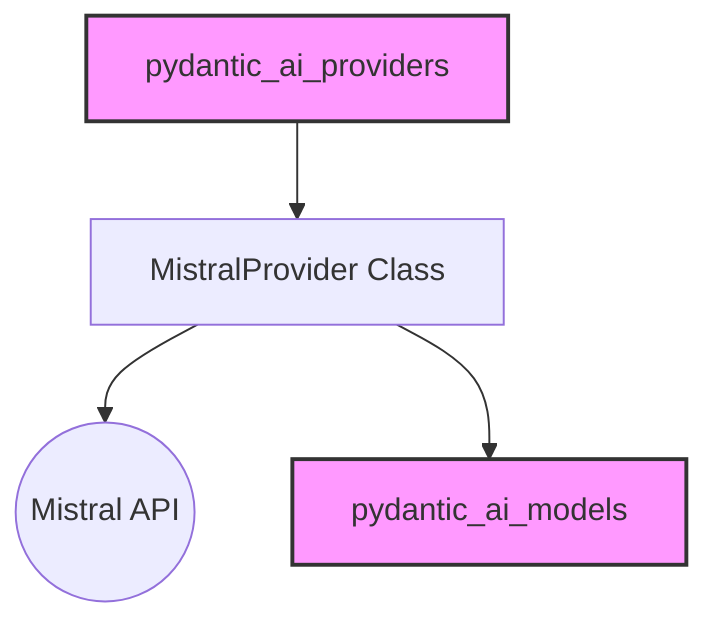

# mistral_provider

The `mistral_provider` module serves as the dedicated interface for integrating Mistral AI models within the `pydantic_ai` framework. It provides the necessary components to authenticate, initialize clients, and manage interactions with the Mistral API, ensuring seamless access to Mistral's language models.

## Architecture and Core Components

The core of this module is the `MistralProvider` class, which abstracts the complexities of interacting with the Mistral API. It manages the underlying Mistral SDK client, handles API key management, and facilitates the integration of Mistral models into the broader `pydantic_ai` model ecosystem.

<!-- DIAGRAM_JSON
{
    "direction": "TD",
    "nodes": [
        {"id": "mistral_provider_class", "label": "MistralProvider Class", "type": "component", "link": null},
        {"id": "mistral_api", "label": "Mistral API", "type": "external", "link": null},
        {"id": "pydantic_ai_models", "label": "pydantic_ai_models", "type": "external", "link": "pydantic_ai_models.md"},
        {"id": "pydantic_ai_providers", "label": "pydantic_ai_providers", "type": "external", "link": "pydantic_ai_providers.md"}
    ],
    "edges": [
        {"source": "mistral_provider_class", "target": "mistral_api"},
        {"source": "mistral_provider_class", "target": "pydantic_ai_models"},
        {"source": "pydantic_ai_providers", "target": "mistral_provider_class"}
    ],
    "groups": []
}
-->


### `MistralProvider` Class

The `MistralProvider` class is responsible for:
*   **Initialization**: It can be initialized with an API key, an existing Mistral client, or it can automatically retrieve the API key from the `MISTRAL_API_KEY` environment variable. It also supports custom base URLs and HTTP clients.
*   **Client Management**: Provides access to the underlying `Mistral` SDK client, which is used for making API requests.
*   **Model Profiling**: Integrates with the `mistral_model_profile` function (likely from [pydantic_ai_models](pydantic_ai_models.md) or a related sub-module) to provide metadata and configuration specific to Mistral models.

```python
class MistralProvider(Provider[Mistral]):
    """Provider for Mistral API."""

    @property
    def name(self) -> str:
        return 'mistral'

    @property
    def base_url(self) -> str:
        return self.client.sdk_configuration.get_server_details()[0]

    @property
    def client(self) -> Mistral:
        return self._client

    @staticmethod
    def model_profile(model_name: str) -> ModelProfile | None:
        return mistral_model_profile(model_name)

    @overload
    def __init__(self, *, mistral_client: Mistral | None = None) -> None: ...

    @overload
    def __init__(self, *, api_key: str | None = None, http_client: httpx.AsyncClient | None = None) -> None: ...

    def __init__(
        self,
        *,
        api_key: str | None = None,
        mistral_client: Mistral | None = None,
        base_url: str | None = None,
        http_client: httpx.AsyncClient | None = None,
    ) -> None:
        """Create a new Mistral provider.

        Args:
            api_key: The API key to use for authentication, if not provided, the `MISTRAL_API_KEY` environment variable
                will be used if available.
            mistral_client: An existing `Mistral` client to use, if provided, `api_key` and `http_client` must be `None`.
            base_url: The base url for the Mistral requests.
            http_client: An existing async client to use for making HTTP requests.
        """
        if mistral_client is not None:
            assert http_client is None, 'Cannot provide both `mistral_client` and `http_client`'
            assert api_key is None, 'Cannot provide both `mistral_client` and `api_key`'
            assert base_url is None, 'Cannot provide both `mistral_client` and `base_url`'
            self._client = mistral_client
        else:
            api_key = api_key or os.getenv('MISTRAL_API_KEY')

            if not api_key:
                raise UserError(
                    'Set the `MISTRAL_API_KEY` environment variable or pass it via `MistralProvider(api_key=...)`'
                    'to use the Mistral provider.'
                )
            elif http_client is not None:
                self._client = Mistral(api_key=api_key, async_client=http_client, server_url=base_url)
            else:
                http_client = cached_async_http_client(provider='mistral')
                self._client = Mistral(api_key=api_key, async_client=http_client, server_url=base_url)
```

## How it Fits into the Overall System

The `mistral_provider` module is a crucial part of the [pydantic_ai_providers](pydantic_ai_providers.md) ecosystem, specifically categorized under [native_providers](native_providers.md). It enables the `pydantic_ai` framework to communicate with Mistral AI, allowing users to leverage Mistral models for various AI tasks.

It interacts with the [pydantic_ai_models](pydantic_ai_models.md) module by providing model-specific configurations and handling usage mapping, ensuring that Mistral models behave consistently within the `pydantic_ai`'s unified model interface. This separation of concerns allows `pydantic_ai` to support multiple AI providers by simply integrating new provider modules like `mistral_provider`.