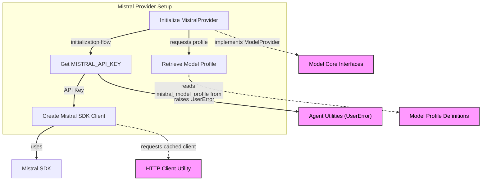

# Mistral Provider Module

The `mistral_provider` module provides the integration layer for interacting with the Mistral AI platform. It encapsulates the necessary logic to configure and use Mistral models within the larger system, acting as a bridge between the core model handling and the Mistral API. This module is crucial for applications that leverage Mistral's generative AI capabilities, offering a standardized way to authenticate, manage clients, and retrieve model-specific configurations.

## `MistralProvider` Class

The `MistralProvider` class is the primary component of this module, responsible for establishing and managing the connection to the Mistral API. It extends a generic `Provider` class, adapting it specifically for Mistral's services.

### Core Components and Functionality

*   **`MistralProvider(Provider[Mistral])`**: This class facilitates the interaction with the Mistral API.
    *   **`name` property**: Returns the string identifier 'mistral' for this provider.
    *   **`base_url` property**: Dynamically retrieves the base URL configured for the Mistral client.
    *   **`client` property**: Provides access to the underlying `Mistral` SDK client instance, which is used for making API requests.
    *   **`model_profile(model_name: str)` static method**: This method is responsible for fetching model-specific configurations by delegating to the `mistral_model_profile` function. This ensures that models from Mistral are used with their appropriate settings.
    *   **`__init__` constructor**: Initializes the `MistralProvider`.
        *   It can be initialized with an existing `Mistral` SDK client instance (`mistral_client`).
        *   Alternatively, it can create a new `Mistral` client by accepting an `api_key`, an optional `base_url`, and an optional `http_client`.
        *   If `api_key` is not explicitly provided, it attempts to read it from the `MISTRAL_API_KEY` environment variable. A `UserError` is raised if no API key is found.
        *   It utilizes a `cached_async_http_client` for efficient management of HTTP connections, especially when an `http_client` is not explicitly provided.

### How it Works

The `MistralProvider` acts as an adapter. When instantiated, it sets up a `Mistral` client, either by taking an already configured client or by creating one using an API key (from parameters or environment variables) and an optional custom HTTP client. This client is then used for all subsequent interactions with the Mistral API. The `model_profile` method ensures that any model requested through this provider adheres to the specific configurations defined for Mistral models, linking directly to the [model_profile_definitions.md](model_profile_definitions.md) module for these profiles.

### Relationship to Other Modules

*   **[model_core_interfaces.md](model_core_interfaces.md)**: The `MistralProvider` integrates with the generic `Model` and `ModelProfile` interfaces defined in this module, ensuring compatibility across different AI model providers.
*   **[model_profile_definitions.md](model_profile_definitions.md)**: This module contains the `mistral_model_profile` function, which `MistralProvider` uses to retrieve specific configurations for Mistral models.
*   **[model_utilities.md](model_utilities.md)**: The `MistralProvider` uses shared utilities like `cached_async_http_client` for managing HTTP connections, which would be defined or managed in a module handling common model utilities.
*   **[agent_utilities.md](agent_utilities.md)**: The `UserError` class, used for raising configuration errors, is considered a general utility and would reside in the `agent_utilities` module.

<!-- DIAGRAM_JSON
{
    "direction": "TD",
    "nodes": [
        {
            "id": "mistral_provider_init",
            "label": "Initialize MistralProvider",
            "type": "component",
            "link": null
        },
        {
            "id": "get_api_key",
            "label": "Get MISTRAL_API_KEY",
            "type": "component",
            "link": null
        },
        {
            "id": "create_mistral_client",
            "label": "Create Mistral SDK Client",
            "type": "component",
            "link": null
        },
        {
            "id": "mistral_sdk",
            "label": "Mistral SDK",
            "type": "external",
            "link": null
        },
        {
            "id": "model_profile_retrieval",
            "label": "Retrieve Model Profile",
            "type": "component",
            "link": null
        },
        {
            "id": "model_profile_defs",
            "label": "Model Profile Definitions",
            "type": "external",
            "link": "model_profile_definitions.md"
        },
        {
            "id": "model_core_int",
            "label": "Model Core Interfaces",
            "type": "external",
            "link": "model_core_interfaces.md"
        },
        {
            "id": "http_client_util",
            "label": "HTTP Client Utility",
            "type": "external",
            "link": "model_utilities.md"
        },
        {
            "id": "agent_utilities",
            "label": "Agent Utilities (UserError)",
            "type": "external",
            "link": "agent_utilities.md"
        }
    ],
    "edges": [
        {
            "source": "mistral_provider_init",
            "target": "get_api_key",
            "label": "initialization flow"
        },
        {
            "source": "get_api_key",
            "target": "create_mistral_client",
            "label": "API Key"
        },
        {
            "source": "create_mistral_client",
            "target": "mistral_sdk",
            "label": "uses"
        },
        {
            "source": "create_mistral_client",
            "target": "http_client_util",
            "label": "requests cached client"
        },
        {
            "source": "mistral_provider_init",
            "target": "model_profile_retrieval",
            "label": "requests profile"
        },
        {
            "source": "model_profile_retrieval",
            "target": "model_profile_defs",
            "label": "reads mistral_model_profile from"
        },
        {
            "source": "mistral_provider_init",
            "target": "model_core_int",
            "label": "implements ModelProvider"
        },
        {
            "source": "get_api_key",
            "target": "agent_utilities",
            "label": "raises UserError"
        }
    ],
    "groups": [
        {
            "id": "provider_setup",
            "label": "Mistral Provider Setup",
            "role": "analytical",
            "nodes": [
                "mistral_provider_init",
                "get_api_key",
                "create_mistral_client",
                "model_profile_retrieval"
            ]
        }
    ]
}
-->

