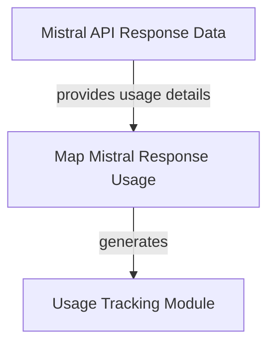

# Mistral Usage Mapper Module

## Introduction

The `mistral_usage_mapper` module is responsible for accurately translating usage information from Mistral AI model responses into a standardized `RequestUsage` format. This standardization is crucial for consistent cost tracking, monitoring, and reporting across different AI model providers within the system.

## Module Overview

This module contains a single core function, `_map_usage`, which acts as an adapter. It takes raw usage data directly from Mistral API responses (either `MistralChatCompletionResponse` or `MistralCompletionChunk`) and transforms it into a `RequestUsage` object, which is used internally by the system for unified usage metrics.

This mapping is essential because different model providers may return usage statistics in varying formats. By centralizing this conversion, the system ensures that all model interactions, regardless of the provider, contribute to a consistent usage reporting mechanism.

### How it Works

The `_map_usage` function inspects the provided Mistral response object. If a `usage` field is present within the response, it extracts the `prompt_tokens` and `completion_tokens` and maps them to `input_tokens` and `output_tokens` respectively in the `RequestUsage` object. If no usage information is available, an empty `RequestUsage` object is returned, preventing errors and allowing for graceful handling of responses without explicit token counts.

## Architecture Diagram

<!-- DIAGRAM_JSON
{
    "direction": "TD",
    "nodes": [
        {
            "id": "map_mistral_usage",
            "label": "Map Mistral Response Usage",
            "type": "component",
            "link": null
        },
        {
            "id": "mistral_api_response",
            "label": "Mistral API Response Data",
            "type": "external",
            "link": null
        },
        {
            "id": "usage_module",
            "label": "Usage Tracking Module",
            "type": "external",
            "link": "usage.md"
        }
    ],
    "edges": [
        {
            "source": "mistral_api_response",
            "target": "map_mistral_usage",
            "label": "provides usage details"
        },
        {
            "source": "map_mistral_usage",
            "target": "usage_module",
            "label": "generates"
        }
    ],
    "groups": []
}
-->

