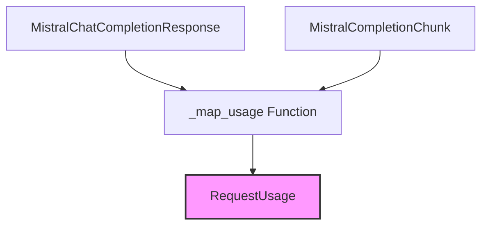

# `mistral_usage_mapping`

The `mistral_usage_mapping` module is a specialized component within the `pydantic_ai_models` system, responsible for accurately mapping usage information from Mistral API responses to a standardized internal `RequestUsage` format. This module ensures consistent token usage tracking across different model providers.

## Core Functionality

The primary function of this module is to abstract away the specific usage reporting mechanisms of the Mistral API, converting them into a common `RequestUsage` object. This allows the higher-level systems, such as `agent_utilities_results`, to uniformly process and record token consumption, regardless of the underlying model provider.

### `_map_usage`

The `_map_usage` function takes a Mistral API response object (either `MistralChatCompletionResponse` or `MistralCompletionChunk`) and extracts the `prompt_tokens` and `completion_tokens` to populate a `RequestUsage` object. If usage information is not present in the Mistral response, it returns an empty `RequestUsage` object.

```python
def _map_usage(response: MistralChatCompletionResponse | MistralCompletionChunk) -> RequestUsage:
    """Maps a Mistral Completion Chunk or Chat Completion Response to a Usage."""
    if response.usage:
        return RequestUsage(
            input_tokens=response.usage.prompt_tokens or 0,
            output_tokens=response.usage.completion_tokens or 0,
        )
    else:
        return RequestUsage()
```

## Architecture and Component Relationships

The `mistral_usage_mapping` module is a leaf module under `provider_usage_mapping`, which itself is part of the `pydantic_ai_models` module. It directly interfaces with Mistral API response structures and outputs a generic `RequestUsage` object, which is then utilized by other parts of the `pydantic_ai_agent_core` system for usage tracking.

<!-- DIAGRAM_JSON
{
    "direction": "TD",
    "nodes": [
        {"id": "_map_usage", "label": "_map_usage Function", "type": "component", "link": null},
        {"id": "mistral_chat_completion_response", "label": "MistralChatCompletionResponse", "type": "external", "link": null},
        {"id": "mistral_completion_chunk", "label": "MistralCompletionChunk", "type": "external", "link": null},
        {"id": "request_usage", "label": "RequestUsage", "type": "external", "link": "agent_utilities_results.md"}
    ],
    "edges": [
        {"source": "mistral_chat_completion_response", "target": "_map_usage"},
        {"source": "mistral_completion_chunk", "target": "_map_usage"},
        {"source": "_map_usage", "target": "request_usage"}
    ],
    "groups": []
}
-->


## Integration with the Overall System

This module plays a vital role in the `pydantic_ai_models` ecosystem by providing a consistent interface for consuming usage data from Mistral models. It enables accurate cost estimation and resource management by standardizing the output into the `RequestUsage` object, which is defined and managed within the [agent_utilities_results](agent_utilities_results.md) module. This abstraction ensures that future changes in Mistral's API for usage reporting or the introduction of new model providers will only require modifications within their respective mapping modules, minimizing impact on the broader system.

This module is a direct child of the [provider_usage_mapping](provider_usage_mapping.md) module, inheriting its role in aggregating usage mapping logic for various LLM providers.
