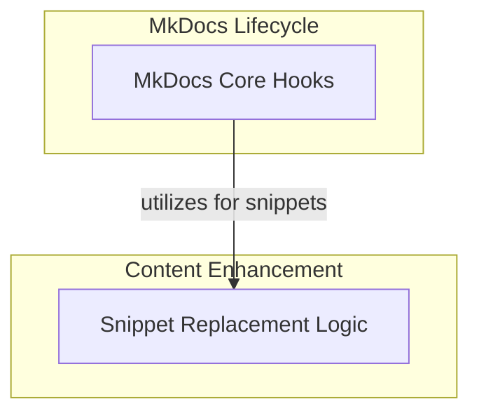

# MkDocs Hooks and Snippets Module

## Introduction

The `mkdocs_hooks_and_snippets` module is a crucial part of the documentation generation pipeline. It provides custom MkDocs hooks to extend functionality during the build process, primarily focusing on markdown transformation and code snippet injection. This module ensures that code examples are dynamically rendered, external content is properly integrated, and the overall documentation experience is enhanced.

## Architecture Overview

The module's architecture is centered around two main functional areas: general MkDocs lifecycle hooks and specialized snippet processing. These areas work in tandem to modify markdown content and prepare the build environment.

<!-- DIAGRAM_JSON
{
    "direction": "TD",
    "nodes": [
        {
            "id": "mkdocs_hooks_and_snippets",
            "label": "MkDocs Hooks and Snippets",
            "type": "module"
        },
        {
            "id": "mkdocs_main_hooks",
            "label": "MkDocs Core Hooks",
            "type": "module",
            "link": "mkdocs_main_hooks.md"
        },
        {
            "id": "snippet_processing",
            "label": "Snippet Replacement Logic",
            "type": "module",
            "link": "snippet_processing.md"
        }
    ],
    "edges": [
        {
            "source": "mkdocs_main_hooks",
            "target": "snippet_processing",
            "label": "utilizes for snippets"
        }
    ],
    "groups": [
        {
            "id": "hooks",
            "label": "MkDocs Hooks",
            "role": "generative",
            "nodes": [
                "mkdocs_main_hooks"
            ]
        },
        {
            "id": "content_transformation",
            "label": "Content Transformation",
            "role": "analytical",
            "nodes": [
                "snippet_processing"
            ]
        }
    ]
}
-->

## Sub-modules

### [MkDocs Core Hooks](mkdocs_main_hooks.md)
This sub-module contains the primary MkDocs hooks that intercept and modify the documentation build process. It includes functions for processing markdown content before HTML conversion and setting up environment variables for the build.

### [Snippet Replacement Logic](snippet_processing.md)
This sub-module is dedicated to the intelligent replacement of code snippet directives within markdown files. It handles path resolution, content extraction, syntax highlighting, and dynamic title generation for embedded code examples.
