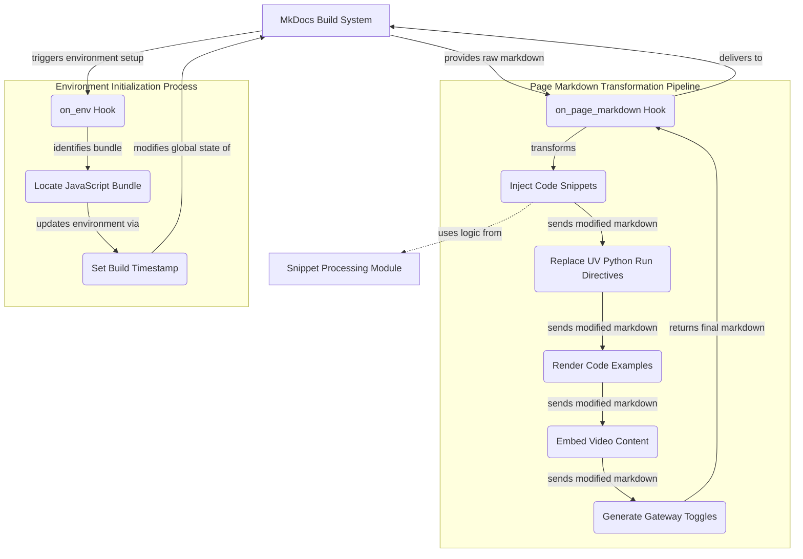

# mkdocs_main_hooks Module Documentation

The `mkdocs_main_hooks` module is a crucial component within the documentation site management system, specifically designed to extend and customize the behavior of MkDocs during the site generation process. It provides two primary hooks: `on_page_markdown` for transforming page content before it's converted to HTML, and `on_env` for initializing the Jinja2 environment used by MkDocs.

This module is essential for dynamically injecting content, processing specific directives, and ensuring consistent environment settings across the generated documentation. It allows for a highly customized and feature-rich documentation experience without modifying the core MkDocs engine.

## Architectural Overview

The `mkdocs_main_hooks` module integrates directly with the MkDocs build system. The `on_page_markdown` hook acts as a pipeline, sequentially applying various transformations to the raw Markdown content. The `on_env` hook ensures that the build environment is correctly configured with necessary global variables and paths.

<!-- DIAGRAM_JSON
{
    "direction": "TD",
    "nodes": [
        {
            "id": "on_page_markdown_hook_entry",
            "label": "on_page_markdown Hook",
            "type": "component",
            "link": null
        },
        {
            "id": "inject_snippets_func_call",
            "label": "Inject Code Snippets",
            "type": "component",
            "link": null
        },
        {
            "id": "replace_uv_python_run_func_call",
            "label": "Replace UV Python Run Directives",
            "type": "component",
            "link": null
        },
        {
            "id": "render_examples_func_call",
            "label": "Render Code Examples",
            "type": "component",
            "link": null
        },
        {
            "id": "render_video_func_call",
            "label": "Embed Video Content",
            "type": "component",
            "link": null
        },
        {
            "id": "create_gateway_toggle_func_call",
            "label": "Generate Gateway Toggles",
            "type": "component",
            "link": null
        },
        {
            "id": "on_env_hook_entry",
            "label": "on_env Hook",
            "type": "component",
            "link": null
        },
        {
            "id": "locate_js_bundle",
            "label": "Locate JavaScript Bundle",
            "type": "component",
            "link": null
        },
        {
            "id": "set_build_timestamp",
            "label": "Set Build Timestamp",
            "type": "component",
            "link": null
        },
        {
            "id": "snippet_processing_module",
            "label": "Snippet Processing Module",
            "type": "external",
            "link": "snippet_processing.md"
        },
        {
            "id": "mkdocs_system",
            "label": "MkDocs Build System",
            "type": "external",
            "link": null
        }
    ],
    "edges": [
        {
            "source": "mkdocs_system",
            "target": "on_page_markdown_hook_entry",
            "label": "provides raw markdown"
        },
        {
            "source": "on_page_markdown_hook_entry",
            "target": "inject_snippets_func_call",
            "label": "transforms"
        },
        {
            "source": "inject_snippets_func_call",
            "target": "snippet_processing_module",
            "label": "uses logic from",
            "type": "dashed"
        },
        {
            "source": "inject_snippets_func_call",
            "target": "replace_uv_python_run_func_call",
            "label": "sends modified markdown"
        },
        {
            "source": "replace_uv_python_run_func_call",
            "target": "render_examples_func_call",
            "label": "sends modified markdown"
        },
        {
            "source": "render_examples_func_call",
            "target": "render_video_func_call",
            "label": "sends modified markdown"
        },
        {
            "source": "render_video_func_call",
            "target": "create_gateway_toggle_func_call",
            "label": "sends modified markdown"
        },
        {
            "source": "create_gateway_toggle_func_call",
            "target": "on_page_markdown_hook_entry",
            "label": "returns final markdown"
        },
        {
            "source": "on_page_markdown_hook_entry",
            "target": "mkdocs_system",
            "label": "delivers to"
        },
        {
            "source": "mkdocs_system",
            "target": "on_env_hook_entry",
            "label": "triggers environment setup"
        },
        {
            "source": "on_env_hook_entry",
            "target": "locate_js_bundle",
            "label": "identifies bundle"
        },
        {
            "source": "locate_js_bundle",
            "target": "set_build_timestamp",
            "label": "updates environment via"
        },
        {
            "source": "set_build_timestamp",
            "target": "mkdocs_system",
            "label": "modifies global state of"
        }
    ],
    "groups": [
        {
            "id": "page_markdown_pipeline",
            "label": "Page Markdown Transformation Pipeline",
            "role": "functional",
            "nodes": [
                "on_page_markdown_hook_entry",
                "inject_snippets_func_call",
                "replace_uv_python_run_func_call",
                "render_examples_func_call",
                "render_video_func_call",
                "create_gateway_toggle_func_call"
            ]
        },
        {
            "id": "env_setup_process",
            "label": "Environment Initialization Process",
            "role": "functional",
            "nodes": [
                "on_env_hook_entry",
                "locate_js_bundle",
                "set_build_timestamp"
            ]
        }
    ]
}
-->

### Module Components

#### `on_page_markdown(markdown: str, page: Page, config: Config, files: Files) -> str`

This hook is invoked by MkDocs for every Markdown page after its content has been read but before it is converted into HTML. Its primary responsibility is to apply a series of transformations to the Markdown content, enhancing it with dynamic features.

**Workflow:**
1.  **Inject Snippets**: Calls `inject_snippets` to insert pre-defined code or content snippets into the Markdown. This function leverages the functionality provided by the [snippet_processing.md](snippet_processing.md) module to manage and inject content efficiently.
2.  **Replace UV Python Run Directives**: Executes `replace_uv_python_run` to find and replace specific markers related to `uv python run` commands, potentially embedding output or transforming the directive.
3.  **Render Examples**: Invokes `render_examples` to process and render various example blocks within the Markdown, likely converting custom syntax into formatted output.
4.  **Embed Video Content**: Calls `render_video` to embed video players or links based on specific Markdown syntax.
5.  **Create Gateway Toggles**: Utilizes `create_gateway_toggle` to insert interactive UI elements, possibly for toggling between different content views or configurations.

The sequence of these operations ensures that content is transformed comprehensively before it reaches the HTML rendering stage.

#### `on_env(env: Environment, config: Config, files: Files) -> Environment`

This hook is called once when the MkDocs environment is initialized. It's used to perform setup tasks that affect the entire build process, particularly relating to the Jinja2 templating environment.

**Workflow:**
1.  **Locate JavaScript Bundle**: It iterates through the `files` object to find the dynamically named `bundle.[a-z0-9]+.min.js` file. The path to this bundle is then stored globally for later use. This ensures that the correct, cache-busted JavaScript bundle is always referenced.
2.  **Set Build Timestamp**: A `build_timestamp` (Unix timestamp) is added to `env.globals`. This timestamp can be used in templates for cache busting assets or displaying when the documentation was last built, enhancing development and deployment workflows.

This hook is critical for setting up the environment dynamically, adapting to changes in asset filenames, and providing useful build metadata to the documentation templates.

### Connections to Other Modules

*   **[snippet_processing.md](snippet_processing.md)**: The `on_page_markdown` hook directly depends on the `inject_snippets` function, which in turn relies on the `snippet_processing` module for its core logic. This ensures a centralized and consistent way to manage and inject reusable content blocks into documentation pages.
