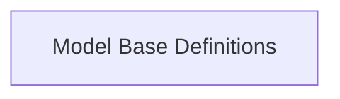

<!-- AUTO_GENERATED_PLACEHOLDER
  reason: LLM did not create .md file for this module
  module_path: pydantic_ai_agent_core/model_core_interfaces/model_base_definitions
  component_count: 1
  generated_at: 2026-04-06T06:47:34.931826
  TODO: Fix LLM prompt to handle small leaf modules
-->

# Model Base Definitions

> ⚠️ **Auto-Generated Placeholder**
> This documentation was auto-generated because the LLM failed to create it.
> Module path: `pydantic_ai_agent_core/model_core_interfaces/model_base_definitions`

Defines the abstract base classes for all models, including core request handling and configuration management.

## Components

This module contains 1 component(s):

- `pydantic_ai_slim.pydantic_ai.models.__init__.Model`

## Structure

---
*Auto-generated placeholder. See sync_issues.json for details.*
