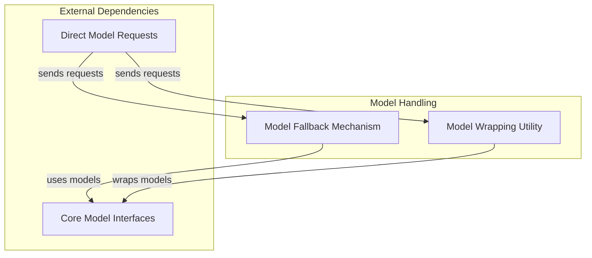

# Model Composition

This module provides essential utilities for composing and managing AI models, enabling advanced functionalities like model fallback and behavior modification through wrapping. It forms a crucial part of the system's flexible model management, ensuring resilience and adaptability in diverse operational scenarios.

## Architecture Overview

The `model_composition` module is structured around two core functionalities: handling model failures gracefully and extending model behavior. These functionalities are implemented through the `FallbackModel` and `WrapperModel` respectively, which interact with other parts of the AI system, particularly the core model interfaces and request handling.

<!-- DIAGRAM_JSON
{
    "direction": "TD",
    "nodes": [
        {"id": "fallback_mechanism", "label": "Model Fallback Mechanism", "type": "module", "link": "fallback_mechanism.md"},
        {"id": "model_wrapping", "label": "Model Wrapping Utility", "type": "module", "link": "model_wrapping.md"},
        {"id": "model_core_interfaces", "label": "Core Model Interfaces", "type": "external", "link": "model_core_interfaces.md"},
        {"id": "direct_model_requests", "label": "Direct Model Requests", "type": "external", "link": "direct_model_requests.md"}
    ],
    "edges": [
        {"source": "fallback_mechanism", "target": "model_core_interfaces", "label": "uses models"},
        {"source": "model_wrapping", "target": "model_core_interfaces", "label": "wraps models"},
        {"source": "direct_model_requests", "target": "fallback_mechanism", "label": "sends requests"},
        {"source": "direct_model_requests", "target": "model_wrapping", "label": "sends requests"}
    ],
    "groups": [
        {
            "id": "model_handling",
            "label": "Model Handling",
            "role": "generative",
            "nodes": ["fallback_mechanism", "model_wrapping"]
        },
        {
            "id": "external_dependencies",
            "label": "External Dependencies",
            "role": "data",
            "nodes": ["model_core_interfaces", "direct_model_requests"]
        }
    ]
}
-->

## Sub-modules

This module contains the following sub-modules:

*   ### [Model Fallback Mechanism](fallback_mechanism.md)
    This sub-module implements the `FallbackModel`, allowing the system to use a series of models in a defined order until a successful response is received or a configured fallback condition is met. It is crucial for building robust AI applications that can withstand individual model failures or performance issues.

*   ### [Model Wrapping Utility](model_wrapping.md)
    This sub-module provides the `WrapperModel`, a flexible base class for creating custom models that extend or modify the behavior of an underlying model. This enables functionalities like logging, caching, or altering model outputs without directly modifying the original model's code.