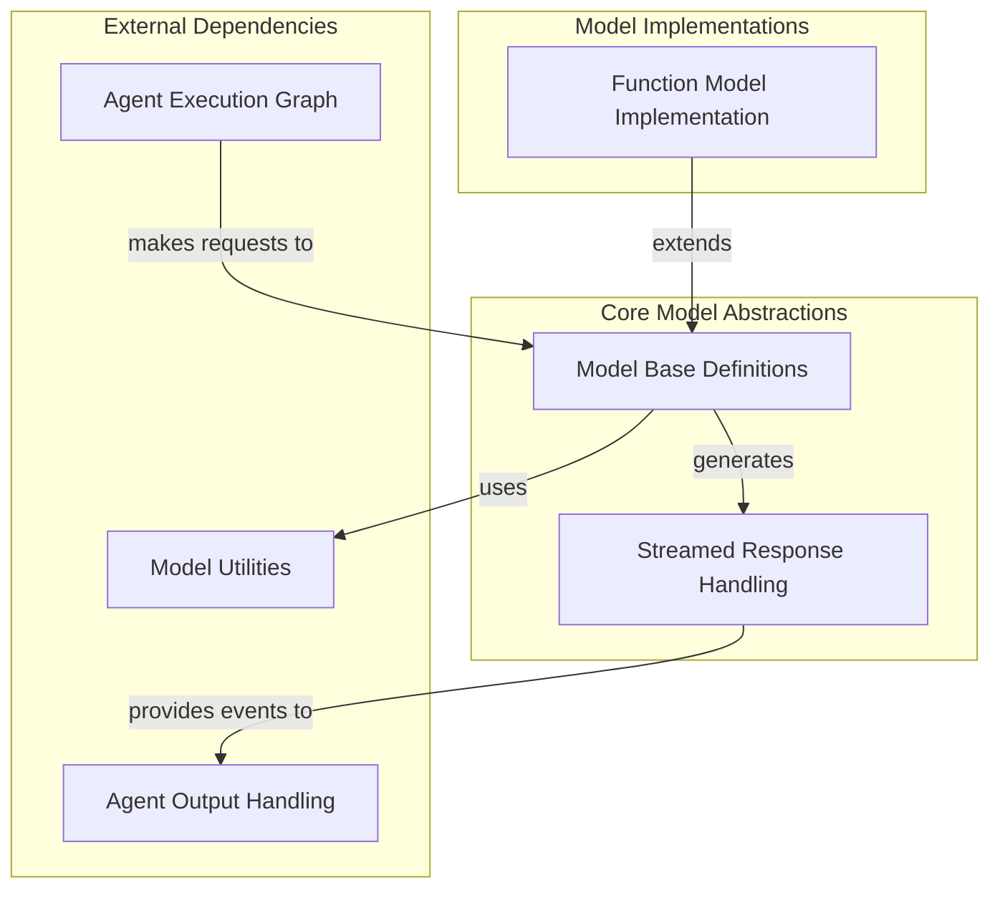

# Model Core Interfaces

## Introduction and Purpose

The `model_core_interfaces` module defines the fundamental abstract interfaces and core concrete implementations for interacting with various language models (LLMs) within the Pydantic AI framework. It establishes the contracts for sending requests to models, handling their responses (both immediate and streamed), and integrating custom function-based models. This module is crucial for abstracting away the specifics of different LLM providers, offering a unified way to integrate and utilize diverse models.

## Architecture Overview

This module is structured around core abstractions for models and their responses, with specific implementations extending these interfaces. It focuses on providing a flexible and extensible foundation for model integration.

<!-- DIAGRAM_JSON
{
    "direction": "TD",
    "nodes": [
        {
            "id": "model_core_interfaces",
            "label": "Model Core Interfaces",
            "type": "module"
        },
        {
            "id": "model_base_definitions",
            "label": "Model Base Definitions",
            "type": "module",
            "link": "model_base_definitions.md"
        },
        {
            "id": "streamed_responses",
            "label": "Streamed Response Handling",
            "type": "module",
            "link": "streamed_responses.md"
        },
        {
            "id": "function_model_implementation",
            "label": "Function Model Implementation",
            "type": "module",
            "link": "function_model_implementation.md"
        },
        {
            "id": "agent_execution_graph",
            "label": "Agent Execution Graph",
            "type": "external",
            "link": "agent_execution_graph.md"
        },
        {
            "id": "agent_output_handling",
            "label": "Agent Output Handling",
            "type": "external",
            "link": "agent_output_handling.md"
        },
        {
            "id": "model_utilities",
            "label": "Model Utilities",
            "type": "external",
            "link": "model_utilities.md"
        }
    ],
    "edges": [
        {
            "source": "agent_execution_graph",
            "target": "model_base_definitions",
            "label": "makes requests to"
        },
        {
            "source": "model_base_definitions",
            "target": "streamed_responses",
            "label": "generates"
        },
        {
            "source": "model_base_definitions",
            "target": "model_utilities",
            "label": "uses"
        },
        {
            "source": "function_model_implementation",
            "target": "model_base_definitions",
            "label": "extends"
        },
        {
            "source": "streamed_responses",
            "target": "agent_output_handling",
            "label": "provides events to"
        }
    ],
    "groups": [
        {
            "id": "core_abstractions",
            "label": "Core Model Abstractions",
            "role": "generative",
            "nodes": [
                "model_base_definitions",
                "streamed_responses"
            ]
        },
        {
            "id": "model_implementations",
            "label": "Model Implementations",
            "role": "generative",
            "nodes": [
                "function_model_implementation"
            ]
        },
        {
            "id": "external_dependencies",
            "label": "External Dependencies",
            "role": "data",
            "nodes": [
                "agent_execution_graph",
                "agent_output_handling",
                "model_utilities"
            ]
        }
    ]
}
-->

## Sub-modules

### [Model Base Definitions](model_base_definitions.md)
This sub-module defines the abstract `Model` class, which serves as the foundation for all LLM integrations. It outlines the core methods for sending model requests, handling token counting, and managing model-specific settings and profiles.

### [Streamed Response Handling](streamed_responses.md)
This sub-module introduces the `StreamedResponse` abstract class, which standardizes the way streamed outputs from LLMs are processed. It provides mechanisms for iterating over stream events, managing response parts, and constructing a final `ModelResponse` from the streamed data.

### [Function Model Implementation](function_model_implementation.md)
This sub-module provides `FunctionModel`, a concrete implementation of the `Model` interface that allows integrating local Python functions as LLMs. It enables developers to define custom logic for generating both non-streamed and streamed model responses, making it highly flexible for testing and specialized use cases.
