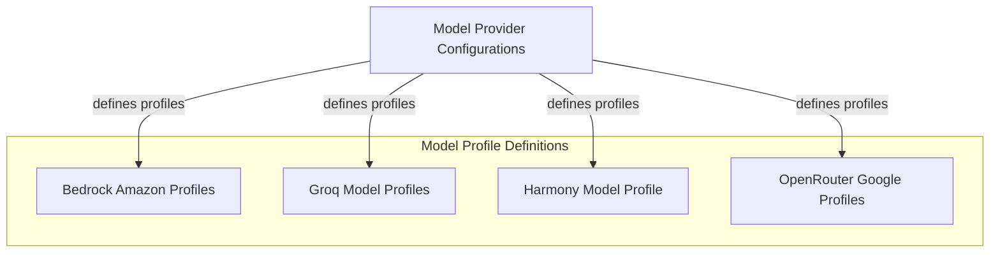

# Model Profile Definitions

The `model_profile_definitions` module is responsible for defining the specific capabilities and behaviors of various AI models across different providers. It centralizes the configuration for how models handle tool usage, JSON output, streaming, and other features. This module is crucial for ensuring that the system interacts correctly and efficiently with a diverse range of language models, adapting to their unique characteristics and limitations.

## Architecture Overview

This module is a part of the `model_provider_configurations` and defines specialized profiles for various AI models from different providers, ensuring correct interaction and capability mapping.

<!-- DIAGRAM_JSON
{
    "direction": "TD",
    "nodes": [
        {
            "id": "model_profile_definitions",
            "label": "Model Profile Definitions",
            "type": "module"
        },
        {
            "id": "model_provider_configurations",
            "label": "Model Provider Configurations",
            "type": "external",
            "link": "model_provider_configurations.md"
        },
        {
            "id": "bedrock_profile",
            "label": "Bedrock Amazon Profiles",
            "type": "module",
            "link": "bedrock_profile.md"
        },
        {
            "id": "groq_profiles",
            "label": "Groq Model Profiles",
            "type": "module",
            "link": "groq_profiles.md"
        },
        {
            "id": "harmony_profile",
            "label": "Harmony Model Profile",
            "type": "module",
            "link": "harmony_profile.md"
        },
        {
            "id": "openrouter_google_profile",
            "label": "OpenRouter Google Profiles",
            "type": "module",
            "link": "openrouter_google_profile.md"
        }
    ],
    "edges": [
        {
            "source": "model_provider_configurations",
            "target": "bedrock_profile",
            "label": "defines profile"
        },
        {
            "source": "model_provider_configurations",
            "target": "groq_profiles",
            "label": "defines profile"
        },
        {
            "source": "model_provider_configurations",
            "target": "harmony_profile",
            "label": "defines profile"
        },
        {
            "source": "model_provider_configurations",
            "target": "openrouter_google_profile",
            "label": "defines profile"
        }
    ],
    "groups": [
        {
            "id": "model_profiles",
            "label": "Model Profiles",
            "role": "data",
            "nodes": [
                "bedrock_profile",
                "groq_profiles",
                "harmony_profile",
                "openrouter_google_profile"
            ]
        },
        {
            "id": "external_configs",
            "label": "External Configurations",
            "role": "analytical",
            "nodes": [
                "model_provider_configurations"
            ]
        }
    ]
}
-->

## Sub-module Functionality

This module organizes model profiles by provider or specific integration.

*   **[Bedrock Amazon Profiles](bedrock_profile.md)**: Manages profiles for Amazon models accessed through AWS Bedrock, detailing their tool support and caching behaviors.
*   **[Groq Model Profiles](groq_profiles.md)**: Provides specific configurations for models available via the Groq provider, including support for MoonshotAI and Meta models, outlining their JSON output capabilities.
*   **[Harmony Model Profile](harmony_profile.md)**: Defines the model profile for the OpenAI Harmony Response format, primarily focusing on streaming behavior and tool choice.
*   **[OpenRouter Google Profiles](openrouter_google_profile.md)**: Handles profiles for Google models when routed through OpenRouter, including necessary JSON schema transformations for compatibility.
