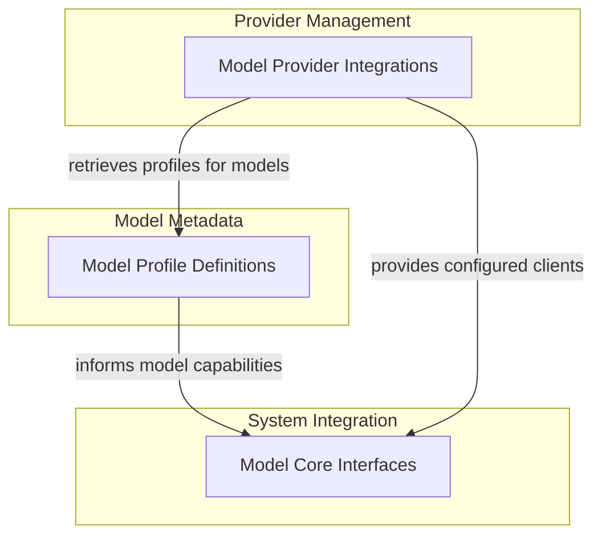

# Model Provider Configurations

The `model_provider_configurations` module is central to integrating and managing various Artificial Intelligence (AI) model providers within the system. It provides a flexible and extensible framework for connecting to different model APIs, handling their specific requirements, and defining their capabilities through model profiles. This module abstracts away the complexities of interacting with diverse AI services, allowing the rest of the system to interact with models through a unified interface.

### Why it Matters

This module is crucial for several reasons:

*   **Flexibility**: It enables easy integration of new AI model providers without significant changes to the core system.
*   **Standardization**: It normalizes interactions with disparate AI APIs, providing a consistent way to configure and utilize models.
*   **Capability Management**: Through model profiles, it precisely defines what each model can do (e.g., support for tools, JSON output, streaming), allowing the system to intelligently select and utilize models based on task requirements.
*   **Environmental Adaptability**: It supports various authentication methods and environment variable configurations for each provider, making deployment and credential management straightforward.

## Architecture Overview

The `model_provider_configurations` module is structured around two primary concerns: integrating with external AI service providers and defining the operational profiles of the models they offer. It primarily interacts with higher-level model interfaces that consume these configurations to perform AI inference.

<!-- DIAGRAM_JSON
{
    "direction": "TD",
    "nodes": [
        {"id": "model_provider_integrations", "label": "Model Provider Integrations", "type": "module", "link": "model_provider_integrations.md"},
        {"id": "model_profile_definitions", "label": "Model Profile Definitions", "type": "module", "link": "model_profile_definitions.md"},
        {"id": "model_core_interfaces", "label": "Model Core Interfaces", "type": "external", "link": "model_core_interfaces.md"}
    ],
    "edges": [
        {"source": "model_provider_integrations", "target": "model_profile_definitions", "label": "retrieves profiles for models"},
        {"source": "model_profile_definitions", "target": "model_core_interfaces", "label": "informs model capabilities"},
        {"source": "model_provider_integrations", "target": "model_core_interfaces", "label": "provides configured clients"}
    ],
    "groups": [
        {
            "id": "provider_management",
            "label": "Provider Management",
            "role": "data",
            "nodes": ["model_provider_integrations"]
        },
        {
            "id": "model_metadata",
            "label": "Model Metadata",
            "role": "analytical",
            "nodes": ["model_profile_definitions"]
        },
        {
            "id": "system_integration",
            "label": "System Integration",
            "role": "surface",
            "nodes": ["model_core_interfaces"]
        }
    ]
}
-->

## Sub-modules

This module contains the following sub-modules:

### [Model Provider Integrations](model_provider_integrations.md)

This sub-module is responsible for managing connections and interactions with a diverse range of external AI model services. It encapsulates the specifics of each provider's API, ensuring a consistent interface for the rest of the system.

### [Model Profile Definitions](model_profile_definitions.md)

This sub-module defines and retrieves specific characteristics and capabilities for various AI models. These profiles are critical for tailoring model behavior, such as tool support, JSON output formatting, and streaming capabilities, to meet the system's functional requirements.
