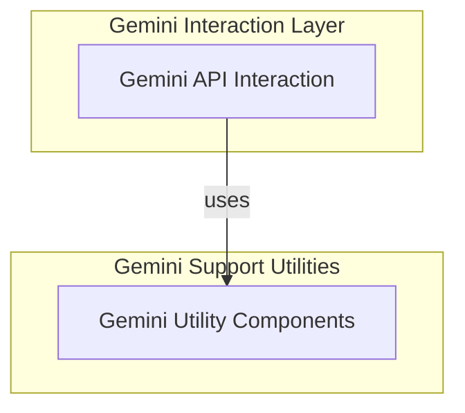

# Model Provider: Gemini

## Introduction and Purpose

The `model_provider_gemini` module facilitates the integration with Google's Gemini API, enabling AI agents to leverage Gemini's advanced capabilities for generating intelligent responses, processing complex prompts, handling tool calls, and streaming content efficiently. This module is crucial for applications requiring robust and scalable AI model interactions with Gemini.

## Architecture Overview

The `model_provider_gemini` module is structured into distinct sub-modules that collaboratively manage the lifecycle of interactions with the Gemini API. At its core, it provides the `GeminiModel` class, which serves as the primary interface for sending requests and receiving responses. Supporting this interaction are utility components that handle the nuances of Gemini's API, such as data mapping, configuration, and usage tracking.

<!-- DIAGRAM_JSON
{
    "direction": "TD",
    "nodes": [
        {"id": "gemini_api_interaction", "label": "Gemini API Interaction", "type": "module", "link": "gemini_api_interaction.md"},
        {"id": "gemini_utility_components", "label": "Gemini Utility Components", "type": "module", "link": "gemini_utility_components.md"}
    ],
    "edges": [
        {"source": "gemini_api_interaction", "target": "gemini_utility_components", "label": "uses"}
    ],
    "groups": [
        {
            "id": "gemini_interaction",
            "label": "Gemini Interaction Layer",
            "role": "generative",
            "nodes": ["gemini_api_interaction"]
        },
        {
            "id": "gemini_support",
            "label": "Gemini Support Utilities",
            "role": "data",
            "nodes": ["gemini_utility_components"]
        }
    ]
}
-->

## High-Level Functionality of Sub-modules

*   **[Gemini API Interaction](gemini_api_interaction.md)**: This sub-module contains the core logic for establishing and managing connections with the Gemini API. It encapsulates the `GeminiModel` class, which handles synchronous and asynchronous requests, streamed responses, and the intricate conversion of internal model messages into Gemini-compatible content and vice-versa. It's responsible for preparing requests, invoking the API, and initially parsing the raw responses.

*   **[Gemini Utility Components](gemini_utility_components.md)**: This sub-module provides essential supporting functionalities for the Gemini model integration. It includes components for processing API responses into standardized output parts, mapping usage metadata, defining tool configurations, and handling various content types such as inline data and file data. These utilities ensure that the interactions with the Gemini API are correctly formatted, interpreted, and tracked.

## Connections to Other Modules

This module integrates with several other parts of the system to provide a comprehensive AI agent experience:

*   **[Model Core Interfaces](model_core_interfaces.md)**: The `GeminiModel` extends the base `Model` and `StreamedResponse` interfaces, ensuring a consistent contract across different model providers.
*   **[Model Provider Configurations](model_provider_configurations.md)**: It leverages provider implementations (e.g., `google-gla`, `google-vertex`) for authentication and specific model profiles, which are defined within the `model_provider_configurations` module.
*   **[Agent Output Handling](agent_output_handling.md)**: The processed responses from Gemini are converted into generic `ModelResponsePart` objects, which are then handled by the `agent_output_handling` module for further agent processing.
*   **[Agent Utilities](agent_utilities.md)**: For tracking and reporting, the `model_provider_gemini` module uses `Usage` objects from `agent_utilities` to provide detailed information about token consumption and other metrics.