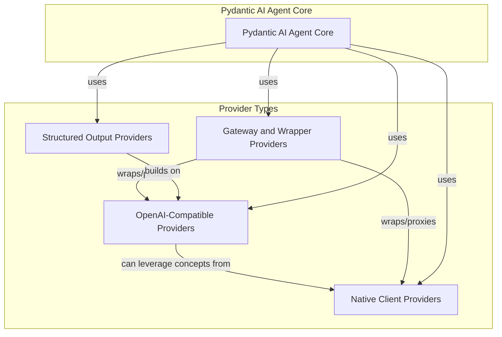

# Model Provider Integrations

The `model_provider_integrations` module is a crucial component of the Pydantic AI Slim framework, designed to provide a unified and extensible interface for interacting with various large language model (LLM) providers. It abstracts away the complexities of different provider APIs, allowing the rest of the system to communicate with diverse models through a consistent set of interfaces.

## Purpose and Importance

This module's primary purpose is to enable seamless integration with a wide array of AI model providers, including popular platforms like OpenAI, Azure, Cohere, Mistral, and many others. By centralizing provider-specific logic, it ensures that the Pydantic AI Slim framework can easily switch between or combine different models without extensive code modifications. This flexibility is vital for:

- **Interoperability**: Connecting to a broad ecosystem of LLMs.
- **Future-proofing**: Adapting to new model providers and API changes with minimal effort.
- **Performance Optimization**: Applying provider-specific model profiles and settings for optimal performance.
- **Abstraction**: Hiding the underlying API differences from the core agent logic.

## Architecture Overview

The `model_provider_integrations` module is structured to categorize providers based on their API interaction patterns: OpenAI-compatible, native client, gateway/wrapper, and specialized structured output providers. This modular design enhances maintainability and allows for targeted development for each provider type.

<!-- DIAGRAM_JSON
{
    "direction": "TD",
    "nodes": [
        {"id": "openai_compatible_providers", "label": "OpenAI-Compatible Providers", "type": "module", "link": "openai_compatible_providers.md"},
        {"id": "native_client_providers", "label": "Native Client Providers", "type": "module", "link": "native_client_providers.md"},
        {"id": "gateway_wrapper_providers", "label": "Gateway and Wrapper Providers", "type": "module", "link": "gateway_wrapper_providers.md"},
        {"id": "structured_output_providers", "label": "Structured Output Providers", "type": "module", "link": "structured_output_providers.md"}
    ],
    "edges": [
        {"source": "openai_compatible_providers", "target": "native_client_providers", "label": "can leverage concepts from"},
        {"source": "gateway_wrapper_providers", "target": "openai_compatible_providers", "label": "wraps/proxies"},
        {"source": "gateway_wrapper_providers", "target": "native_client_providers", "label": "wraps/proxies"},
        {"source": "structured_output_providers", "target": "openai_compatible_providers", "label": "builds on"},
        {"source": "pydantic_ai_agent_core", "target": "openai_compatible_providers", "label": "uses"},
        {"source": "pydantic_ai_agent_core", "target": "native_client_providers", "label": "uses"},
        {"source": "pydantic_ai_agent_core", "target": "gateway_wrapper_providers", "label": "uses"},
        {"source": "pydantic_ai_agent_core", "target": "structured_output_providers", "label": "uses"}
    ],
    "groups": [
        {
            "id": "provider_types",
            "label": "Provider Types",
            "role": "data",
            "nodes": ["openai_compatible_providers", "native_client_providers", "gateway_wrapper_providers", "structured_output_providers"]
        },
        {
            "id": "core_system",
            "label": "Core System",
            "role": "generative",
            "nodes": ["pydantic_ai_agent_core"]
        }
    ]
}
-->

## Sub-modules

This module is divided into the following sub-modules, each handling a specific category of model provider integrations:

### [OpenAI-Compatible Providers](openai_compatible_providers.md)
This sub-module includes providers that offer an OpenAI-compatible API interface, allowing for seamless integration with a wide range of models that adhere to the OpenAI API specification. Examples include Alibaba, Azure, DeepSeek, Fireworks, GitHub, Grok, Heroku, MoonshotAI, Nebius, Ollama, OVHcloud, SambaNova, and Together AI.

### [Native Client Providers](native_client_providers.md)
This sub-module encapsulates integrations with model providers that utilize their own native SDKs or client libraries, offering specific functionalities and optimized interactions. This category includes providers like Cohere, Mistral, VoyageAI, and xAI.

### [Gateway and Wrapper Providers](gateway_wrapper_providers.md)
This sub-module manages integrations with providers that act as gateways or wrappers, abstracting interactions with multiple underlying models or offering specialized inference services. Hugging Face, LiteLLM, and Vercel AI Gateway fall into this category.

### [Structured Output Providers](structured_output_providers.md)
This sub-module focuses on providers that excel in generating structured outputs, primarily exemplified by the Outlines framework, which is designed for reliable and controlled text generation.

## Connection to the Rest of the System

The `model_provider_integrations` module serves as a foundational layer for the entire Pydantic AI Slim framework. It is directly utilized by the `pydantic_ai_agent_core` module, which orchestrates agent behavior, model interactions, and tool usage. By providing a consistent interface to diverse models, this module enables the core agent to perform tasks ranging from natural language understanding and generation to complex reasoning and tool execution, regardless of the underlying LLM technology. It also interacts with `model_profile_definitions` to retrieve specific model capabilities and configuration settings.
