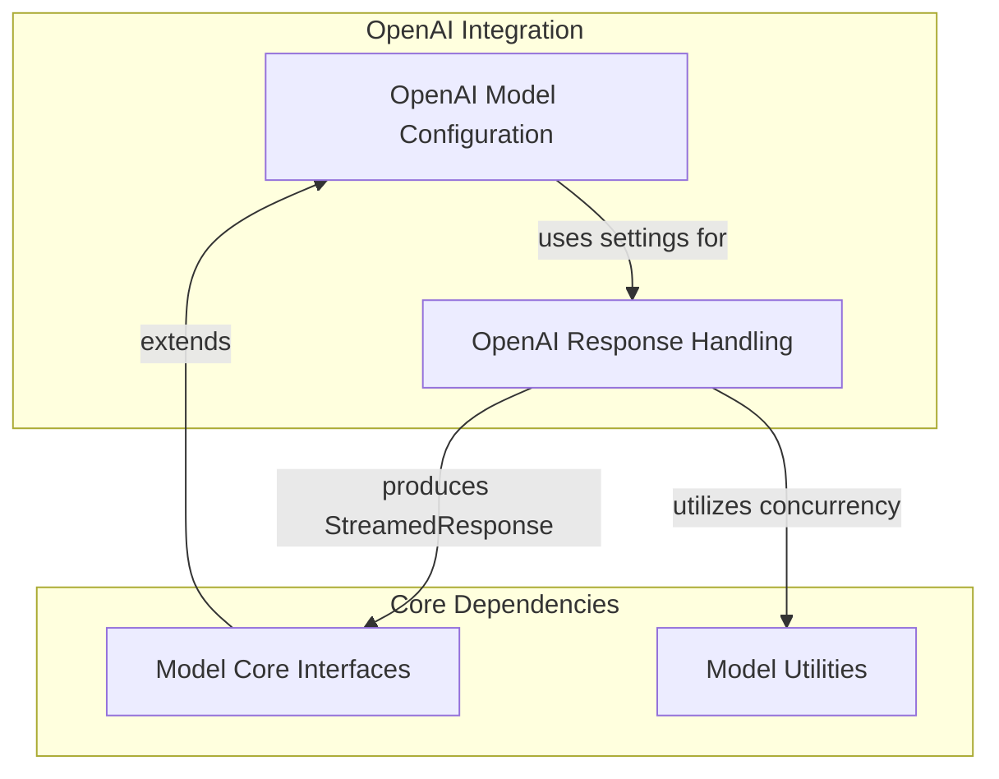

# model_provider_openai Module Documentation

## Introduction and Purpose

The `model_provider_openai` module provides the core functionality for integrating Pydantic-AI with OpenAI models. It defines the necessary classes and logic for making requests to OpenAI, handling streamed and non-streamed responses, configuring model settings, and mapping various content types (text, tool calls, binary data) to and from OpenAI's API formats. This module is crucial for enabling Pydantic-AI agents to leverage the powerful capabilities of OpenAI models, ensuring seamless communication and data exchange.

## Architecture Overview

The `model_provider_openai` module is structured into key sub-modules that manage distinct aspects of OpenAI integration:

*   **OpenAI Model Configuration**: Defines the structure and settings for OpenAI models.
*   **OpenAI Response Handling**: Manages the parsing, processing, and mapping of responses received from OpenAI.

These sub-modules work in conjunction to provide a robust and flexible interface for interacting with OpenAI's API, ensuring proper request formulation and accurate interpretation of model outputs.

<!-- DIAGRAM_JSON
{
    "direction": "TD",
    "nodes": [
        {
            "id": "model_provider_openai",
            "label": "model_provider_openai",
            "type": "module"
        },
        {
            "id": "openai_model_configuration",
            "label": "OpenAI Model Configuration",
            "type": "module",
            "link": "openai_model_configuration.md"
        },
        {
            "id": "openai_response_handling",
            "label": "OpenAI Response Handling",
            "type": "module",
            "link": "openai_response_handling.md"
        },
        {
            "id": "model_core_interfaces",
            "label": "Model Core Interfaces",
            "type": "external",
            "link": "model_core_interfaces.md"
        },
        {
            "id": "model_utilities",
            "label": "Model Utilities",
            "type": "external",
            "link": "model_utilities.md"
        }
    ],
    "edges": [
        {
            "source": "model_core_interfaces",
            "target": "openai_model_configuration",
            "label": "extends"
        },
        {
            "source": "openai_model_configuration",
            "target": "openai_response_handling",
            "label": "uses settings for"
        },
        {
            "source": "openai_response_handling",
            "target": "model_core_interfaces",
            "label": "produces StreamedResponse"
        },
        {
            "source": "openai_response_handling",
            "target": "model_utilities",
            "label": "utilizes concurrency"
        }
    ],
    "groups": [
        {
            "id": "openai_integration",
            "label": "OpenAI Integration",
            "role": "generative",
            "nodes": [
                "openai_model_configuration",
                "openai_response_handling"
            ]
        },
        {
            "id": "core_dependencies",
            "label": "Core Dependencies",
            "role": "analytical",
            "nodes": [
                "model_core_interfaces",
                "model_utilities"
            ]
        }
    ]
}
-->

## Sub-modules

### OpenAI Model Configuration
This sub-module ([`openai_model_configuration.md`](openai_model_configuration.md)) is responsible for defining the OpenAI model itself, its general settings, and specific settings for handling OpenAI Responses API, including built-in tools, reasoning summaries, truncation strategies, and output inclusion options. It provides the foundational structure for how Pydantic-AI configures and interacts with different OpenAI model variants.

### OpenAI Response Handling
This sub-module ([`openai_response_handling.md`](openai_response_handling.md)) focuses on the intricate process of managing and interpreting responses from OpenAI models. It handles streamed responses, mapping delta chunks into meaningful events (text, thinking, tool calls), and managing various content types, including binary data for chat completions. This ensures that the raw API responses are effectively transformed into the Pydantic-AI's internal representation for further processing by agents.

## Connections to Other Modules

*   **[model_core_interfaces.md](model_core_interfaces.md)**: The `model_provider_openai` module relies on the core interfaces defined in this module for `Model` and `StreamedResponse` base classes, ensuring consistency across different model providers.
*   **[model_utilities.md](model_utilities.md)**: This module leverages utilities like `limit_model_concurrency` from `model_utilities` to manage request rates and optimize performance when interacting with OpenAI's API.
