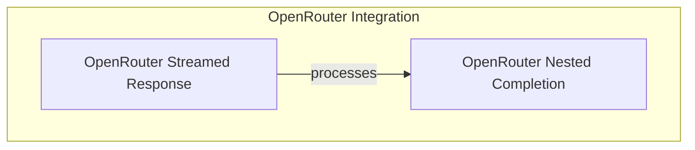

# model_provider_openrouter

This module provides the integration layer for interacting with models hosted on the OpenRouter platform. It extends the core model interfaces to handle OpenRouter's specific response formats and functionalities, enabling seamless communication with various models available through the OpenRouter API.

## Architecture Overview

The `model_provider_openrouter` module is designed to abstract away the specifics of OpenRouter API interactions, providing a consistent interface for the larger system. It primarily focuses on processing streaming responses and structuring completion data according to OpenRouter's conventions.

It interacts closely with general model interfaces and streaming response handlers, mapping OpenRouter's unique data structures and error formats to the system's internal representations.

## Sub-modules

This module consists of the following key sub-modules:

- **[OpenRouter Streamed Response](openrouter_streaming_response.md)**: Manages the processing of real-time streaming data from OpenRouter models.
- **[OpenRouter Nested Completion](openrouter_nested_completion.md)**: Handles the parsing and validation of nested completion objects returned by the OpenRouter API.

<!-- DIAGRAM_JSON
{
    "direction": "TD",
    "nodes": [
        {"id": "openrouter_streaming_response", "label": "OpenRouter Streamed Response", "type": "module", "link": "openrouter_streaming_response.md"},
        {"id": "openrouter_nested_completion", "label": "OpenRouter Nested Completion", "type": "module", "link": "openrouter_nested_completion.md"}
    ],
    "edges": [
        {"source": "openrouter_streaming_response", "target": "openrouter_nested_completion", "label": "processes"}
    ],
    "groups": [
        {
            "id": "openrouter_integration",
            "label": "OpenRouter Integration",
            "role": "generative",
            "nodes": ["openrouter_streaming_response", "openrouter_nested_completion"]
        }
    ]
}
-->

