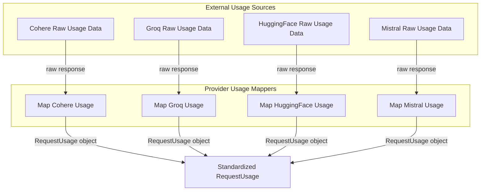

# Model Provider Usage Mapping

## Introduction and Purpose

The `model_provider_usage_mapping` module serves as a critical translation layer within the system, standardizing how usage information is reported by various Artificial Intelligence (AI) model providers. Its primary purpose is to convert provider-specific usage data (such as token counts, search units, or classifications) into a consistent and unified `RequestUsage` format. This standardization is essential for accurate, centralized tracking, billing, and analysis of AI model consumption across different platforms, ensuring that downstream systems can process usage metrics uniformly regardless of the originating model provider.

## Architecture Overview

The `model_provider_usage_mapping` module operates by providing dedicated mapping functions for each integrated model provider. These functions act as adapters, taking the raw, provider-specific response objects and extracting the relevant usage metrics, then transforming them into the common `RequestUsage` data structure. This design promotes modularity, allowing easy integration of new providers or updates to existing provider APIs without affecting the core consumption tracking logic.

<!-- DIAGRAM_JSON
{
    "direction": "TD",
    "nodes": [
        {
            "id": "model_provider_usage_mapping",
            "label": "Model Provider Usage Mapping",
            "type": "module"
        },
        {
            "id": "cohere_usage_mapper",
            "label": "Map Cohere Usage",
            "type": "module",
            "link": "cohere_usage_mapper.md"
        },
        {
            "id": "groq_usage_mapper",
            "label": "Map Groq Usage",
            "type": "module",
            "link": "groq_usage_mapper.md"
        },
        {
            "id": "huggingface_usage_mapper",
            "label": "Map HuggingFace Usage",
            "type": "module",
            "link": "huggingface_usage_mapper.md"
        },
        {
            "id": "mistral_usage_mapper",
            "label": "Map Mistral Usage",
            "type": "module",
            "link": "mistral_usage_mapper.md"
        },
        {
            "id": "cohere_raw",
            "label": "Cohere Raw Usage Data",
            "type": "external"
        },
        {
            "id": "groq_raw",
            "label": "Groq Raw Usage Data",
            "type": "external"
        },
        {
            "id": "huggingface_raw",
            "label": "HuggingFace Raw Usage Data",
            "type": "external"
        },
        {
            "id": "mistral_raw",
            "label": "Mistral Raw Usage Data",
            "type": "external"
        },
        {
            "id": "standardized_usage",
            "label": "Standardized RequestUsage",
            "type": "external"
        }
    ],
    "edges": [
        {
            "source": "cohere_raw",
            "target": "cohere_usage_mapper",
            "label": "raw response"
        },
        {
            "source": "groq_raw",
            "target": "groq_usage_mapper",
            "label": "raw response"
        },
        {
            "source": "huggingface_raw",
            "target": "huggingface_usage_mapper",
            "label": "raw response"
        },
        {
            "source": "mistral_raw",
            "target": "mistral_usage_mapper",
            "label": "raw response"
        },
        {
            "source": "cohere_usage_mapper",
            "target": "standardized_usage",
            "label": "RequestUsage object"
        },
        {
            "source": "groq_usage_mapper",
            "target": "standardized_usage",
            "label": "RequestUsage object"
        },
        {
            "source": "huggingface_usage_mapper",
            "target": "standardized_usage",
            "label": "RequestUsage object"
        },
        {
            "source": "mistral_usage_mapper",
            "target": "standardized_usage",
            "label": "RequestUsage object"
        }
    ],
    "groups": [
        {
            "id": "provider_mappers",
            "label": "Provider Usage Mappers",
            "role": "data",
            "nodes": [
                "cohere_usage_mapper",
                "groq_usage_mapper",
                "huggingface_usage_mapper",
                "mistral_usage_mapper"
            ]
        },
        {
            "id": "data_sources",
            "label": "External Usage Sources",
            "role": "data",
            "nodes": [
                "cohere_raw",
                "groq_raw",
                "huggingface_raw",
                "mistral_raw"
            ]
        },
        {
            "id": "output",
            "label": "Standardized Output",
            "role": "data",
            "nodes": [
                "standardized_usage"
            ]
        }
    ]
}
-->

## Sub-modules

This module is composed of several sub-modules, each responsible for mapping usage data from a specific model provider to a common `RequestUsage` format:

*   **[Cohere Usage Mapper](cohere_usage_mapper.md)**: This sub-module contains the logic to parse and transform usage details from Cohere model responses into the standardized `RequestUsage` format. It handles extracting token counts and other billed units.
*   **[Groq Usage Mapper](groq_usage_mapper.md)**: Responsible for converting usage information received from Groq model completions into a consistent `RequestUsage` object, specifically focusing on prompt and completion tokens.
*   **[HuggingFace Usage Mapper](huggingface_usage_mapper.md)**: This sub-module is designed to take usage data from HuggingFace model outputs and map it to the standard `RequestUsage` format, primarily dealing with prompt and completion token counts.
*   **[Mistral Usage Mapper](mistral_usage_mapper.md)**: Focuses on mapping usage details from Mistral AI model responses or completion chunks into the unified `RequestUsage` structure, processing prompt and completion token counts.
