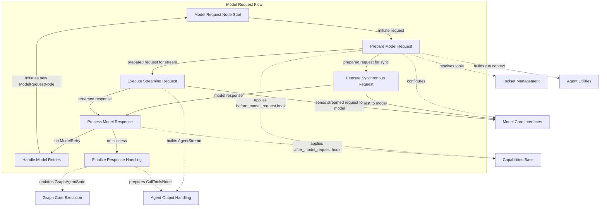

# model_request_node

The `model_request_node` module is a crucial component within the agent execution graph, primarily responsible for orchestrating interactions with language models. It defines the `ModelRequestNode` class, which represents a step in the agent's execution flow where a model request is made based on the current message history and agent state. This module handles both synchronous and asynchronous (streaming) model interactions, integrates with various agent capabilities, manages message history updates, and implements retry mechanisms.

Its core purpose is to abstract the complexities of communicating with different language models, providing a standardized interface for agents to send prompts, receive responses, and handle tool calls generated by the model.

## Architecture and Flow

The `ModelRequestNode` manages the lifecycle of a model request, from preparation to response handling. It interacts heavily with other core components of the `pydantic_ai_slim` framework to ensure proper context, tool availability, and post-processing of model outputs.

<!-- DIAGRAM_JSON
{
    "direction": "TD",
    "nodes": [
        {"id": "model_request_node_entry", "label": "Model Request Node Start", "type": "component", "link": null},
        {"id": "prepare_request", "label": "Prepare Model Request", "type": "component", "link": null},
        {"id": "make_sync_request", "label": "Execute Synchronous Request", "type": "component", "link": null},
        {"id": "stream_request", "label": "Execute Streaming Request", "type": "component", "link": null},
        {"id": "process_response", "label": "Process Model Response", "type": "component", "link": null},
        {"id": "handle_retries", "label": "Handle Model Retries", "type": "component", "link": null},
        {"id": "finish_handling", "label": "Finalize Response Handling", "type": "component", "link": null},
        {"id": "model_core_interfaces", "label": "Model Core Interfaces", "type": "external", "link": "model_core_interfaces.md"},
        {"id": "toolset_management", "label": "Toolset Management", "type": "external", "link": "toolset_management.md"},
        {"id": "capabilities_base", "label": "Capabilities Base", "type": "external", "link": "capabilities_base.md"},
        {"id": "agent_output_handling", "label": "Agent Output Handling", "type": "external", "link": "agent_output_handling.md"},
        {"id": "agent_utilities", "label": "Agent Utilities", "type": "external", "link": "agent_utilities.md"},
        {"id": "graph_core_execution", "label": "Graph Core Execution", "type": "external", "link": "graph_core_execution.md"}
    ],
    "edges": [
        {"source": "model_request_node_entry", "target": "prepare_request", "label": "initiate request"},
        {"source": "prepare_request", "target": "model_core_interfaces", "label": "configures"},
        {"source": "prepare_request", "target": "toolset_management", "label": "resolves tools"},
        {"source": "prepare_request", "target": "capabilities_base", "label": "applies before_model_request hook"},
        {"source": "prepare_request", "target": "agent_utilities", "label": "builds run context"},
        {"source": "prepare_request", "target": "make_sync_request", "label": "prepared request for sync"},
        {"source": "prepare_request", "target": "stream_request", "label": "prepared request for stream"},
        {"source": "make_sync_request", "target": "model_core_interfaces", "label": "sends request to model"},
        {"source": "stream_request", "target": "model_core_interfaces", "label": "sends streamed request to model"},
        {"source": "make_sync_request", "target": "process_response", "label": "model response"},
        {"source": "stream_request", "target": "process_response", "label": "streamed response"},
        {"source": "stream_request", "target": "agent_output_handling", "label": "builds AgentStream"},
        {"source": "process_response", "target": "capabilities_base", "label": "applies after_model_request hook"},
        {"source": "process_response", "target": "handle_retries", "label": "on ModelRetry"},
        {"source": "process_response", "target": "finish_handling", "label": "on success"},
        {"source": "handle_retries", "target": "model_request_node_entry", "label": "initiates new ModelRequestNode"},
        {"source": "finish_handling", "target": "graph_core_execution", "label": "updates GraphAgentState"},
        {"source": "finish_handling", "target": "agent_output_handling", "label": "prepares CallToolsNode"}
    ],
    "groups": [
        {
            "id": "model_request_flow",
            "label": "Model Request Flow",
            "role": "main",
            "nodes": ["model_request_node_entry", "prepare_request", "make_sync_request", "stream_request", "process_response", "handle_retries", "finish_handling"]
        }
    ]
}
-->

## Core Components

### `ModelRequestNode`

`ModelRequestNode` is an `AgentNode` that encapsulates the logic for interacting with a language model. It holds the `ModelRequest` object, manages the model's response, and handles the transition to subsequent nodes in the agent graph, typically `CallToolsNode` if the model suggests tool calls.

**Key Attributes:**

*   `request`: The `ModelRequest` that this node will send to the model.
*   `is_resuming_without_prompt`: A flag indicating if the request is part of a resumption without an explicit user prompt.
*   `_result`: Stores the next node to execute (`CallToolsNode` or another `ModelRequestNode` for retries).
*   `_did_stream`: Tracks whether the model interaction was a streaming request.
*   `last_request_context`: Stores the `ModelRequestContext` for the last model interaction, useful for capabilities hooks.

**Core Methods:**

*   `run(self, ctx)`:
    *   The primary entry point for executing a synchronous model request.
    *   Calls `_prepare_request` to set up the request context, including message history, tool resolution, and capability hooks.
    *   Executes the model request via `ctx.deps.root_capability.wrap_model_request`, which allows capabilities to interject before and after the model call.
    *   Handles potential `SkipModelRequest` or `ModelRetry` exceptions.
    *   After receiving a response, it calls `_finish_handling` to process the response, update history, and determine the next node.

*   `stream(self, ctx)`:
    *   The entry point for executing a streaming model request.
    *   Similar to `run`, it calls `_prepare_request` to set up the request context.
    *   It uses an `asynccontextmanager` to yield an `AgentStream`, allowing the caller to consume parts of the model's response as they arrive.
    *   Employs cooperative hand-off with a separate task (`wrap_task`) to manage the capability middleware and the actual streaming call to the model.
    *   Handles `SkipModelRequest` and `ModelRetry` during streaming, providing an empty stream or initiating a retry node.
    *   Ensures the stream is fully consumed before `_finish_handling` is called.

*   `_prepare_request(self, ctx)`:
    *   Prepares all necessary components for a model request: the model itself, `ModelSettings`, `ModelRequestParameters`, and the `message_history`.
    *   Appends the current `ModelRequest` to the `message_history`.
    *   Resolves dynamic toolsets via `ctx.deps.tool_manager.for_run_step`.
    *   Fetches and merges instructions, then validates the request.
    *   Applies the `before_model_request` capability hook to allow modification of the request before it's sent to the model.
    *   Calculates and checks token usage limits if configured.

*   `_finish_handling(self, ctx, response)`:
    *   Processes the `ModelResponse` after the model has returned it.
    *   Applies the `after_model_request` capability hook, which can modify or reject the response.
    *   If the response is rejected with `ModelRetry`, it triggers `_build_retry_node`.
    *   Appends the final model response to the agent's message history.
    *   Updates usage statistics.
    *   Sets `_result` to a `CallToolsNode`, signaling that the agent should now consider executing any tool calls proposed by the model's response.

*   `_build_agent_stream(ctx, stream_response, model_request_parameters)`:
    *   A static method that constructs an `AgentStream` object from the raw streamed response and current context.
    *   This `AgentStream` is then yielded by the `stream` method.
    *   It integrates `OutputSchema`, `OutputValidator`, `ToolManager`, and `Usage` from `ctx.deps` to provide a rich streaming experience.

*   `_resolve_wrap_result(self, ctx, run_context, request_context, result_or_exc)`:
    *   Helper method to handle the outcome of the `wrap_model_request` call, specifically dealing with `SkipModelRequest` responses and general exceptions.

*   `_append_response(ctx, response)`:
    *   Appends a model response to the `message_history` and increments usage statistics.
    *   Enforces usage limits after appending the response.

*   `_build_retry_node(self, ctx, error)`:
    *   Creates a new `ModelRequestNode` to initiate a retry, typically when a `ModelRetry` exception is raised by a capability hook or the model itself.
    *   Increments the retry counter in the agent state and adds a `RetryPromptPart` to the new request.

## Interactions with Other Modules

*   **[agent_output_handling](agent_output_handling.md)**: `ModelRequestNode` constructs and yields `AgentStream` objects (from `pydantic_ai_slim.pydantic_ai.result.AgentStream`) during streaming requests. It also utilizes `OutputSchema` and `OutputValidator` to process and validate model outputs.

*   **[model_core_interfaces](model_core_interfaces.md)**: Directly interacts with `pydantic_ai_slim.pydantic_ai.models.Model` for sending requests and receiving `StreamedResponse` or `ModelResponse`. It also uses `ModelSettings` and `ModelRequestParameters` to configure the model call.

*   **[toolset_management](toolset_management.md)**: Uses `pydantic_ai_slim.pydantic_ai._tool_manager.ToolManager` to resolve and prepare tools that might be available to the model, ensuring the model has the correct schema for tool calling.

*   **[capabilities_base](capabilities_base.md)**: Integrates deeply with the agent's capabilities via `ctx.deps.root_capability`. This includes `before_model_request`, `wrap_model_request`, `after_model_request`, and `on_model_request_error` hooks, allowing custom logic to be injected at various stages of the model interaction.

*   **[agent_utilities](agent_utilities.md)**: Utilizes utilities for building `RunContext` (`build_run_context`) and for time tracking (`now_utc`). It also interacts with `Usage` for tracking token and request usage.

*   **[graph_core_execution](graph_core_execution.md)**: As an `AgentNode`, it operates within the `GraphRunContext` and modifies the `GraphAgentState` (e.g., updating `message_history`, `run_step`, `usage`). It ultimately transitions to a `CallToolsNode` which is another node in the agent graph.

*   **[message_capture_utility](message_capture_utility.md)**: Though not directly imported, the `capture_run_messages` component implicitly works with the `message_history` updated by `ModelRequestNode`.