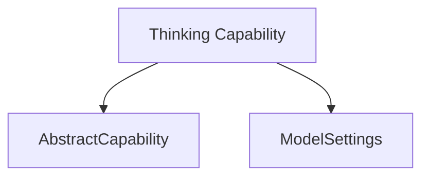

# Model Thinking Module

## Introduction

The `model_thinking` module, part of the `pydantic_ai_capabilities.agent_behaviors` sub-module, provides the `Thinking` capability for AI agents. This module is designed to enable and configure the model's thinking and reasoning processes in a standardized way across different AI model providers.

## Purpose and Core Functionality

The primary purpose of the `model_thinking` module is to offer a unified interface for controlling the "thinking" or "reasoning" effort of an AI model. This is achieved through the `Thinking` class, which allows developers to specify the desired level of thinking, ranging from disabling it entirely to setting explicit effort levels like 'minimal', 'low', 'medium', 'high', or 'xhigh'.

Core functionalities include:

*   **Standardized Thinking Control**: Provides a consistent `thinking` setting that works across various AI model providers.
*   **Effort Level Configuration**: Allows granular control over the thinking effort, enabling agents to adapt their reasoning intensity to different tasks.
*   **Provider-Specific Overrides**: Accommodates provider-specific thinking settings, ensuring that specialized configurations take precedence when available.
*   **Integration with Model Settings**: Seamlessly integrates with the overall `ModelSettings` to ensure thinking configurations are applied correctly during model inference.

## Architecture and Component Relationships

The `model_thinking` module is built around a single core component, the `Thinking` class. This class extends `AbstractCapability`, indicating its role as a configurable behavior within the agent framework. It utilizes `ModelSettings` to convey its configuration to the underlying AI models.

<!-- DIAGRAM_JSON
{
    "direction": "TD",
    "nodes": [
        {"id": "thinking_capability", "label": "Thinking Capability", "type": "component", "link": null},
        {"id": "abstract_capability", "label": "AbstractCapability", "type": "external", "link": "capability_core.md"},
        {"id": "model_settings", "label": "ModelSettings", "type": "external", "link": "pydantic_ai_models.md"}
    ],
    "edges": [
        {"source": "thinking_capability", "target": "abstract_capability"},
        {"source": "thinking_capability", "target": "model_settings"}
    ],
    "groups": []
}
-->

### Component Breakdown:

*   **`Thinking` Class**: This is the central component of the module. It inherits from [`AbstractCapability`][capability_core.md] and defines the `effort` attribute, which dictates the thinking level. It implements the `get_model_settings` method to translate its `effort` into a `ModelSettings` object.

### Dependencies:

*   **`AbstractCapability`**: The `Thinking` class is a concrete implementation of `AbstractCapability`, linking it to the core capabilities framework defined in the [`capability_core`][capability_core.md] module.
*   **`ModelSettings`**: The `Thinking` module relies on `ModelSettings` (likely from the [`pydantic_ai_models`][pydantic_ai_models.md] module or a related settings module) to pass its thinking configuration to the AI models. This ensures that the configured thinking effort is respected during model operations.

## How the Module Fits into the Overall System

The `model_thinking` module is a crucial part of an AI agent's behavioral configuration. It allows agent developers to precisely control how much "thought" an AI model should apply to a given task. By integrating with the broader `pydantic_ai_capabilities` framework, it provides a standardized, portable, and flexible way to manage model reasoning across different environments and model providers.

Agents can be initialized with various `Thinking` capabilities, influencing their decision-making processes, response generation, and overall problem-solving approach. This modular design promotes reusability and simplifies the configuration of complex AI behaviors. Its connection to `ModelSettings` ensures that this capability is seamlessly integrated into the model's runtime configuration, enabling dynamic adjustment of thinking based on task requirements or user preferences.