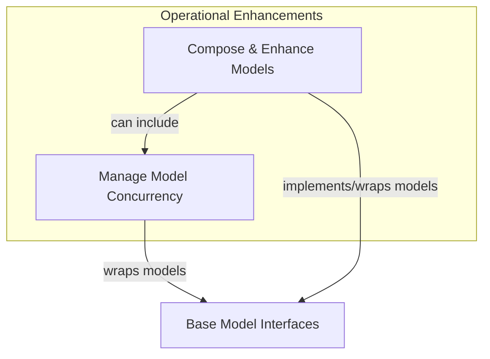

# Model Utilities

The `model_utilities` module provides essential tools and patterns for enhancing and managing the behavior of AI models within the pydantic-ai-agent-core framework. It offers functionalities for controlling concurrency, implementing robust fallback mechanisms, and creating adaptable model wrappers. This module is crucial for building resilient, performant, and flexible AI applications by abstracting complex operational concerns.

## Architecture Overview

The `model_utilities` module is designed to integrate seamlessly with various AI models, offering a layer of control and adaptation. It comprises components that handle operational aspects like request concurrency and structural patterns for combining and modifying model behavior, such as fallback logic and general model wrapping. These utilities work by either enhancing existing `Model` instances or providing new `Model` implementations that compose other models.

<!-- DIAGRAM_JSON
{
    "direction": "TD",
    "nodes": [
        {"id": "concurrency_management", "label": "Manage Model Concurrency", "type": "module", "link": "concurrency_management.md"},
        {"id": "model_composition", "label": "Compose & Enhance Models", "type": "module", "link": "model_composition.md"},
        {"id": "model_core_interfaces", "label": "Base Model Interfaces", "type": "external", "link": "model_core_interfaces.md"}
    ],
    "edges": [
        {"source": "concurrency_management", "target": "model_core_interfaces", "label": "wraps models"},
        {"source": "model_composition", "target": "model_core_interfaces", "label": "implements/wraps models"},
        {"source": "model_composition", "target": "concurrency_management", "label": "can include"}
    ],
    "groups": [
        {
            "id": "operational_enhancements",
            "label": "Operational Enhancements",
            "role": "generative",
            "nodes": ["concurrency_management", "model_composition"]
        }
    ]
}
-->

## Sub-modules

### [Concurrency Management](concurrency_management.md)
This sub-module focuses on controlling the rate at which AI model requests are processed. It provides mechanisms to limit the number of concurrent calls to a model, helping to prevent API rate limits and manage system resources efficiently.

### [Model Composition](model_composition.md)
This sub-module offers advanced patterns for combining and adapting AI models. It includes functionalities for creating models with fallback strategies (switching to alternative models on failure) and generic wrapper models that can modify the behavior of an underlying model without altering its core implementation.
