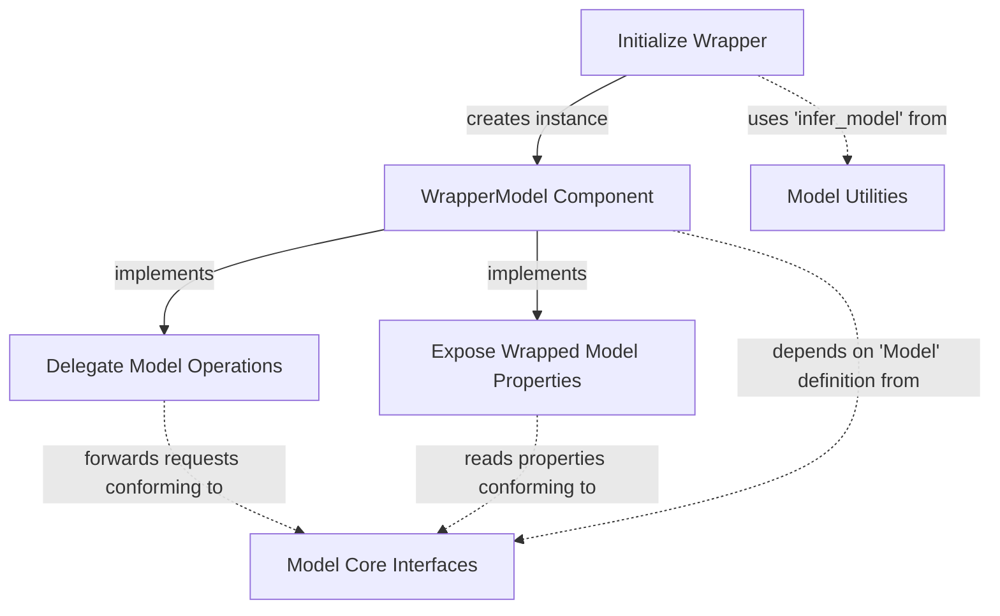

# model_wrapping

The `model_wrapping` module provides a foundational mechanism for creating wrapper models. These wrappers allow for extending or modifying the behavior of existing language models without directly altering their core implementations. This is crucial for adding cross-cutting concerns like logging, caching, rate limiting, or for implementing complex model orchestration patterns like fallback models.

## WrapperModel Component

The primary component within this module is `WrapperModel`. It serves as an abstract base class (though practically implementing passthrough logic) for any model that needs to encapsulate another model.

### How it Works

`WrapperModel` achieves its wrapping functionality by holding an instance of an underlying `Model` (which can be inferred from a `Model` object or a `KnownModelName` string during initialization). All core model operations and properties are then delegated directly to this `wrapped` model instance.

This delegation includes:

*   **Request Handling**: `request()` and `request_stream()` for making predictions.
*   **Token Counting**: `count_tokens()` for estimating token usage.
*   **Parameter Customization**: `customize_request_parameters()` and `prepare_request()` for modifying model call parameters.
*   **Property Access**: `model_name`, `system`, `profile`, and `settings` are directly exposed from the wrapped model.

The `__getattr__` method ensures that any attribute not explicitly defined in `WrapperModel` is automatically forwarded to the `wrapped` model, making it a transparent proxy.

### Why it Matters

The `WrapperModel` is a critical building block for creating flexible and composable model architectures. It enables:

*   **Modularity**: Behaviors can be added or changed by wrapping models, rather than modifying them.
*   **Reusability**: Common functionalities (e.g., error handling, monitoring) can be implemented once in a wrapper and applied to various models.
*   **Abstraction**: It hides the complexity of the underlying model, presenting a consistent `Model` interface.
*   **Advanced Patterns**: Forms the basis for more sophisticated patterns like [fallback_mechanism](fallback_mechanism.md) and [concurrency_management](concurrency_management.md).

## Architecture Diagram

<!-- DIAGRAM_JSON
{
    "direction": "TD",
    "nodes": [
        {
            "id": "wrapper_model_component",
            "label": "WrapperModel Component",
            "type": "component",
            "link": null
        },
        {
            "id": "initialize_wrapper",
            "label": "Initialize Wrapper",
            "type": "component",
            "link": null
        },
        {
            "id": "delegate_requests",
            "label": "Delegate Model Operations",
            "type": "component",
            "link": null
        },
        {
            "id": "expose_properties",
            "label": "Expose Wrapped Model Properties",
            "type": "component",
            "link": null
        },
        {
            "id": "model_core_interfaces",
            "label": "Model Core Interfaces",
            "type": "external",
            "link": "model_core_interfaces.md"
        },
        {
            "id": "model_utilities",
            "label": "Model Utilities",
            "type": "external",
            "link": "model_utilities.md"
        }
    ],
    "edges": [
        {
            "source": "initialize_wrapper",
            "target": "wrapper_model_component",
            "label": "creates instance"
        },
        {
            "source": "initialize_wrapper",
            "target": "model_utilities",
            "label": "uses 'infer_model' from",
            "style": "dashed"
        },
        {
            "source": "wrapper_model_component",
            "target": "delegate_requests",
            "label": "implements"
        },
        {
            "source": "wrapper_model_component",
            "target": "expose_properties",
            "label": "implements"
        },
        {
            "source": "delegate_requests",
            "target": "model_core_interfaces",
            "label": "forwards requests conforming to",
            "style": "dashed"
        },
        {
            "source": "expose_properties",
            "target": "model_core_interfaces",
            "label": "reads properties conforming to",
            "style": "dashed"
        },
        {
            "source": "wrapper_model_component",
            "target": "model_core_interfaces",
            "label": "depends on 'Model' definition from",
            "style": "dashed"
        }
    ],
    "groups": []
}
-->

