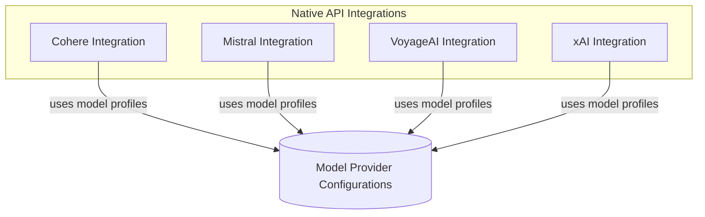

# Native Client Providers Module

## Introduction

The `native_client_providers` module provides direct integrations with various AI model providers using their native SDKs. This module abstracts the complexities of API key management, client initialization, and request handling, offering a unified `Provider` interface for seamless interaction with different large language models (LLMs) and embedding services. It serves as a critical bridge, allowing the core system to leverage a diverse ecosystem of AI capabilities without deep knowledge of each provider's specific implementation details.

## Architecture Overview

The `native_client_providers` module is structured around individual provider implementations, each encapsulating the logic required to connect and interact with a specific AI service. These providers adhere to a common `Provider` interface, enabling consistent usage across the system. They typically manage the lifecycle of the underlying SDK client, handle authentication, and map model profiles.

<!-- DIAGRAM_JSON
{
    "direction": "TD",
    "nodes": [
        {
            "id": "native_client_providers",
            "label": "Native Client Providers",
            "type": "module"
        },
        {
            "id": "cohere_provider",
            "label": "Cohere Integration",
            "type": "module",
            "link": "cohere_provider.md"
        },
        {
            "id": "mistral_provider",
            "label": "Mistral Integration",
            "type": "module",
            "link": "mistral_provider.md"
        },
        {
            "id": "voyage_ai_provider",
            "label": "VoyageAI Integration",
            "type": "module",
            "link": "voyage_ai_provider.md"
        },
        {
            "id": "xai_provider",
            "label": "xAI Integration",
            "type": "module",
            "link": "xai_provider.md"
        },
        {
            "id": "model_provider_configurations",
            "label": "Model Provider Configurations",
            "type": "external",
            "link": "model_provider_configurations.md"
        }
    ],
    "edges": [
        {
            "source": "cohere_provider",
            "target": "model_provider_configurations",
            "label": "uses model profiles"
        },
        {
            "source": "mistral_provider",
            "target": "model_provider_configurations",
            "label": "uses model profiles"
        },
        {
            "source": "voyage_ai_provider",
            "target": "model_provider_configurations",
            "label": "uses model profiles"
        },
        {
            "source": "xai_provider",
            "target": "model_provider_configurations",
            "label": "uses model profiles"
        }
    ],
    "groups": [
        {
            "id": "native_integrations",
            "label": "Native API Integrations",
            "role": "surface",
            "nodes": [
                "cohere_provider",
                "mistral_provider",
                "voyage_ai_provider",
                "xai_provider"
            ]
        }
    ]
}
-->

## Sub-modules

### [Cohere Integration](cohere_provider.md)
Handles the integration with the Cohere API, providing access to Cohere's LLMs and other AI services.

### [Mistral Integration](mistral_provider.md)
Manages interactions with the Mistral AI API, enabling the use of Mistral's models.

### [VoyageAI Integration](voyage_ai_provider.md)
Provides the necessary components to integrate with the VoyageAI platform, primarily for embedding models.

### [xAI Integration](xai_provider.md)
Offers an interface for connecting to the xAI API and utilizing their specialized AI models.
