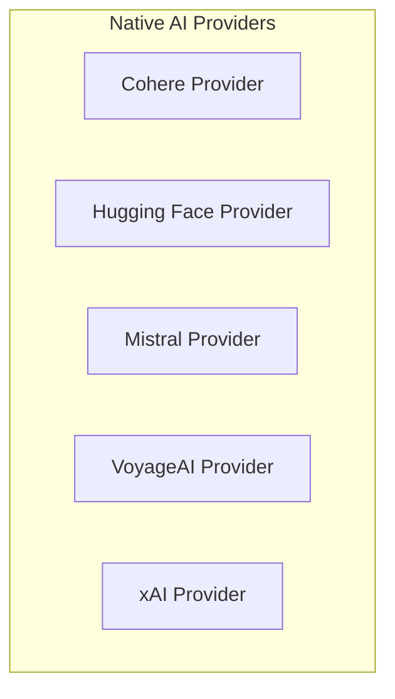

# Native Providers Module

The `native_providers` module is a crucial component within the `pydantic_ai_providers` system, responsible for integrating and managing access to various native AI model providers. This module abstracts away the complexities of interacting with different vendor-specific APIs, offering a unified interface for utilizing models from Cohere, Hugging Face, Mistral, VoyageAI, and xAI.

## Purpose and Core Functionality

The primary purpose of `native_providers` is to provide a standardized way to configure, authenticate, and interact with a selection of popular AI model providers directly. It encapsulates provider-specific logic, including API key management, client instantiation, and base URL configuration, enabling seamless switching and usage of different AI backends.

Key functionalities include:
- **Provider Abstraction**: Offers a generic `Provider` interface for consistent interaction across diverse AI services.
- **Authentication Handling**: Manages API keys and environment variables for secure access to each provider.
- **Client Management**: Instantiates and maintains clients for each integrated AI service (e.g., Cohere's `AsyncClientV2`, Mistral's `Mistral`).
- **Model Profiling**: Provides static methods to retrieve model profiles, aiding in understanding model capabilities and configurations.

## Architecture Overview

The `native_providers` module is structured around individual provider implementations, each inheriting from a common `Provider` abstract base class (as defined in the `pydantic_ai_providers` module). This design promotes extensibility, allowing new providers to be added by implementing the `Provider` interface.

Each provider class (`CohereProvider`, `MistralProvider`, etc.) manages its own client, authentication details, and specific configurations, ensuring isolation and maintainability.

<!-- DIAGRAM_JSON
{
    "direction": "TD",
    "nodes": [
        {"id": "cohere_provider", "label": "Cohere Provider", "type": "module", "link": "cohere_provider.md"},
        {"id": "huggingface_provider", "label": "Hugging Face Provider", "type": "module", "link": "huggingface_provider.md"},
        {"id": "mistral_provider", "label": "Mistral Provider", "type": "module", "link": "mistral_provider.md"},
        {"id": "voyageai_provider", "label": "VoyageAI Provider", "type": "module", "link": "voyageai_provider.md"},
        {"id": "xai_provider", "label": "xAI Provider", "type": "module", "link": "xai_provider.md"}
    ],
    "edges": [],
    "groups": []
}
-->

## Sub-modules

This module contains the following sub-modules, each dedicated to a specific AI provider:

- **[Cohere Provider](cohere_provider.md)**: Integrates with the Cohere API, offering access to Cohere models for various natural language processing tasks.
- **[Hugging Face Provider](huggingface_provider.md)**: Provides an interface to Hugging Face inference endpoints, allowing interaction with a wide range of open-source and commercial models hosted on the Hugging Face platform.
- **[Mistral Provider](mistral_provider.md)**: Manages integration with the Mistral AI API, enabling access to Mistral's powerful language models.
- **[VoyageAI Provider](voyageai_provider.md)**: Facilitates interaction with the VoyageAI API for tasks like embeddings and other AI functionalities.
- **[xAI Provider](xai_provider.md)**: Integrates with the xAI API to utilize their advanced AI services and models, such as Grok.

## How it Fits into the Overall System

The `native_providers` module is a fundamental part of the `pydantic_ai_providers` ecosystem, which itself is a sub-module of the larger `pydantic_ai_slim` framework. It serves as a direct bridge to external AI services, allowing the core `pydantic_ai_slim` agent and model components to leverage a diverse set of AI capabilities without needing to handle provider-specific implementation details.

It is typically utilized by components that require interaction with specific AI models, where the choice of provider is crucial for performance, cost, or specific model features. By abstracting these providers, the system gains flexibility and maintainability, making it easier to add or update AI service integrations.
