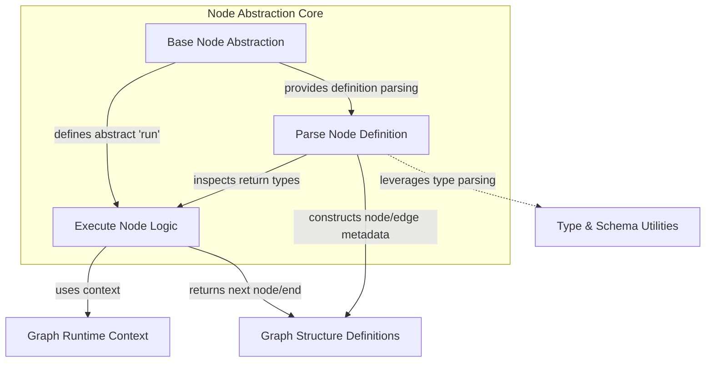

The `node_abstraction` module provides the foundational building blocks for defining discrete processing units, or "nodes," within a larger execution graph. This module is critical for constructing flexible and extensible agent workflows, as it establishes the core interface and behaviors that all graph nodes must adhere to. It enables the system to understand how nodes connect, how they execute, and what outputs they produce, forming the backbone of the `pydantic_ai_agent_core`'s graph-based execution model.

### Core Functionality

The central component of this module is the `BaseNode` abstract class. It defines the contract for any node participating in a graph. Subclasses of `BaseNode` must implement the `run` method, which encapsulates the node's specific logic. The return type hints of the `run` method are particularly important, as they dictate the possible subsequent nodes in the graph or signal the termination of the graph's execution.

Key aspects of the `node_abstraction` module include:

*   **Abstract Node Definition**: `BaseNode` serves as the blueprint, ensuring consistency across all node implementations.
*   **Dynamic Graph Structure Inference**: Through methods like `get_node_def`, the module dynamically analyzes the `run` method's return type hints to determine potential next nodes and graph termination points. This allows for programmatic construction and validation of graph structures.
*   **Snapshotting and Identification**: Mechanisms for generating unique identifiers (`get_snapshot_id`, `get_node_id`) are provided to support persistence, debugging, and tracing of node instances and their definitions within a graph.
*   **Documentation Integration**: The `get_note` method allows for the inclusion of docstring-based notes directly into generated Mermaid diagrams, enhancing diagram readability and understanding.

### How it Connects to the System

The `node_abstraction` module is a fundamental part of the `pydantic_ai_agent_core.graph_core_execution` sub-tree, enabling the definition and execution of complex agent behaviors.

*   **Graph Definition**: It works in conjunction with the [graph_definition](graph_definition.md) module, providing the `NodeDef` and `Edge` structures that capture the parsed information about node relationships and transitions.
*   **Graph Runtime**: During execution, concrete `BaseNode` implementations interact with the [graph_runtime](graph_runtime.md) module by receiving a `GraphRunContext` object, which provides access to the current state and dependencies.
*   **Type and Schema Utilities**: The parsing of `run` method return types heavily relies on utilities from the [type_and_schema_utilities](type_and_schema_utilities.md) module to correctly interpret complex type hints, including `Union` and `Annotated` types, to infer graph connections.
*   **Error Handling**: Graph setup errors, such as missing return type hints, are reported using exceptions, ensuring robust graph construction.

<!-- DIAGRAM_JSON
{
    "direction": "TD",
    "nodes": [
        {
            "id": "base_node",
            "label": "Base Node Abstraction",
            "type": "component",
            "link": null
        },
        {
            "id": "run_method",
            "label": "Execute Node Logic",
            "type": "component",
            "link": null
        },
        {
            "id": "parse_node_def",
            "label": "Parse Node Definition",
            "type": "component",
            "link": null
        },
        {
            "id": "graph_runtime",
            "label": "Graph Runtime Context",
            "type": "external",
            "link": "graph_runtime.md"
        },
        {
            "id": "graph_definition",
            "label": "Graph Structure Definitions",
            "type": "external",
            "link": "graph_definition.md"
        },
        {
            "id": "type_utilities",
            "label": "Type & Schema Utilities",
            "type": "external",
            "link": "type_and_schema_utilities.md"
        }
    ],
    "edges": [
        {
            "source": "base_node",
            "target": "run_method",
            "label": "defines abstract 'run'"
        },
        {
            "source": "base_node",
            "target": "parse_node_def",
            "label": "provides definition parsing"
        },
        {
            "source": "run_method",
            "target": "graph_runtime",
            "label": "uses context"
        },
        {
            "source": "run_method",
            "target": "graph_definition",
            "label": "returns next node/end"
        },
        {
            "source": "parse_node_def",
            "target": "run_method",
            "label": "inspects return types"
        },
        {
            "source": "parse_node_def",
            "target": "type_utilities",
            "label": "leverages type parsing"
        },
        {
            "source": "parse_node_def",
            "target": "graph_definition",
            "label": "constructs node/edge metadata"
        }
    ],
    "groups": [
        {
            "id": "node_core",
            "label": "Node Abstraction Core",
            "role": "core",
            "nodes": [
                "base_node",
                "run_method",
                "parse_node_def"
            ]
        }
    ]
}
-->
