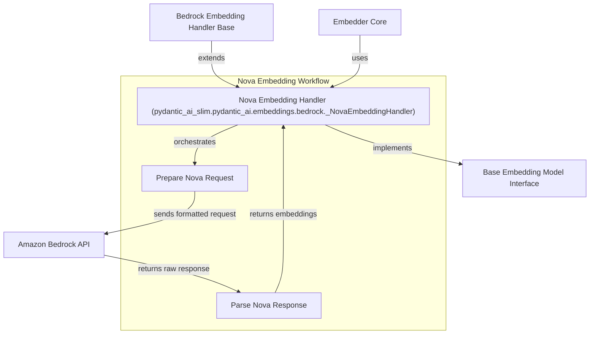

# nova_embedding_handler

The `nova_embedding_handler` module provides the concrete implementation for interacting with Amazon Bedrock's Nova embedding models. It encapsulates the logic for preparing requests in the Nova-specific format and parsing the responses to extract embedding vectors. This module is a specialized component within the broader [embedding_provider_integrations.md](embedding_provider_integrations.md) system, specifically handling the nuances of the Nova model within the Bedrock ecosystem.

## Core Functionality

The primary component of this module is `_NovaEmbeddingHandler`, which inherits from `_BedrockEmbeddingHandler`. It offers two key functionalities:

### 1. Request Preparation (`prepare_request`)

This method is responsible for transforming a generic embedding request into the specific JSON format required by the Amazon Bedrock Nova embedding API.

-   **Input**: It accepts a list of texts (currently limited to a single text per request), an `EmbedInputType` (e.g., 'query' or 'document'), and `BedrockEmbeddingSettings`.
-   **Truncation Mode**: It intelligently determines the `truncationMode` (START, END, or NONE) based on model-specific settings or general truncation preferences, as required by Nova models.
-   **Embedding Purpose**: It sets the `embeddingPurpose` (GENERIC_RETRIEVAL for queries, GENERIC_INDEX for documents) which is a mandatory field for Nova embeddings, allowing for optimization based on the use case.
-   **Dimensions**: Optionally includes `embeddingDimension` if specified in the settings.
-   **Output**: Produces a dictionary representing the JSON body for the Nova API call.

### 2. Response Parsing (`parse_response`)

After the Nova API returns a response, this method extracts the relevant embedding vectors.

-   **Input**: It takes the raw dictionary response from the Bedrock Nova API.
-   **Extraction**: It navigates the nested JSON structure to locate the `embedding` list.
-   **Error Handling**: Includes robust checks to ensure the expected `embeddings` and `embedding` fields are present, raising `UnexpectedModelBehavior` if the response format is unexpected.
-   **Output**: Returns a list containing the extracted embedding vector and a `None` value for any potential usage metadata (which is not directly mapped here but could be in a more comprehensive system).

## How it Connects

The `_NovaEmbeddingHandler` integrates into the larger embedding framework by providing a concrete implementation for a specific embedding model. It leverages the abstract interface defined by [embedding_core.md](embedding_core.md)'s `EmbeddingModel` and specifically extends `_BedrockEmbeddingHandler` (part of [bedrock_embedding_handlers.md](bedrock_embedding_handlers.md)) to interact with the AWS Bedrock service.

The overall flow involves:
1.  An `Embedder` (from [embedding_core.md](embedding_core.md)) receives an embedding request.
2.  The `Embedder` dispatches the request to the appropriate `EmbeddingModel` handler (in this case, `_NovaEmbeddingHandler`).
3.  `_NovaEmbeddingHandler.prepare_request` constructs the API call.
4.  The request is sent to the Bedrock service (managed by the Bedrock provider, likely configured via [model_provider_configurations.md](model_provider_configurations.md)).
5.  `_NovaEmbeddingHandler.parse_response` processes the Bedrock response.
6.  The extracted embeddings are returned through the `Embedder`.

<!-- DIAGRAM_JSON
{
    "direction": "TD",
    "nodes": [
        {"id": "nova_handler", "label": "Nova Embedding Handler (pydantic_ai_slim.pydantic_ai.embeddings.bedrock._NovaEmbeddingHandler)", "type": "component", "link": null},
        {"id": "prepare_request", "label": "Prepare Nova Request", "type": "component", "link": null},
        {"id": "parse_response", "label": "Parse Nova Response", "type": "component", "link": null},
        {"id": "bedrock_handler_base", "label": "Bedrock Embedding Handler Base", "type": "external", "link": "bedrock_embedding_handlers.md"},
        {"id": "embedder", "label": "Embedder Core", "type": "external", "link": "embedding_core.md"},
        {"id": "embedding_model", "label": "Base Embedding Model Interface", "type": "external", "link": "embedding_core.md"},
        {"id": "bedrock_api", "label": "Amazon Bedrock API", "type": "external", "link": "model_provider_configurations.md"}
    ],
    "edges": [
        {"source": "bedrock_handler_base", "target": "nova_handler", "label": "extends"},
        {"source": "embedder", "target": "nova_handler", "label": "uses"},
        {"source": "nova_handler", "target": "embedding_model", "label": "implements"},
        {"source": "nova_handler", "target": "prepare_request", "label": "orchestrates"},
        {"source": "prepare_request", "target": "bedrock_api", "label": "sends formatted request"},
        {"source": "bedrock_api", "target": "parse_response", "label": "returns raw response"},
        {"source": "parse_response", "target": "nova_handler", "label": "returns embeddings"}
    ],
    "groups": [
        {
            "id": "nova_embedding_process",
            "label": "Nova Embedding Workflow",
            "role": "system",
            "nodes": ["nova_handler", "prepare_request", "parse_response"]
        }
    ]
}
-->

