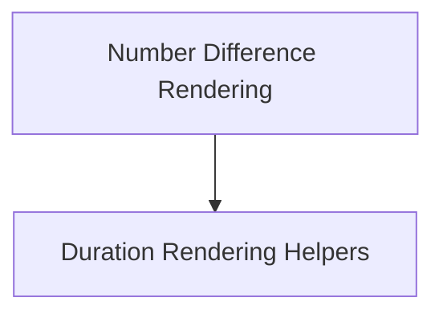

# Number and Duration Rendering Module

## Introduction

The `number_and_duration_rendering` module, part of `pydantic_evals.pydantic_evals.reporting`, provides essential utilities for formatting and rendering numerical and duration differences in a human-readable format. It is crucial for generating clear and concise reports, particularly in evaluation and performance metrics where changes and comparisons need to be easily understood.

## Architecture Overview

This module is composed of specialized functions that handle different aspects of rendering. It focuses on presenting raw values and their differences with appropriate units and formatting (e.g., percentages, multipliers for numbers, and time units for durations).

<!-- DIAGRAM_JSON
{
    "direction": "TD",
    "nodes": [
        {"id": "number_difference_rendering", "label": "Number Difference Rendering", "type": "module", "link": "number_difference_rendering.md"},
        {"id": "duration_rendering_helpers", "label": "Duration Rendering Helpers", "type": "module", "link": "duration_rendering_helpers.md"}
    ],
    "edges": [
        {"source": "number_difference_rendering", "target": "duration_rendering_helpers", "label": "utilizes"}
    ],
    "groups": []
}
-->

## Sub-modules

### [Number Difference Rendering](number_difference_rendering.md)

This sub-module focuses on intelligently displaying the difference between two numerical values. It provides functionality to calculate and format both absolute and relative changes, presenting them with appropriate precision and context, such as percentages or multipliers.

### [Duration Rendering Helpers](duration_rendering_helpers.md)

This sub-module offers utilities for formatting time durations into user-friendly strings. It can convert raw seconds into more understandable units (milliseconds, seconds) and also handles the rendering of differences between two durations, similar to how number differences are handled, including relative changes.