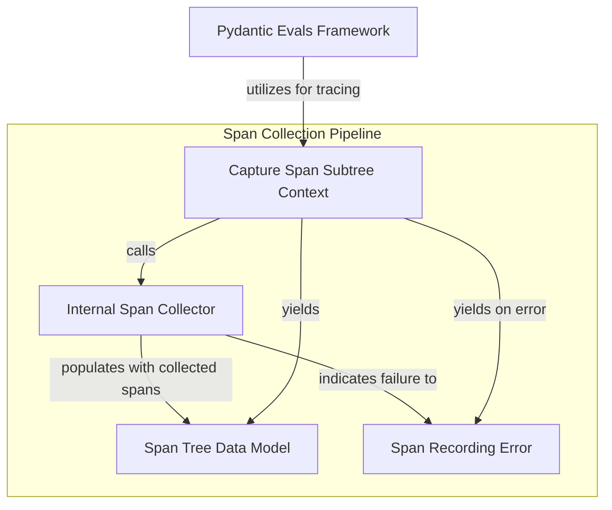

# `observability_utilities` Module

The `observability_utilities` module provides essential tools for integrating OpenTelemetry tracing within the `pydantic_evals_framework`. Its primary function is to enable the capture and structuring of OpenTelemetry spans into a `SpanTree` for detailed analysis of execution flows, particularly within evaluation contexts. This allows developers to gain deep insights into the performance and behavior of evaluation runs, identifying bottlenecks and understanding the sequence of operations.

### Module Overview

The core of this module is the `context_subtree` component, which acts as a context manager to collect all OpenTelemetry spans generated within its scope. This collected data is then organized into a hierarchical `SpanTree` object, offering a clear, tree-like representation of the operations performed. In cases where tracing setup is incomplete or an error occurs during span collection, the module gracefully handles it by yielding a `SpanTreeRecordingError`. This robust error handling ensures that downstream processes can react appropriately to tracing failures without crashing the application.

This module is crucial for the `pydantic_evals_framework` as it underpins the ability to monitor and debug complex evaluation scenarios, making the framework more transparent and easier to optimize.

<!-- DIAGRAM_JSON
{
    "direction": "TD",
    "nodes": [
        {"id": "capture_span_subtree", "label": "Capture Span Subtree Context", "type": "component", "link": null},
        {"id": "collect_spans_internal", "label": "Internal Span Collector", "type": "component", "link": null},
        {"id": "span_tree_model", "label": "Span Tree Data Model", "type": "component", "link": null},
        {"id": "span_error_model", "label": "Span Recording Error", "type": "component", "link": null},
        {"id": "pydantic_evals_framework", "label": "Pydantic Evals Framework", "type": "external", "link": "pydantic_evals_framework.md"}
    ],
    "edges": [
        {"source": "capture_span_subtree", "target": "collect_spans_internal", "label": "calls"},
        {"source": "collect_spans_internal", "target": "span_tree_model", "label": "populates with collected spans"},
        {"source": "collect_spans_internal", "target": "span_error_model", "label": "indicates failure to"},
        {"source": "capture_span_subtree", "target": "span_tree_model", "label": "yields"},
        {"source": "capture_span_subtree", "target": "span_error_model", "label": "yields on error"},
        {"source": "pydantic_evals_framework", "target": "capture_span_subtree", "label": "utilizes for tracing"}
    ],
    "groups": [
        {
            "id": "span_collection_pipeline",
            "label": "Span Collection Pipeline",
            "role": "data_flow",
            "nodes": ["capture_span_subtree", "collect_spans_internal", "span_tree_model", "span_error_model"]
        }
    ]
}
-->
