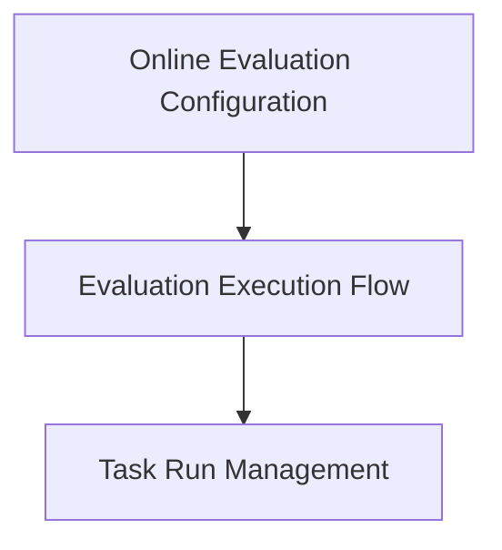

# Online Evaluation Core Module

## Introduction
The `online_evaluation_core` module provides the foundational components for integrating real-time evaluation capabilities into Python functions. It enables developers to configure, wrap, and dispatch evaluators to assess function behavior and performance as part of an ongoing process. This module is critical for continuous monitoring and quality assurance within AI-driven applications.

## Architecture Overview
The `online_evaluation_core` module is structured around three main sub-modules: `online_evaluation_config`, `evaluation_execution_flow`, and `task_run_management`. The `online_evaluation_config` sub-module sets up the parameters for evaluation, which are then utilized by the `evaluation_execution_flow` to wrap target functions and dispatch the actual evaluations. The `task_run_management` component provides utilities for executing individual tasks within the evaluation context, often leveraged by the `evaluation_execution_flow`.

<!-- DIAGRAM_JSON
{
    "direction": "TD",
    "nodes": [
        {"id": "online_evaluation_config", "label": "Online Evaluation Configuration", "type": "module", "link": "online_evaluation_config.md"},
        {"id": "evaluation_execution_flow", "label": "Evaluation Execution Flow", "type": "module", "link": "evaluation_execution_flow.md"},
        {"id": "task_run_management", "label": "Task Run Management", "type": "module", "link": "task_run_management.md"}
    ],
    "edges": [
        {"source": "online_evaluation_config", "target": "evaluation_execution_flow"},
        {"source": "evaluation_execution_flow", "target": "task_run_management"}
    ],
    "groups": []
}
-->

## Sub-modules

*   **[Online Evaluation Configuration](online_evaluation_config.md)**: This sub-module is responsible for defining and managing the configuration settings for online evaluations. It allows customization of evaluation behavior, including default sinks, sampling rates, and error handling.
*   **[Evaluation Execution Flow](evaluation_execution_flow.md)**: This sub-module orchestrates the core process of online evaluation. It handles the wrapping of functions, capturing of inputs, sampling of evaluators, and the asynchronous dispatch of evaluation tasks.
*   **[Task Run Management](task_run_management.md)**: This sub-module provides utilities for executing and tracking individual tasks, typically within the context of a dataset or an ongoing evaluation. It ensures proper task isolation and metric capture.
