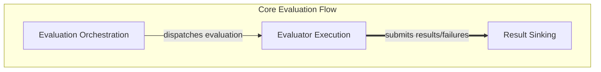

# Online Evaluation System

## Introduction and Purpose
The `online_evaluation_system` module provides a robust framework for attaching evaluators to functions, enabling real-time, online evaluation of their inputs and outputs. It allows for flexible configuration of evaluation behavior, including sampling rates, concurrency limits, and various sinks for result submission. This system is crucial for continuously monitoring and improving the performance of AI agents and other systems by integrating evaluation directly into their operational flow.

## Architecture Overview
The `online_evaluation_system` is designed with a clear separation of concerns, orchestrating the evaluation process from function invocation to result dispatch. It comprises three main sub-modules:
- **[Evaluation Orchestration](evaluation_orchestration.md)**: Manages the core process of wrapping functions, capturing inputs, sampling relevant evaluators, and initiating the asynchronous evaluation flow.
- **[Evaluator Execution](evaluator_execution.md)**: Handles the actual running of individual evaluators, including managing concurrency to prevent system overload.
- **[Result Sinking](result_sinking.md)**: Responsible for reliably delivering evaluation results and any failures to designated storage or reporting mechanisms.

These sub-modules interact to provide a seamless and configurable online evaluation experience.

## High-level functionality of each sub-module:

*   **[Evaluation Orchestration](evaluation_orchestration.md)**: This sub-module is the entry point for online evaluations. It decorates functions, intercepts their calls, extracts inputs and outputs, and intelligently decides which evaluators to run based on configured sampling rates. It then dispatches these evaluations for processing, ensuring that the main function execution remains unblocked.
*   **[Evaluator Execution](evaluator_execution.md)**: This component focuses on the actual running of individual evaluators. It manages the asynchronous execution of each evaluator, applying concurrency limits to control resource usage. It is responsible for calling the evaluator logic and handling any immediate results or failures.
*   **[Result Sinking](result_sinking.md)**: After an evaluator has produced its results or encountered a failure, this sub-module takes over. It ensures that these outcomes are reliably submitted to one or more configured sinks (e.g., databases, logging systems, monitoring platforms). It also incorporates error handling for the submission process itself.

<!-- DIAGRAM_JSON
{
    "direction": "TD",
    "nodes": [
        {
            "id": "online_evaluation_system",
            "label": "Online Evaluation System",
            "type": "module"
        },
        {
            "id": "evaluation_orchestration",
            "label": "Evaluation Orchestration",
            "type": "module",
            "link": "evaluation_orchestration.md"
        },
        {
            "id": "evaluator_execution",
            "label": "Evaluator Execution",
            "type": "module",
            "link": "evaluator_execution.md"
        },
        {
            "id": "result_sinking",
            "label": "Result Sinking",
            "type": "module",
            "link": "result_sinking.md"
        }
    ],
    "edges": [
        {
            "source": "evaluation_orchestration",
            "target": "evaluator_execution",
            "label": "dispatches evaluation"
        },
        {
            "source": "evaluator_execution",
            "target": "result_sinking",
            "label": "submits results/failures"
        }
    ],
    "groups": [
        {
            "id": "core_evaluation_flow",
            "label": "Core Evaluation Flow",
            "role": "generative",
            "nodes": [
                "evaluation_orchestration",
                "evaluator_execution",
                "result_sinking"
            ]
        }
    ]
}
-->

