# OpenAI Compatible Providers

This module provides a unified interface for interacting with various AI model providers that offer an OpenAI-compatible API. It abstracts away the specifics of each provider's authentication, base URLs, and model profiling, allowing developers to use a consistent `AsyncOpenAI` client across different services.

## Architecture

The `openai_compatible_providers` module is designed around a set of `Provider` classes, each responsible for integrating with a specific third-party AI service. Each provider class encapsulates the necessary logic to:
- Define the provider's name and base URL.
- Instantiate and manage an `AsyncOpenAI` client configured for the specific provider.
- Provide a static `model_profile` method to map generic model names to provider-specific profiles, including necessary transformations for OpenAI-compatible schema.
- Handle API key retrieval, often supporting environment variables for configuration.

This architecture ensures that new providers can be easily added by implementing a new `Provider` class, maintaining a modular and extensible system.

<!-- DIAGRAM_JSON
{
    "direction": "TD",
    "nodes": [
        {"id": "alibaba_provider", "label": "Alibaba Provider", "type": "module", "link": "alibaba_provider.md"},
        {"id": "azure_provider", "label": "Azure Provider", "type": "module", "link": "azure_provider.md"},
        {"id": "cerebras_provider", "label": "Cerebras Provider", "type": "module", "link": "cerebras_provider.md"},
        {"id": "deepseek_provider", "label": "DeepSeek Provider", "type": "module", "link": "deepseek_provider.md"},
        {"id": "fireworks_provider", "label": "Fireworks Provider", "type": "module", "link": "fireworks_provider.md"},
        {"id": "github_provider", "label": "GitHub Provider", "type": "module", "link": "github_provider.md"},
        {"id": "grok_provider", "label": "Grok Provider", "type": "module", "link": "grok_provider.md"},
        {"id": "heroku_provider", "label": "Heroku Provider", "type": "module", "link": "heroku_provider.md"},
        {"id": "litellm_provider", "label": "LiteLLM Provider", "type": "module", "link": "litellm_provider.md"},
        {"id": "moonshot_ai_provider", "label": "MoonshotAI Provider", "type": "module", "link": "moonshot_ai_provider.md"},
        {"id": "nebius_provider", "label": "Nebius Provider", "type": "module", "link": "nebius_provider.md"},
        {"id": "ollama_provider", "label": "Ollama Provider", "type": "module", "link": "ollama_provider.md"},
        {"id": "ovhcloud_provider", "label": "OVHcloud Provider", "type": "module", "link": "ovhcloud_provider.md"},
        {"id": "sambanova_provider", "label": "SambaNova Provider", "type": "module", "link": "sambanova_provider.md"},
        {"id": "together_provider", "label": "Together Provider", "type": "module", "link": "together_provider.md"},
        {"id": "vercel_provider", "label": "Vercel Provider", "type": "module", "link": "vercel_provider.md"}
    ],
    "edges": [
        {"source": "openai_compatible_providers", "target": "alibaba_provider"},
        {"source": "openai_compatible_providers", "target": "azure_provider"},
        {"source": "openai_compatible_providers", "target": "cerebras_provider"},
        {"source": "openai_compatible_providers", "target": "deepseek_provider"},
        {"source": "openai_compatible_providers", "target": "fireworks_provider"},
        {"source": "openai_compatible_providers", "target": "github_provider"},
        {"source": "openai_compatible_providers", "target": "grok_provider"},
        {"source": "openai_compatible_providers", "target": "heroku_provider"},
        {"source": "openai_compatible_providers", "target": "litellm_provider"},
        {"source": "openai_compatible_providers", "target": "moonshot_ai_provider"},
        {"source": "openai_compatible_providers", "target": "nebius_provider"},
        {"source": "openai_compatible_providers", "target": "ollama_provider"},
        {"source": "openai_compatible_providers", "target": "ovhcloud_provider"},
        {"source": "openai_compatible_providers", "target": "sambanova_provider"},
        {"source": "openai_compatible_providers", "target": "together_provider"},
        {"source": "openai_compatible_providers", "target": "vercel_provider"}
    ],
    "groups": []
}
-->

```mermaid
graph TD
    sub_module_openai_compatible_providers[OpenAI Compatible Providers]

    sub_module_openai_compatible_providers --> alibaba_provider[Alibaba Provider]
    sub_module_openai_compatible_providers --> azure_provider[Azure Provider]
    sub_module_openai_compatible_providers --> cerebras_provider[Cerebras Provider]
    sub_module_openai_compatible_providers --> deepseek_provider[DeepSeek Provider]
    sub_module_openai_compatible_providers --> fireworks_provider[Fireworks Provider]
    sub_module_openai_compatible_providers --> github_provider[GitHub Provider]
    sub_module_openai_compatible_providers --> grok_provider[Grok Provider]
    sub_module_openai_compatible_providers --> heroku_provider[Heroku Provider]
    sub_module_openai_compatible_providers --> litellm_provider[LiteLLM Provider]
    sub_module_openai_compatible_providers --> moonshot_ai_provider[MoonshotAI Provider]
    sub_module_openai_compatible_providers --> nebius_provider[Nebius Provider]
    sub_module_openai_compatible_providers --> ollama_provider[Ollama Provider]
    sub_module_openai_compatible_providers --> ovhcloud_provider[OVHcloud Provider]
    sub_module_openai_compatible_providers --> sambanova_provider[SambaNova Provider]
    sub_module_openai_compatible_providers --> together_provider[Together Provider]
    sub_module_openai_compatible_providers --> vercel_provider[Vercel Provider]

    click alibaba_provider "alibaba_provider.md" "View Alibaba Provider Module"
    click azure_provider "azure_provider.md" "View Azure Provider Module"
    click cerebras_provider "cerebras_provider.md" "View Cerebras Provider Module"
    click deepseek_provider "deepseek_provider.md" "View DeepSeek Provider Module"
    click fireworks_provider "fireworks_provider.md" "View Fireworks Provider Module"
    click github_provider "github_provider.md" "View GitHub Provider Module"
    click grok_provider "grok_provider.md" "View Grok Provider Module"
    click heroku_provider "heroku_provider.md" "View Heroku Provider Module"
    click litellm_provider "litellm_provider.md" "View LiteLLM Provider Module"
    click moonshot_ai_provider "moonshot_ai_provider.md" "View MoonshotAI Provider Module"
    click nebius_provider "nebius_provider.md" "View Nebius Provider Module"
    click ollama_provider "ollama_provider.md" "View Ollama Provider Module"
    click ovhcloud_provider "ovhcloud_provider.md" "View OVHcloud Provider Module"
    click sambanova_provider "sambanova_provider.md" "View SambaNova Provider Module"
    click together_provider "together_provider.md" "View Together Provider Module"
    click vercel_provider "vercel_provider.md" "View Vercel Provider Module"
```

## Sub-modules

This module is composed of several sub-modules, each providing integration with a specific OpenAI-compatible AI service:

*   **[Alibaba Provider](alibaba_provider.md)**: Integrates with Alibaba Cloud Model Studio (DashScope) OpenAI-compatible API.
*   **[Azure Provider](azure_provider.md)**: Integrates with the Azure OpenAI API, supporting various models.
*   **[Cerebras Provider](cerebras_provider.md)**: Integrates with the Cerebras AI API, offering access to their models.
*   **[DeepSeek Provider](deepseek_provider.md)**: Integrates with the DeepSeek API, providing access to DeepSeek models.
*   **[Fireworks Provider](fireworks_provider.md)**: Integrates with Fireworks AI API for various AI models.
*   **[GitHub Provider](github_provider.md)**: Integrates with GitHub Models API, supporting multiple AI models.
*   **[Grok Provider](grok_provider.md)**: Integrates with Grok API, providing OpenAI-compatible access to Grok models.
*   **[Heroku Provider](heroku_provider.md)**: Integrates with Heroku AI inference API for OpenAI-compatible models.
*   **[LiteLLM Provider](litellm_provider.md)**: Integrates with LiteLLM API, allowing access to a wide range of LLMs through a unified interface.
*   **[MoonshotAI Provider](moonshot_ai_provider.md)**: Integrates with MoonshotAI platform (Kimi models) offering OpenAI-compatible API.
*   **[Nebius Provider](nebius_provider.md)**: Integrates with Nebius AI Studio API for diverse AI models.
*   **[Ollama Provider](ollama_provider.md)**: Integrates with local or remote Ollama API for running open-source models.
*   **[OVHcloud Provider](ovhcloud_provider.md)**: Integrates with OVHcloud AI Endpoints, providing access to various AI models.
*   **[SambaNova Provider](sambanova_provider.md)**: Integrates with SambaNova AI models through an OpenAI-compatible API.
*   **[Together Provider](together_provider.md)**: Integrates with Together AI API, offering access to various models.
*   **[Vercel Provider](vercel_provider.md)**: Integrates with Vercel AI Gateway API for flexible AI model access.
