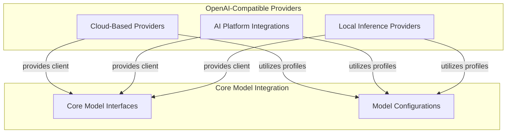

# OpenAI Compatible Providers

The `openai_compatible_providers` module serves as a crucial abstraction layer, providing a unified interface to interact with various Large Language Model (LLM) providers that adhere to the OpenAI API specification. This module simplifies the integration of diverse AI models into applications by standardizing how they are accessed and configured, regardless of the underlying vendor.

## Purpose

The primary purpose of this module is to enable seamless swapping between different OpenAI-compatible LLM providers. It encapsulates the specific initialization parameters, API keys, and model profile adaptations required for each provider, offering a consistent `Provider` interface. This modular design enhances flexibility, allowing developers to experiment with different models or switch providers without extensive code changes.

## Architecture Overview

The `openai_compatible_providers` module is structured around individual provider implementations, each extending a common `Provider` interface. These providers are responsible for:
*   Initializing an `AsyncOpenAI` client (or a compatible client).
*   Defining their base URL and authentication mechanisms.
*   Adapting model-specific settings and profiles to conform to the OpenAI-compatible interface.

The various provider sub-modules within this component feed into the broader [model core interfaces](model_core_interfaces.md) and leverage [model provider configurations](model_provider_configurations.md) for model-specific behaviors.

<!-- DIAGRAM_JSON
{
    "direction": "TD",
    "nodes": [
        {
            "id": "openai_compatible_providers",
            "label": "OpenAI-Compatible Providers",
            "type": "module"
        },
        {
            "id": "cloud_based_providers",
            "label": "Cloud-Based Providers",
            "type": "module",
            "link": "cloud_based_providers.md"
        },
        {
            "id": "ai_platform_providers",
            "label": "AI Platform Integrations",
            "type": "module",
            "link": "ai_platform_providers.md"
        },
        {
            "id": "local_inference_providers",
            "label": "Local Inference Providers",
            "type": "module",
            "link": "local_inference_providers.md"
        },
        {
            "id": "model_core_interfaces",
            "label": "Core Model Interfaces",
            "type": "external",
            "link": "model_core_interfaces.md"
        },
        {
            "id": "model_provider_configurations",
            "label": "Model Configurations",
            "type": "external",
            "link": "model_provider_configurations.md"
        }
    ],
    "edges": [
        {
            "source": "cloud_based_providers",
            "target": "model_core_interfaces",
            "label": "provides client"
        },
        {
            "source": "cloud_based_providers",
            "target": "model_provider_configurations",
            "label": "utilizes profiles"
        },
        {
            "source": "ai_platform_providers",
            "target": "model_core_interfaces",
            "label": "provides client"
        },
        {
            "source": "ai_platform_providers",
            "target": "model_provider_configurations",
            "label": "utilizes profiles"
        },
        {
            "source": "local_inference_providers",
            "target": "model_core_interfaces",
            "label": "provides client"
        },
        {
            "source": "local_inference_providers",
            "target": "model_provider_configurations",
            "label": "utilizes profiles"
        }
    ],
    "groups": [
        {
            "id": "openai_compatible_providers__group",
            "label": "OpenAI-Compatible Providers",
            "role": "surface",
            "nodes": [
                "cloud_based_providers",
                "ai_platform_providers",
                "local_inference_providers"
            ],
            "_repaired": "r4_group_renamed_avoid_node_collision"
        },
        {
            "id": "core_model_integration",
            "label": "Core Model Integration",
            "role": "generative",
            "nodes": [
                "model_core_interfaces",
                "model_provider_configurations"
            ]
        }
    ]
}
-->

## Sub-modules

This module organizes OpenAI-compatible providers into the following sub-modules:

*   **[AI Platform Integrations](ai_platform_providers.md)**: This sub-module contains integrations for various specialized AI model inference platforms that offer OpenAI-compatible endpoints. It includes providers like Cerebras, DeepSeek, Fireworks, Grok, MoonshotAI, Nebius, SambaNova, and Together, enabling access to their unique model offerings through a familiar API.

*   **[Cloud-Based Providers](cloud_based_providers.md)**: This sub-module encompasses integrations for OpenAI-compatible APIs offered by major cloud platforms and hosted services. It includes providers such as Alibaba, Azure, GitHub, Heroku, and OVHcloud, facilitating the use of their extensive infrastructure and diverse models.

*   **[Local Inference Providers](local_inference_providers.md)**: This sub-module provides the necessary components for integrating with local or self-hosted OpenAI-compatible inference solutions, such as Ollama. It allows for the use of local models with the same `Provider` interface, ideal for development, privacy-sensitive applications, or environments with limited internet connectivity.

Each sub-module's documentation provides detailed information on specific providers, their configurations, and any unique characteristics.
